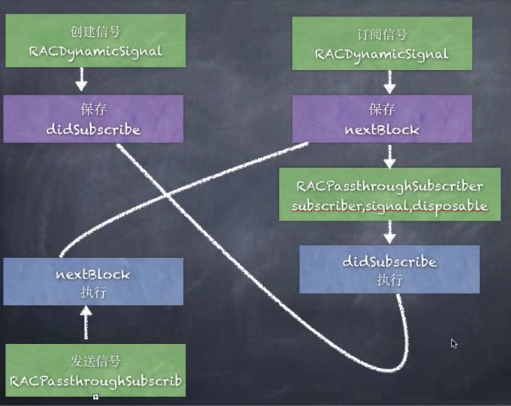

# RACSignal

RACSignal：信号类，signal本身不具备发送信号的能力。

遵循**RACSubscriber**代理才可以发送消息。

### 在创建RACSignal中先说一下RAC的四部曲

1. 创建信号
2. 订阅信号
3. 发送信息
3. 取消订阅

```objective-c
- (void)RACSignalTest {
    //1、创建信号量
    RACSignal * signal = [RACSignal createSignal:^RACDisposable * _Nullable(id<RACSubscriber>  _Nonnull subscriber) {
        
        NSLog(@"创建信号量");
        
        //3、发布信息
        [subscriber sendNext:@"I'm send next data"];
        //3.1发送完成信号，并取消订阅
        [subscriber sendCompleted];
        
        self.subscriber = subscriber;
        
        NSLog(@"那我啥时候运行");
        //4用于取消订阅时清理资源用，比如释放一些资源
        return [RACDisposable disposableWithBlock:^{
            NSLog(@"RACDisposable");
        }];
    }];
    
    //2、订阅信号量
    RACDisposable *disposable = [signal subscribeNext:^(id  _Nullable x) {
        NSLog(@"%@",x);
    }];
    
    //主动出发取消订阅
    [disposable dispose];
    
    //2.2订阅错误信号
    [signal subscribeError:^(NSError * _Nullable error) {
        NSLog(@"error");
    }];
    //2.3订阅完成信号
    [signal subscribeCompleted:^{
        NSLog(@"completed");
    }];

}
```

## 创建信号

创建一个Signal信号对象，传递的参数是一个block。block的返回值是`RACDisposable`对象，block的参数是遵循RACSubscriber协议

```objective-c
+ (RACSignal *)createSignal:(RACDisposable * (^)(id<RACSubscriber> subscriber))didSubscribe {
	return [RACDynamicSignal createSignal:didSubscribe];
}
```

可以看到其内部创建了一个`RACDynamicSignal`信号，并且把`didSubscribe` 这个block也传了过去

```objective-c
+ (RACSignal *)createSignal:(RACDisposable * (^)(id<RACSubscriber> subscriber))didSubscribe {
	RACDynamicSignal *signal = [[self alloc] init];
	signal->_didSubscribe = [didSubscribe copy];//保存
	return [signal setNameWithFormat:@"+createSignal:"];
}
```

创建了一个 `RACDynamicSignal` 类型的信号，然后将传入的名为 `didSubscribe` 的block保存在创建的信号的 `didSubscribe` 属性中，**此时仅仅是保存并未触发**。返回`RACDynamicSignal`这个对象。

**创建信号本质就是创建了一个 `RACDynamicSignal` 类型的信号，并将传入的代码块保存起来，留待以后调用。**

#### 但是这个block什么时候调用呢？

没错就是在我们订阅信号的时候调用

## 订阅信号

```objective-c
      [signal subscribeNext:^(id  _Nullable x) {
           NSLog(@"%@",x);
       }];
```

这里一订阅信号就给我一个block，并且还带一个参数x，并不知道是个什么东西，就先打印出来。
然后我们点击进去看下内部实现

```objective-c
- (RACDisposable *)subscribeNext:(void (^)(id x))nextBlock {
	NSCParameterAssert(nextBlock != NULL);
	
	RACSubscriber *o = [RACSubscriber subscriberWithNext:nextBlock error:NULL completed:NULL];
	return [self subscribe:o];//执行订阅命令 并传入订阅者
}
```

1. 创建一个订阅者RACSubscriber

RACSubscriber订阅者有三个block：nextBlock，errorBlock，completeBlock

```objective-c
+ (instancetype)subscriberWithNext:(void (^)(id x))next error:(void (^)(NSError *error))error completed:(void (^)(void))completed {
	RACSubscriber *subscriber = [[self alloc] init];

//保存了nextblock
	subscriber->_next = [next copy];
	subscriber->_error = [error copy];
	subscriber->_completed = [completed copy];

	return subscriber;
}
```

2. RACDynamicSignal调用`subscribe`方法

```objective-c
- (RACDisposable *)subscribe:(id<RACSubscriber>)subscriber {
	NSCParameterAssert(subscriber != nil);

  //销毁
	RACCompoundDisposable *disposable = [RACCompoundDisposable compoundDisposable];
  
  //RACPassthroughSubscriber才是真正的订阅者，保存subscriber self dispose。
  //信号signal 订阅者subscriber 销毁disposable。
	subscriber = [[RACPassthroughSubscriber alloc] initWithSubscriber:subscriber signal:self disposable:disposable];

	if (self.didSubscribe != NULL) {
		RACDisposable *schedulingDisposable = [RACScheduler.subscriptionScheduler schedule:^{
		//这里就在调用didSubscribe方法，并且把刚才传入的subscriber调用出去
			RACDisposable *innerDisposable = self.didSubscribe(subscriber);
			[disposable addDisposable:innerDisposable];
		}];

		[disposable addDisposable:schedulingDisposable];
	}
	
	return disposable;
}
//在这个方法中会判断是否有didSubscriber，
//如果有就调用block并且把传入进来的subscriber作为block的参数调用出去
```

##### 订阅信号之后就会运行创建信号的block，

这个时候我们再来看下创建信号的方法

```objective-c
 [RACSignal createSignal:^RACDisposable * _Nullable(id<RACSubscriber>  _Nonnull subscriber) {
        
        NSLog(@"创建信号量");
        
        //3、发布信息
        [subscriber sendNext:@"I'm send next data"];
        
        NSLog(@"那我啥时候运行");
        
        return nil;
    }];
    
    //2、订阅信号量
    [signal subscribeNext:^(id  _Nullable x) {
        NSLog(@"%@",x);
    }];
它给我们一个subscriber 
而这个sbuscriber就是我们调用订阅信号的方法所创建的subscriber，然后我们要用这个订阅者发送信息
```

##### 那我们订阅的信号啥时候调用呢？

- 当我们的订阅者发送消息的时候就会调用。

这个时候我们看下订阅者发送信息的方法内部做了什么

```objective-c
#pragma mark RACSubscriber

- (void)sendNext:(id)value {
	@synchronized (self) {
		void (^nextBlock)(id) = [self.next copy];
		if (nextBlock == nil) return;

		nextBlock(value);
	}
}
```

这里的代码很简洁了 主要就是做了一件事，如果nextblock不为空就把传进来传value原封不动的调用出去。 而这个nextblock就是我们在订阅信号的时候创建的那个subscriber所保存的nextblock。

所以RACSignal的处理流程就是

- 创建信号的block会在订阅信号的时候调用
- 订阅信号的block会在订阅者发布信息的时候调用

## 图


