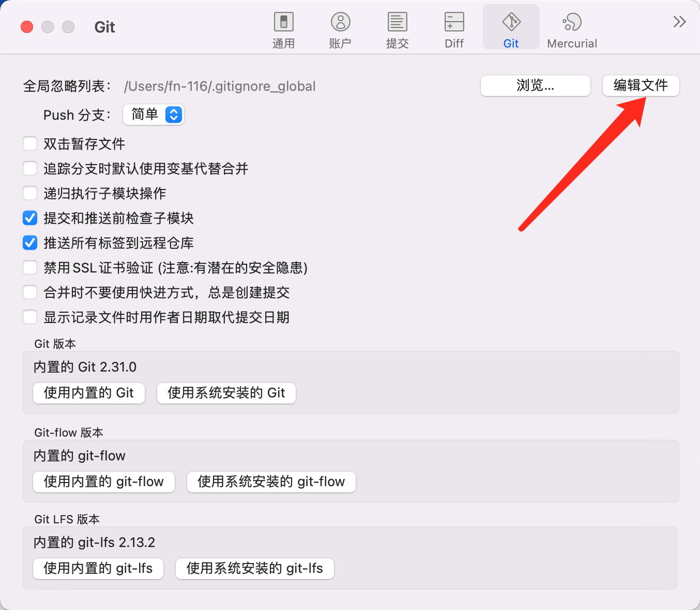

在.gitignore_global文件中编辑，添加忽略文件。

```
*~
.DS_Store
Pods
.gitignore
WorkspaceSettings.xcsettings
UserInterfaceState.xcuserstate
Breakpoints_v2.xcbkptlist
xcuserdata
xcschememanagement.plist
IDEWorkspaceChecks.plist
*.xcworkspacedata
_CodeSignature/
Podfile.lock
```

