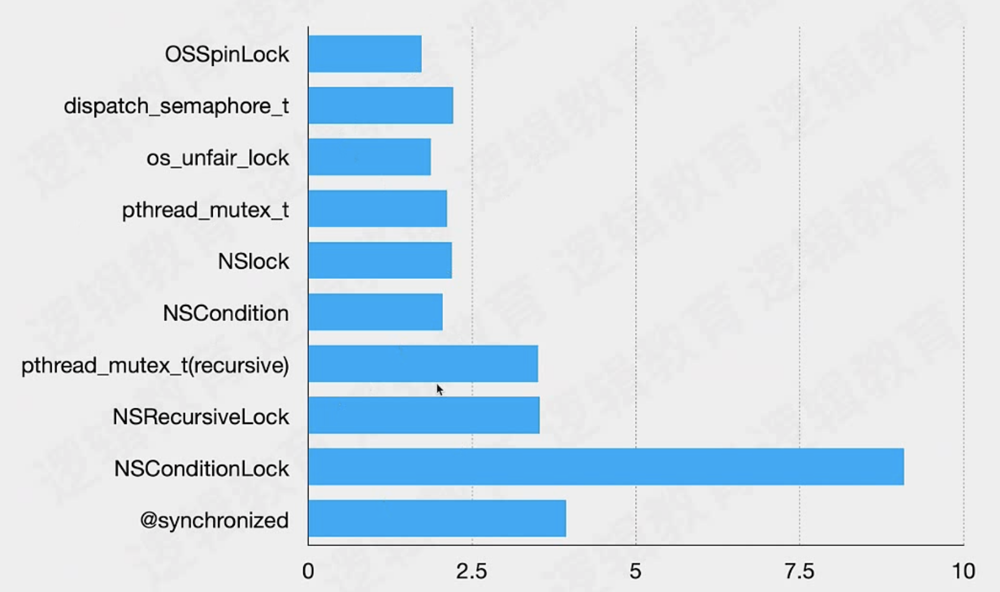
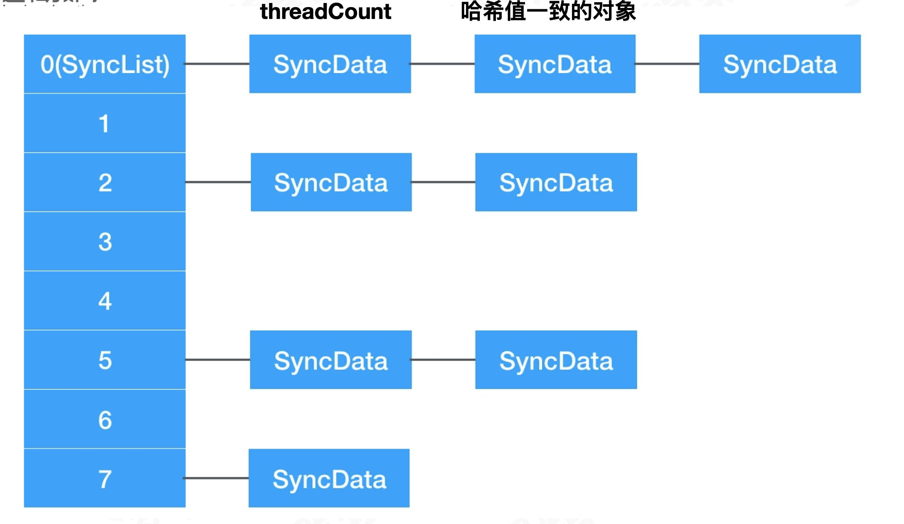
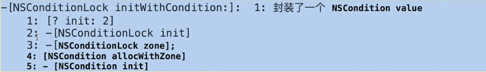
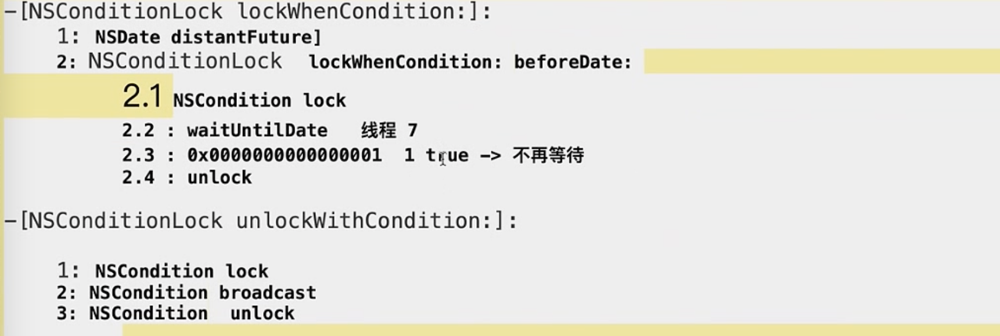

# 锁

锁 – 是保证线程安全常见的同步工具。锁是一种非强制的机制，每一个线程在访问数据或者资源前，要先获取(Acquire) 锁，并在访问结束之后释放(Release)锁。如果锁已经被占用，其它试图获取锁的线程会等待，直到锁重新可用。

## 为什么要有锁

多线程编程时，锁是用来保护**线程安全**的工具。

当多个线程同时对一块内存发生读和写的操作，可能出现意料之外的结果（资源抢夺：买票）。

程序执行的顺序会被打乱，可能造成提前释放一个变量，计算结果错误等情况。

所以将线程不安全的代码 “锁” 起来。保证一段代码或者多段代码操作的原子性，保证多个线程对同一个数据的访问 **同步 (Synchronization)**。

## atomic

属性关键字设置 atomic 之后，默认生成的 getter 和 setter 方法执行是原子的。

但是它只保证了自身的读/写操作，却不能说是线程安全。

如下情况:

```objective-c
//thread A
for (int i = 0; i < 100000; i ++) {
if (i % 2 == 0) {
    self.arr = @[@"1"， @"2"， @"3"];
}else {
    self.arr = @[@"1"];
}
NSLog(@"Thread A: %@\n"， self.arr);
}

//thread B
if (self.arr.count >= 2) {
    NSString* str = [self.arr objectAtIndex:1];
}
```

就算在 **thread B** 中针对 arr 数组进行了大小判断，但是仍然可能在 `objectAtIndex:` 操作时被改变数组长度，导致出错。这种情况声明为 atomic 也没有用。

而解决方式，就是进行加锁。

需要注意的是，读/写的操作都需要加锁，不仅仅是对一段代码加锁。

## 死锁

死锁的必要条件：

1. 串行队列
2. 同步任务

```objective-c
- (void)viewDidLoad {
    [super viewDidLoad];
    // Do any additional setup after loading the view.    
    
    /**
     viewDidLoad整个代码块和下面的同步代码块都是在主队列主线程，相互等待。
     viewDidLoad先添加到队列，下面的任务后添加，下面的任务要等viewDidLoad整个执行结束才执行，但是下面的任务块是在viewDidLoad代码块中的。形成死锁。
     如果下面的同步任务不是主队列就不会死锁。不在同一个队列。
     */
    dispatch_sync(dispatch_get_main_queue(), ^{
        NSLog(@"---%@--", [NSThread currentThread]);
    });
    NSLog(@"123");
}
```

## 锁的分类

可以根据锁的状态，锁的特性等进行不同的分类，很多锁之间其实并不是并列的关系，而是一种锁下的不同实现。

### 1、自旋锁（spin lock）

OSSpinLock 是一种自旋锁。它的特点是在线程等待时会一直轮询，处于**忙等**状态。自旋锁由此得名。

自旋锁看起来是比较耗费 cpu 的，然而在互斥临界区计算量较小的场景下，它的效率远高于其它的锁。

因为它是一直处于 running 状态，减少了线程切换上下文的消耗。

#### OSSpinLock 不再安全

OSSpinLock 不再安全，原因就在于优先级反转问题。

#### 优先级反转(Priority Inversion)

什么情况叫做优先级反转

wikipedia 上是这么定义的：

> 优先级倒置，又称优先级反转、优先级逆转、优先级翻转，是一种不希望发生的任务调度状态。在该种状态下，一个高优先级任务间接被一个低优先级任务所抢先(preemtped)，使得两个任务的相对优先级被倒置。
> 这往往出现在一个高优先级任务等待访问一个被低优先级任务正在使用的临界资源，从而阻塞了高优先级任务；同时，该低优先级任务被一个次高优先级的任务所抢先，从而无法及时地释放该临界资源。这种情况下，该次高优先级任务获得执行权。

再消化一下

> 有：高优先级任务A / 次高优先级任务B / 低优先级任务C / 资源Z 。
> A 等待 C 使用 Z，而 B 并不需要 Z，抢先获得时间片执行。C 由于没有时间片，无法执行。
> 这种情况造成 A 在 B 之后执行，使得优先级被倒置了。
> 而如果 A 等待资源时不是阻塞等待，而是忙循环，则可能永远无法获得资源。此时 C 无法与 A 争夺 CPU 时间，从而 C 无法执行，进而无法释放资源。造成的后果，就是 A 无法获得 Z 而继续推进。

而 OSSpinLock 忙等的机制，就可能造成高优先级一直 running ，占用 cpu 时间片。而低优先级任务无法抢占时间片，变成迟迟完不成，不释放锁的情况。

#### 为什么使用其它的锁，可以解决优先级反转

我们看到很多本来使用 OSSpinLock 的知名项目，都改用了其它方式替代，比如 `pthread_mutex` 和 `dispatch_semaphore` 。

原因在于：其它锁出现优先级反转后，高优先级的任务不会忙等。因为处于等待状态的高优先级任务，**没有占用时间片**，所以低优先级任务一般都能进行下去，从而释放掉锁。

### 2、互斥锁（mutex）

休眠，等待唤醒执行。执行不执行的条件。

互斥+同步

可能多个线程之间同时处理任务，同一时刻只能有一个线程处理（互斥），线程按照相应的顺序执行（同步）。

同步=互斥+顺序。

互斥锁可以分为非递归锁/递归锁两种，主要区别在于:同一个线程可以重复获取递归锁，不会死锁; 同一个线程重复获取非递归锁，则会产生死锁。

#### 2.1、递归锁（可重入锁）

同一个线程可以重复获取递归锁，不会死锁（例：synchonized）。

递归锁也称为可重入锁。

因为是递归锁，我们可以写类似这样的代码:

```objective-c
- (void)testLock{
  if(_count>0){ 
     @synchronized (obj) {
        _count = _count - 1;
        [self testLock];
      }
    }
}
```

#### 2.2、非递归锁

同一个线程重复获取非递归锁，则会因为递归产生死锁（例：NSLock）。

### 自旋锁和互斥锁的关系

自旋锁，也是互斥锁的一种实现，而 `spin lock`和 `mutex` 两者都是为了解决某项资源的互斥使用，在任何时刻只能有一个保持者。

区别在于 `spin lock`和 `mutex` 调度机制上有所不同。互斥锁是闲等，自旋锁是互斥锁加忙等。

短小精悍的任务用自旋锁，`automic`里面就使用自旋锁。

## 锁的性能分析



## dispatch_semaphore

dispatch_semaphore 是 GCD 中同步的一种方式，与他相关的只有三个函数，一个是创建信号量，一个是等待信号，一个是发送信号。

## @synchonized

@synchonized 是一个递归锁。结构体里面有一个recursive_mutex_t。

```c++
typedef struct alignas(CacheLineSize) SyncData {
    struct SyncData* 						nextData;
    DisguisedPtr<objc_object> 	object;
    int32_t 										threadCount;  // number of THREADS using this block
    recursive_mutex_t 					mutex;
} SyncData;
```

xcrun之后底层代码

```
objc_sync_enter(_sync_obj);  lockCount++
objc_sync_exit(_sync_obj);		lockCount--
```

- SyncData是可以重用的（threadCount==0）
- 存在全局的map里

object对应一个类似链表，可以重复加锁。

数据结构：

objA、objB、objC对象哈希值可能一样（哈希冲突），才会有拉链的形成，拉链是头插法。



```
    {//1
        {//2
            {//3
                {//4
                    {//5
                        
                    }
                }
            }
        }
    }
```

线程1 加锁

线程2 加锁

线程3 加锁

线程4 加锁

线程5 加锁

最里面的线程5线unlock，然后线程4，线程3，线程2

### 注：

如果锁的对象 obj 为 nil，或者 obj 地址不同，锁会失效。

```objective-c
@synchronized (obj) {
    obj = newObj;//这里的 obj 被更改后，等到其它线程访问时，就和没加锁一样直接进去了。
}    
```

另外一种情况，就是 `@synchonized(self)`. 不少代码都是直接将self传入@synchronized当中，而 `self` 很容易作为一个外部对象，被调用和修改。所以它和上面是一样的情况，需要避免使用。

正确的做法是：obj 应当传入一个类内部维护的NSObject对象，而且这个对象是对外不可见的，不被随便修改的。

```objective-c
    // 锁的对象 不要为空
    NSObject *OBJC = [NSObject alloc];
    // self 生命周期 OBJC生命周期和_testArray不一样 容易出问题
    // 传self 同一个对象 方便存储 释放
    // 真机 和 模拟器
    @synchronized (self) {
        <#statements#>
    }
```

### Sync 总结

1. sync 哈希表 **-** 拉链法 syncData
2. sDatalist array 存的synclist (绑定objc对象)
3. objc_sync_enter / exit 对称 递归锁
4. 两种存储: tls / cache
5. 第一次 syncData 头插法 链表 标记 threadcount = 1
6. 判断是不是同一个对象
7. TLS -> lockcount ++
8. TLS 找不到 重新创建syncData并且 threadCount ++ 
9. lock — threadCount—**

Synchronized : 可重入 递归 多线程：

1. TLS保障 **threadCount** 多少条线程对这个锁对象加锁 
2. lockCount同一线程被锁多少次

lockCount可递归同一个线程被锁多少次， threadCount可多线程 有多少线程加锁

同一个线程lockCount++

不同线程threadCount++

两个情况走的代码不一样

## pthread_mutex

pthread 定义了一组跨平台的线程相关的 API，其中可以**使用 pthread_mutex 作为互斥锁**。

`pthread_mutex` 不是使用忙等，而是同信号量一样，会阻**塞线程并进行等待**，调用时进行线程上下文切换。

`pthread_mutex` 本身拥有设置协议的功能，通过设置它的协议，来解决优先级反转:

> pthread_mutexattr_setprotocol(pthread_mutexattr_t *attr， int protocol)

其中协议类型包括以下几种：

- PTHREAD_PRIO_NONE：线程的优先级和调度不会受到互斥锁拥有权的影响。
- PTHREAD_PRIO_INHERIT：当高优先级的等待低优先级的线程锁定互斥量时，低优先级的线程以高优先级线程的优先级运行。这种方式将以继承的形式传递。当线程解锁互斥量时，线程的优先级自动被降到它原来的优先级。该协议就是支持优先级继承类型的互斥锁，它不是默认选项，需要在程序中进行设置。
- PTHREAD_PRIO_PROTECT：当线程拥有一个或多个使用 PTHREAD_PRIO_PROTECT 初始化的互斥锁时，此协议值会影响其他线程（如 thrd2）的优先级和调度。thrd2 以其较高的优先级或者以 thrd2 拥有的所有互斥锁的最高优先级上限运行。基于被 thrd2 拥有的任一互斥锁阻塞的较高优先级线程对于 thrd2的调度没有任何影响。

设置协议类型为 `PTHREAD_PRIO_INHERIT` ，运用优先级继承的方式，可以解决优先级反转的问题。

在 iOS 中使用的 NSLock，NSRecursiveLock 等都是基于 pthread_mutex 做实现的。

## NSLock

NSLock 属于 pthread_mutex 的一层封装， 设置了属性为`PTHREAD_MUTEX_ERRORCHECK` 。

它会损失一定性能换来错误提示。并简化直接使用 pthread_mutex 的定义。

NSLock继承NSObject，遵循锁的协议NSLocking

```objective-c
@protocol NSLocking

- (void)lock;
- (void)unlock;

@end
```

## NSCondition条件锁

NSCondition 是通过 pthread 中的**条件变量(condition variable)**pthread_cond_t 来实现的。

**NSCondition** 的对象实际上作为一个锁和一个线程检查器:

**锁主要 为了当检测条件时保护数据源，执行条件引发的任务;**

**线程检查器 主要是根据条件决定是否继续运行线程，即线程是否被阻塞**

1. **[condition lock];//**一般用于多线程同时访问、修改同一个数据源，保证在同一 时间内数据源只被访问、修改一次，其他线程的命令需要在**lock** 外等待，只到 **unlock** ，才可访问
2. **[condition unlock];//**与**lock** 同时使用
3. **[condition wait];//**让当前线程处于等待状态
4. **[condition signal];//CPU**发信号告诉线程不用在等待，可以继续执行

应用场景：生产者消费者发生混乱问题

## 条件变量

在线程间的同步中，有这样一种情况：

线程 A 需要等条件 C 成立，才能继续往下执行。现在这个条件不成立，线程 A 就阻塞等待。

而线程 B 在执行过程中，使条件 C 成立了，就唤醒线程 A 继续执行。

对于上述情况，可以使用条件变量来操作。

条件变量，类似信号量，提供线程阻塞与信号机制，可以用来阻塞某个线程，等待某个数据就绪后，随后唤醒线程。

一个条件变量总是和一个互斥量搭配使用。

而 NSCondition 其实就是封装了一个互斥锁和条件变量，互斥锁的 lock/unlock 方法和后者的 wait/signal 统一封装在 NSCondition 对象中，暴露给使用者。

用条件变量控制线程同步，最为经典的例子就是 生产者-消费者问题。

### 生产者-消费者问题

生产者消费者问题，是一个著名的线程同步问题，该问题描述如下：

有一个生产者在生产产品，这些产品将提供给若干个消费者去消费。要求让生产者和消费者能并发执行，在两者之间设置一个具有多个缓冲区的缓冲池，生产者将它生产的产品放入一个缓冲区中，消费者可以从缓冲区中取走产品进行消费，显然生产者和消费者之间必须保持同步，即不允许消费者到一个空的缓冲区中取产品，也不允许生产者向一个已经放入产品的缓冲区中再次投放产品。

生产和消费是两个单独的事务，单独负责安全（lock unlock），但是之间会有联系影响（信号通知）。

生产者和消费者都适用lock保证自身的安全。使用信号保证之间的安全。

我们可以刚好可以使用 NSCondition 解决生产者-消费者问题。

这里需要注意，实际操作 NSCondition 做 wait 操作时，如果用 if 判断:

```
if(count==0){
    [condition wait];
}
```

上面这样是不能保证消费者是线程安全的。

因为 NSCondition 可以给每个线程分别加锁，但加锁后不影响其他线程进入临界区。所以 NSCondition 使用 wait 并加锁后，并不能真正保证线程的安全。

当一个 signal 操作发出时，如果有两个线程都在做 消费者 操作，那同时都会消耗掉资源，于是绕过了检查。

例如我们的条件是，count == 0 执行等待。

假设当前 count = 0，线程A 要判断到 count == 0，执行等待；

线程B 执行了 count = 1 ，并唤醒线程A 执行 count - 1 ，同时线程C 也判断到 count > 0 。因为处在不同的线程锁，同样判断执行了 count - 1。2 个线程都会执行 count - 1，但是 count = 1，实际就出现count = -1 的情况。

所以为了保证消费者操作的正确，使用 while 循环中的判断，进行二次确认:

```
while (count == 0) {
    [condition wait];
}
```

## 条件变量和信号量的区别

每个信号量有一个与之关联的值，发出时+1，等待时-1，任何线程都可以发出一个信号，即使没有线程在等待该信号量的值。

可是对于条件变量，例如 pthread_cond_signal 发出信号后，没有任何线程阻塞在 pthread_cond_wait 上，那这个条件变量上的信号会直接丢失掉。

## NSConditionLock

NSConditionLock 称为条件锁，只有 condition 参数与初始化时候的 condition 相等，lock 才能正确进行加锁操作。

这里分清两个概念：

- `unlockWithCondition:`，它是先解锁，再修改 condition 参数的值。 并不是当 condition 符合某个件值去解锁。
- `lockWhenCondition:`，它与 `unlockWithCondition:` 不一样，不会修改 condition 参数的值，而是符合 condition 的值再上锁。

可以利用 NSConditionLock 实现任务之间的依赖.

#### 代码分析

NSConditionLock *conditionLock = [[NSConditionLock alloc] initWithCondition:2];代码分析：

打符号断点查看流程`-[NSConditionLock initWithCondition:]`



**NSConditionLock有一个NSCondition成员变量**

NSConditionLock的lock和unlock 都是用了NSCondition的lock和unlock



## NSRecursiveLock

NSRecursiveLock 和前面提到的 @synchonized 一样，是一个递归锁。

**NSRecursiveLock无法进行多线程的可递归，而synchonized可以多线程可递归。**

NSRecursiveLock 与 NSLock 的区别在于内部封装的 pthread_mutex_t 对象的类型不同，`NSRecursiveLock` 的类型被设置为 `PTHREAD_MUTEX_RECURSIVE`。

NSRecursiveLock解决了NSLock的不可递归问题。

synchonized解决了NSRecursiveLock的不可多线程问题。

---

上面几种锁底层都是pthread_mutex的封装，pthread_mutex_lock和pthread_mutex_unlock的封装。

递归锁和非递归锁的不同是递归锁设置了pthread_mutexattr_settype(attrs， Int32(PTHREAD_MUTEX_RECURSIVE))
