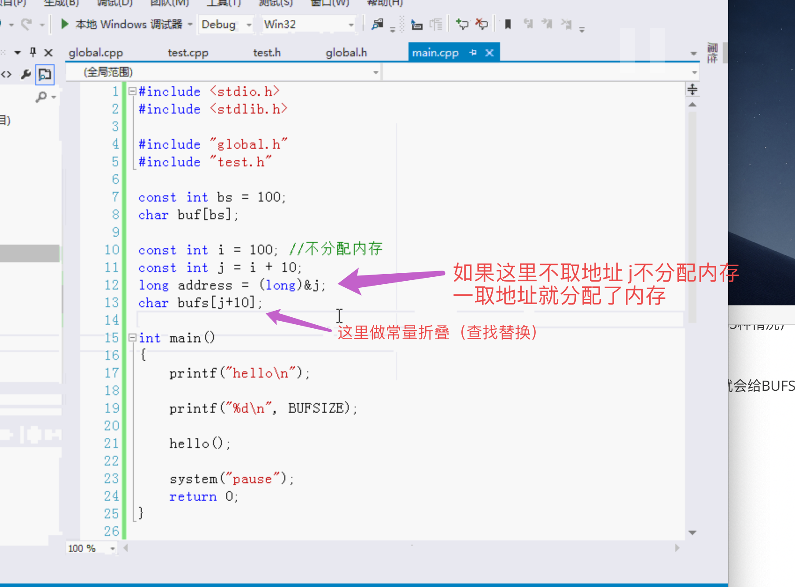
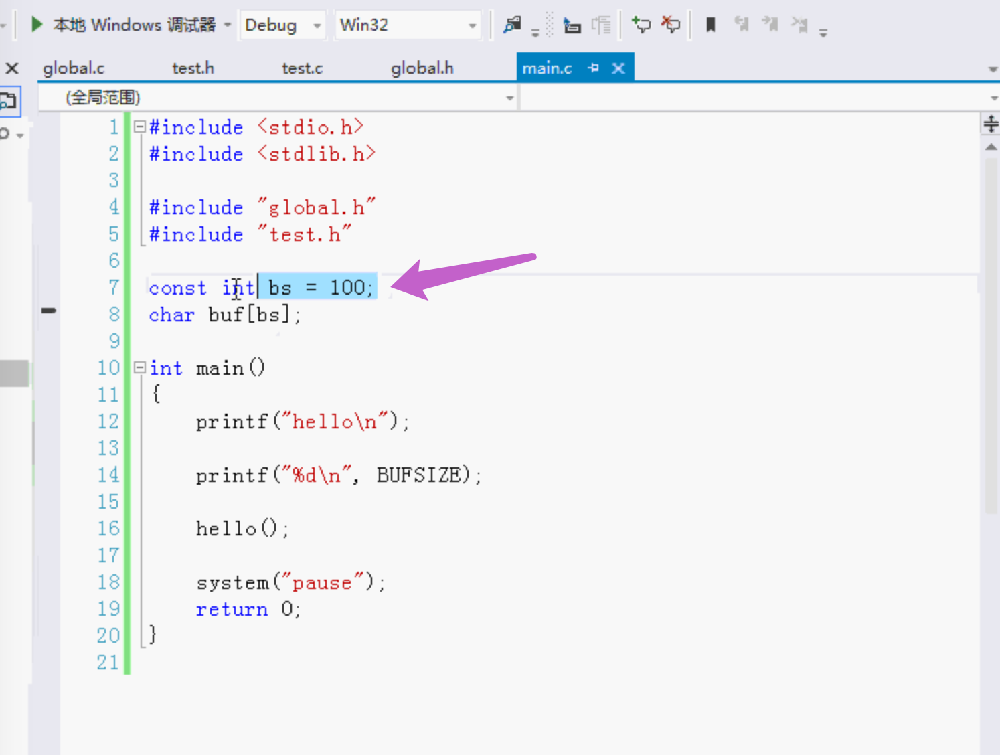

# const

const在其他文件使用，C++用的多。

C语言

- 默认是外部链接性

  在C语言中（**外部链接性**）

  在C语言会出现重复定义	因为C语言const默认外部链接性，**其它文件引用包含const的头文件的时候 预处理 相当于把头文件换成了const的定义 所以会有多处的重复定义**。

  C语言使用const必须写一个源文件，默认外部链接性，extern做一个声明（引用）。

- 不能改变内容的普通变量（常量）

- 总是分配内存空间

C++

- 默认是内部链接性

  在C++中 （**内部链接性**）

  但是在C++中可以。因为在C++中const默认的链接性是内部链接性。即使头文件被包含，头文件替换对应的定义，但是是内部链接性，所以不会出错。

  C++可以直接在`.h`头文件使用。

- 保存在符号表里，进行常量折叠（如同使用#define一样）

- 通常并不会分配内存空间，有时会分配内存空间
  1. 使用外部链接性
  2. 取地址
  3. 用于集合

#### C语言中

把头文件里的const变成一个声明，`extern const int BUFSIZE;` 	外部常量声明

在源文件里`const int BUFSIZE = 100;`  全部的外部常量

引入头文件，因为替换的时候都是声明，所以就没有问题了。

#### C++：内部链接性

高级：

C++中 不会每次都把引用的头文件替换成对应的常量定义，那样多个文件引入头文件，就会有多处替换，重复 低效率。

#define就是文本替换，const是常量折叠，在常量表中去查找替换。

C++中并没有定义一个常量分配内存，而是做了一个常量折叠。

---

C语言里 总是分配内存

C++里 通常不分配内存，有时也会分配内存（除非是上图中的下面的3种情况）

1. 使用外部链接性

   在源文件中使用`extern const int BUFSIZE = 100; `这样C++就会给BUFSIZE分配内存。（这是定义）

   在头文件中声明`extern const int BUFSIZE;。` （这是声明）

   这样的就是外部链接性 分配内存。

2. 取地址

   

   

3. 用于集合

   数组，struct，类

   普通的可以放到符号表里，所以不分配内存，而数组值太复杂了，不能放符号表里。

### 分配内存 只有在运行的时候才有值 在编译的时候值是未知的

- `#define` 在预处理的时候。#define会做一个文本查找替换。

  预处理器做的替换，无法检查类型。

- `const` 编译器会把`BUFSIZE` 放到符号表里，没有分配内存。编译的时候都把BUFSIZE换成100。

  编译器做的常量折叠，首先会检查类型。通过安全之后才替换。

### 程序执行四个重要步骤

> 预处理 -> 编译 -> 汇编 -> 链接

上图在编译的时候

C语言不知道bs值是多少，在运行的时候才知道是100，并且不能改。所以C语言中编译的时候会出错。

但是在C++中可以，并不给bs分配内存，只做常量折叠（查找替换），把bs放符号表里，编译的时候查找，知道bs是100。

