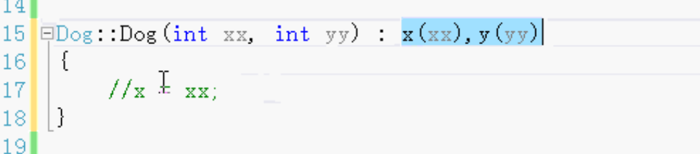
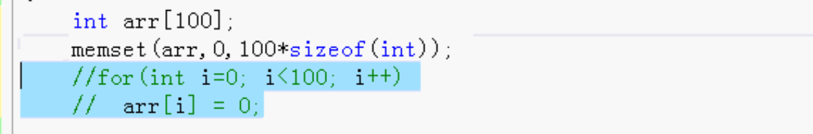
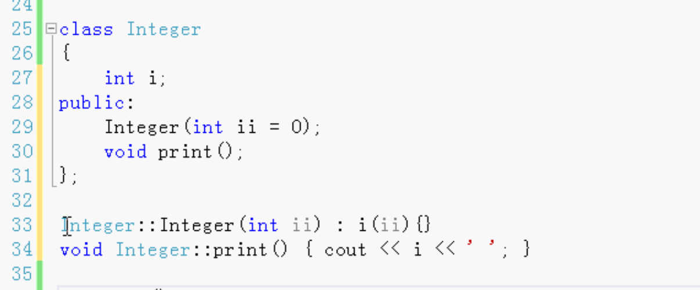
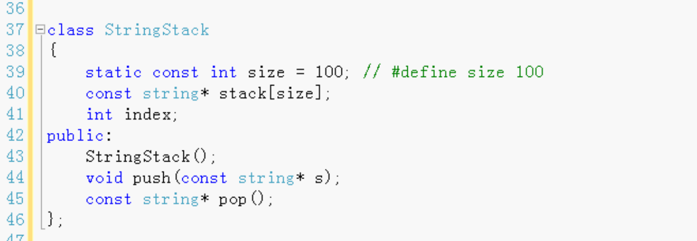
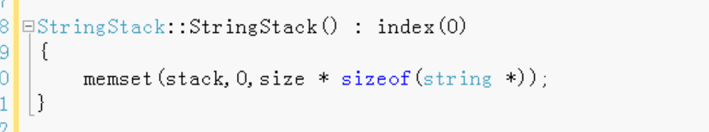
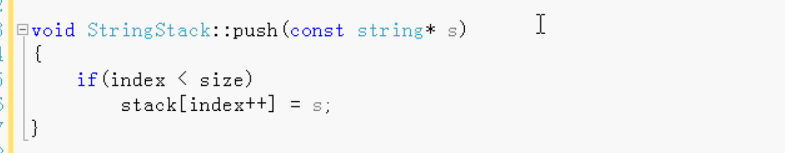
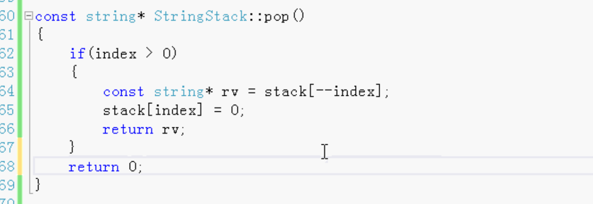
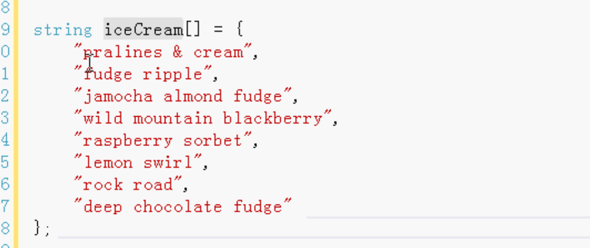
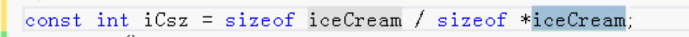
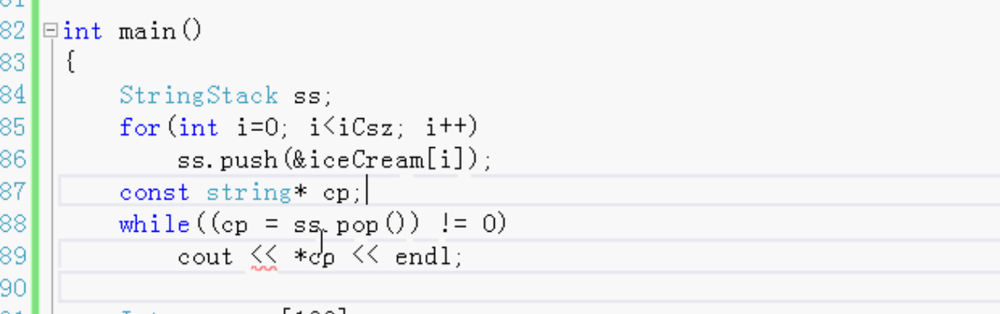

# 常量-类里的const数据成员

- 静态和非静态const数据成员
- 构造函数初始化列表
- 内部类型的构造函数
- 编译期间类里的常量，static const


数据类型：

- 常数据成员：

  const int y;	一经赋值就不能修改。

- 静态的常数据成员: 

  static const int z;	所有的对象共用的，而且只有一个。

- 静态非常数据成员：

  static int z;	不是常 也是公用的。可读写可修改。

常（const）只能初始化，初始化之后就不能修改了。


## 构造函数初始化列表：

const要在列表里初始化。


C++会先执行初始化列表 在进行构造函数里的赋值。




下面两个写法一样：

```c++
Int i = 12;

int j(12);//调用int的构造函数对j初始化。只有C++可以
```


只有**静态**常量才可以在类中初始化。

只有static const 才可以在类中初始化， const 不可以在类中初始化。

例：

在类中

static const int z = 100;//对的。 编译时常量 所以可以这样写

const int y = 200;//错的。	运行时分配内存，编译时没有分配内存 不能初始化。初始化列表进行初始化。


### 初始化：



for循环或者memset。 两个一样。

### C++包装 

##### 例1:

包装int 使int可以自动的初始化



使用：

```
Integer arr[100];//会自动的初始化
arr[100].print();
```

##### 例2:

#### 字符串堆栈：

数组里面有100个 指向字符串的指针

push的时候是放的字符串的指针，



index 栈顶位置

###### 构造函数：



Push：

把一个字符串放入到堆栈里。如果堆栈满了就不能放。



Pop：

把栈顶字符串取出来。

如果堆栈空 则不能取。不是空的 则可以取字符串。




取走之后，就没有了，栈顶位置指针指向置为空。


使用：

1. 先定义一个字符串数组

   

2. 获取数组大小

   整个数组大小除以第一个（数组的名称就是指向的第一个）的大小 就是数组的个数

   


3. 使用自己写的字符串堆栈

   堆栈里保存的是指针。所以放的时候是放地址。

   