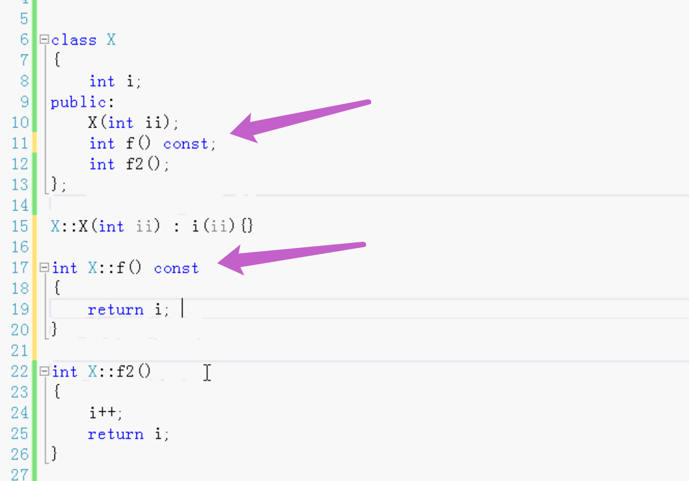
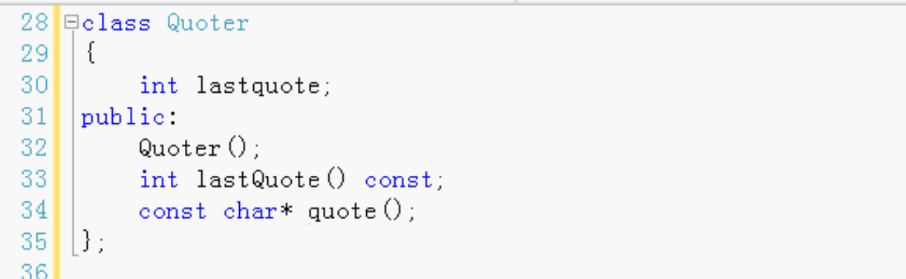
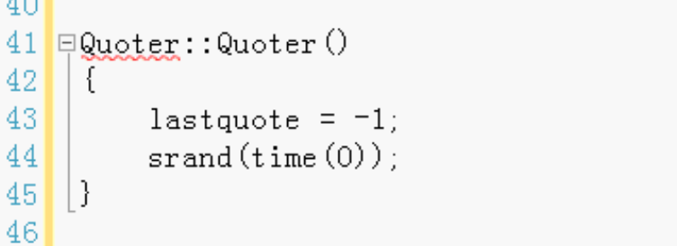
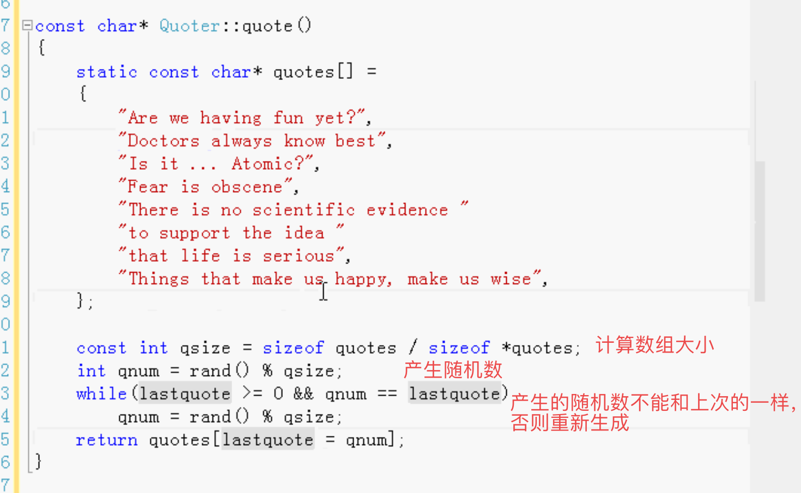
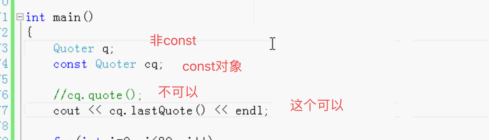
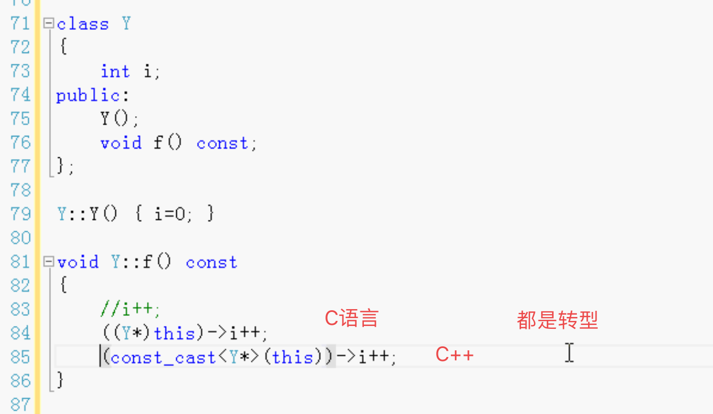
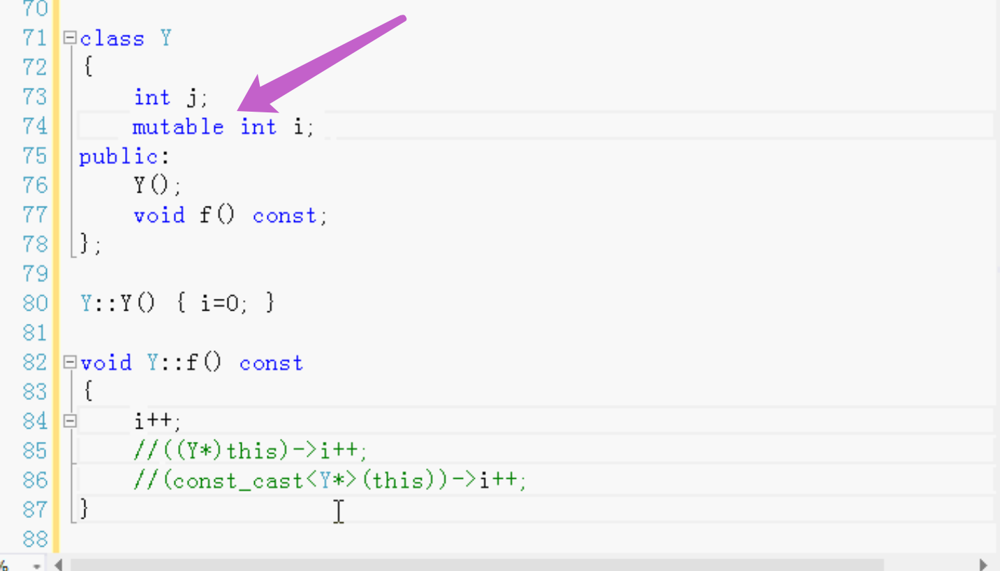

常量-const

- const对象
- const成员函数
- const对象只能调用const成员函数

类可以创建const对象 也可以创建非const对象。

const对象只能调用类里面的const成员函数。

const对象 

const对象里面的数据不允许被修改

const对象可以调用没有对数据进行修改的成员函数，不可以调用对数据修改的成员函数。

成员函数用const修饰，表示没有对成员变量进行修改。

对数据进行的修改的成员函数，不能用const。不然会报错。

使用了const就不能对数据进行修改。

const对象可以调用const成员函数。不可以调用非const成员函数。

根本原因就是能修改不能修改的问题。

编程中如果不使用const对象 那么类就不需要const成员函数。

如果使用了const对象，因为不知道成员函数是否对数据进行了修改，所以必须指定const修饰函数。

类不知道创建的对象是否是const，所以创建类的时候，就把成员函数该加const的就加上，能加的就加，这样使用这个类的时候，创建对象可以const可以非const。

例：

lastquote上次产生的随机数（用作数组下标）。

构造函数：

const成员函数：

直接返回的上次随机数，不修改。

计算数组大小

是否和上次的随机数相同，新产生的随机数不能和上次的一样，要产生不一样的。

测试：

##### const对象只能调用const函数。不能调用非const。

##### 非const对象可以调用const函数。也可以调用非const。

特殊情况：

如果const成员函数 想要对数据进行修改。

C语言 通过this指针转变成非const，对数据进行修改。

C++ 同理	都是通过转型。

后来的C++

通过mutable 修饰的成员变量 在const成员函数中就可以修改。

成员函数是const

const是写在函数后面

写在前面的 可能是函数返回值是const。

