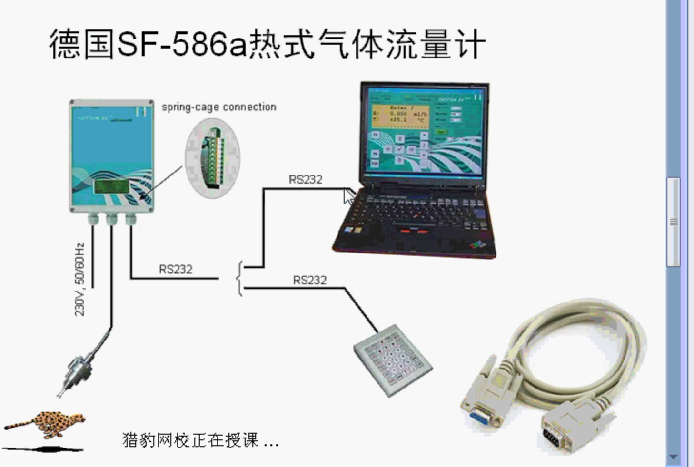
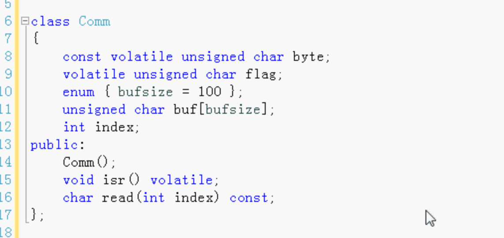
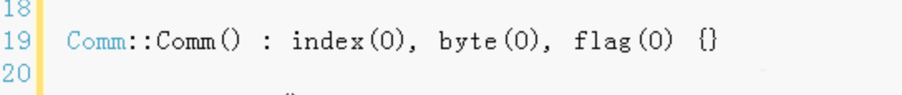
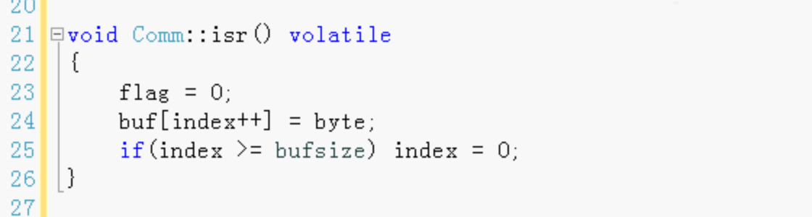
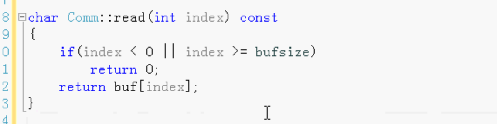
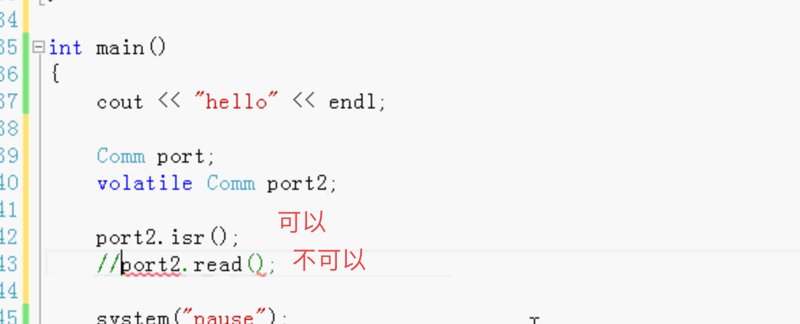

C-V 限定词

- const
- volatile （易变的）
- 和const一样，可以用数据成员、成员函数、和对象本身使用volatile

const和volatile可以一起组合使用

volatile用于对硬件开发。

例：

Comm相当于图中的电脑

byteC++代码不能修改，但是可以被外部设备改变。

buf 缓存区 是一个数组

index 操作数组的下标

写volatile主要是为了告诉C++编译器 不要对byte和flag这两个变量进行优化。

凡是和硬件有关的都定义成volatile。告诉C++ 不要对它进行优化。

volatile易变的。

构造函数：

读取：

volatile和const一样，我们可以把一个成员函数（数据成员）定义成const，也可以把一个成员函数定义成volatile。

volatile和const可以组合使用，C++不可变，但是其他的硬件设备可以改变 或者多线程。

volatile告诉C++不要对它优化，如果优化了可能接收不到数据或数据错误。

const对象只能调用const函数

volatile对象只能调用volatile函数

