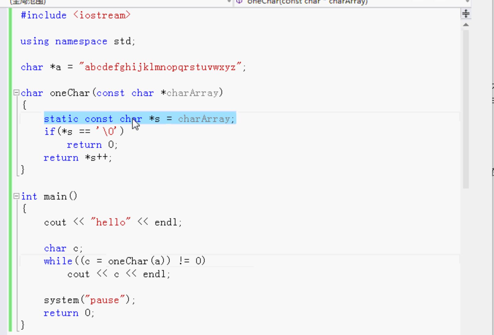

# 函数内部的静态变量

- 使用static定义变量
- 静态数据区

### 函数内部：

##### 普通的变量：

不是静态的，在堆栈上分配存储空间。

调用一次函数就结束了，变量就没有了。

调用的时候在堆栈上分配内存，结束之后变量就没了。

下次再调用的时候，会重新生成新的变量。

##### 静态的变量：

不是在堆栈上，在静态数据区，第一次的时候分配变量内存，调用结束后，静态数据区变量没有撤销，一直保存，还存在，第二次调用函数，还是用的之前的变量。每次用的都是之前的数据。

静态数据区一直等程序停止才会消失。

函数内部的静态变量，不能在其它函数里调用，因为是在函数自己的内部。

作用域只在自己函数内部。

只是生命期延长了，用的值是同一个变量。

如果不用函数内部的静态变量，则需要使用全局变量。

尽可能的不要使用全局变量。

使用静态变量是一个非常好的设计方法。

例：

鼠标指向的那行，static 只执行一次， 赋一次值。 以后都是同一个s。

运行结果会把每一个字符输出。