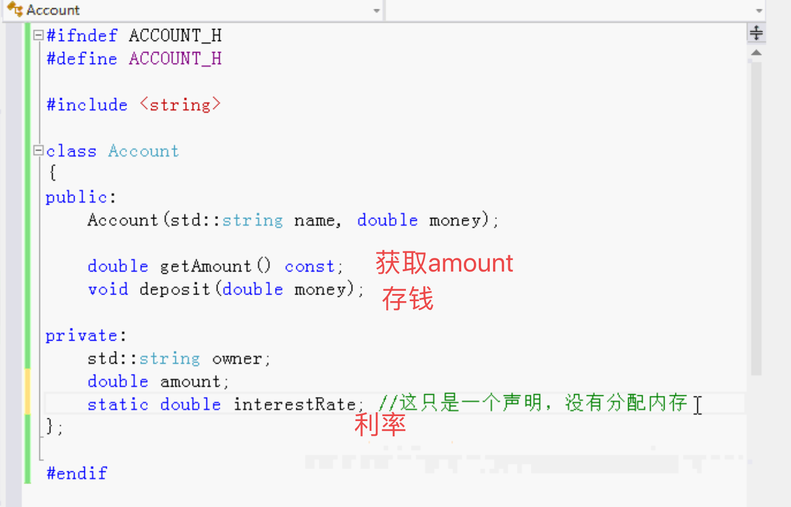
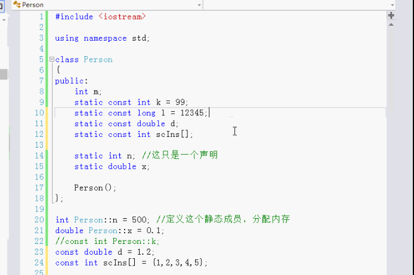
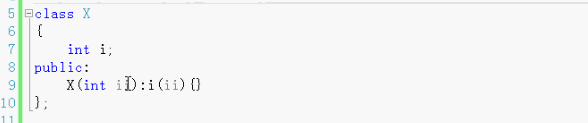
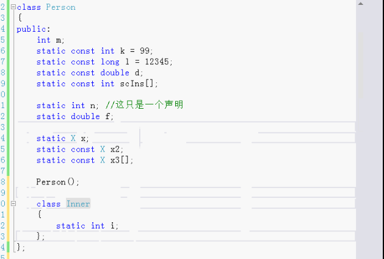
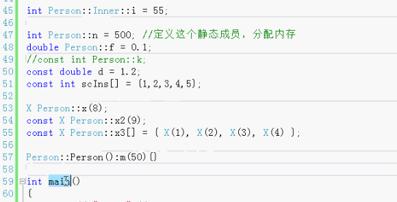
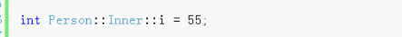
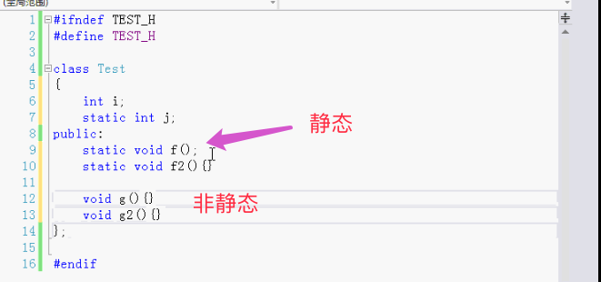
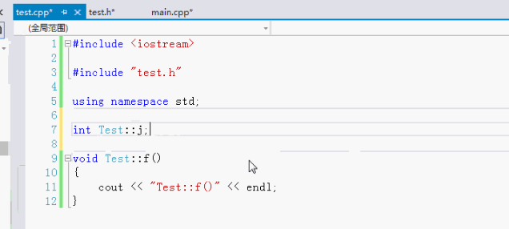

# 静态成员

- 静态数据成员
- 静态成员函数
- 静态数据成员的存储定义和初始化
- 嵌套类和局部类的静态成员
- 静态成员函数只能访问静态数据成员，只能调用静态成员函数


#### 例：

银行账号：

构造函数：

私有成员变量：

- 姓名
- 金额


存钱银行会给利息，每一个人的利率都是一样的。不需要给每个人一个利率。改变利率也不方便。

利率做成全局变量也可以，但是不太好。因为只有账号的类需要使用，其它的类不需要使用。

所以写在类里面，做成静态的。这就叫静态数据成员。C++会把它保存在单独的数据区里。



interestRate在.h文件中只是声明，没有分配内存。不能初始化。

还需要在.cpp中定义。并且还可以初始化。statci不需要写。在这时分配内存。

要想修改静态的成员函数（利率），定义的函数也得是静态的。只有静态成员函数才能访问静态数据成员。

修改静态数据成员的函数写成静态的，这样就可以用类去调用，而不是某一个对象去调用。

静态成员函数 可以用类直接调用。而不是某一个对象（也可以通过一个对象来调用静态成员函数，但是不好）。


静态的函数只能使用静态的数据成员，不能使用非晶态的。也不能调用非晶态的成员函数。

静态函数的只能使用静态的数据和函数。

非晶态成员函数可以访问静态的成员函数。也可以调用静态的数据成员。


静态的数据成员不属于任何对象，所以不能够使用`this->`。属于类，不属于任何对象。

非静态的成员函数才可以用`this->`。

通过类直接调用静态的成员函数。


静态成员函数和静态数据成员是全局函数全局变量的改进。


非静态成员也叫实例成员，静态成员也叫类成员。是所有的类的对象共享的。

```
class Person
{
  int m;
  static int n; 	//这只是一个声明，
}

int Person::n;	//	定义这个静态成员，分配内存。如果没有这一行，后面使用n 改变n的值不会起作用，因为没有分配内存。
```

m：每个person对象都有一个自己的m

n：所有的person共用一个。


非静态的成员，在创建对象的时候分配内存。

静态的成员，因为它不属于对象，所以创建对象的时候并不会分配内存。需要在写一行定义，分配内存。


静态的成员是和类关联在一起。


构造函数后面加一个冒号：初始化列表，但是不能初始化静态成员，因为静态的成员不属于一个对象，

静态成员不是一个对像的组成部分。


对静态成员初始化是直接分配内存的时候初始化：

```
int Person::n = 200;
```


非静态的可以在构造函数初始化列表初始化，静态的不可以。


在类的外面定义 分配内存 初始化。在类里声明。

例外：

静态的常量的整型 可以在类里面初始化。

这个例外仅仅是针对静态的常态的整型。数组 double都不行。




静态成员也可以是自定义的类型。一个自己写的类class。





定义 分配内存：



#### 嵌套类：

类person中还可以再做一个类，

嵌套类的初始化：




#### 局部类：

在一个函数的内部定义一个类

在复杂的数据结构中，嵌套类是可以定义静态成员的，局部类不可以定义静态成员。


#### 主要：

声明和定义


# 静态成员函数

类里面有静态成员函数



可以通过对象来调用f。

还可以通过类调用f，不需要创建对象。

静态的成员函数相当于是对象共用的全局函数，和类关联在一起的。通过类调用。

静态的数据成员，在源文件中要写上定义：

也可以进行初始化



- 静态的函数

  可以对静态成员操作，不可以对非静态成员操作。可以调用静态函数，不可以调用非静态的。

  静态的是所有对象共用的，属于类。

  静态成员 静态函数：相当于全局函数。全局变量。但并不一样，是在类里的。

  静态成员静态函数替代全局成员全局函数。这样写比较好。

- 非静态函数：

  可以对非静态的变量操作，可以对静态的操作。可以操作自己的，可以操作共用的。

  可以调用普通非静态函数，也可以调用静态的函数。


