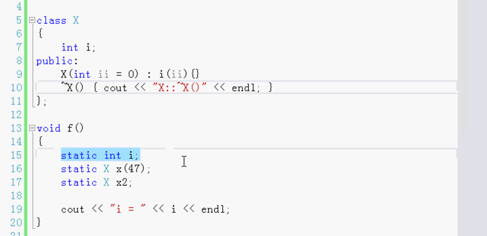
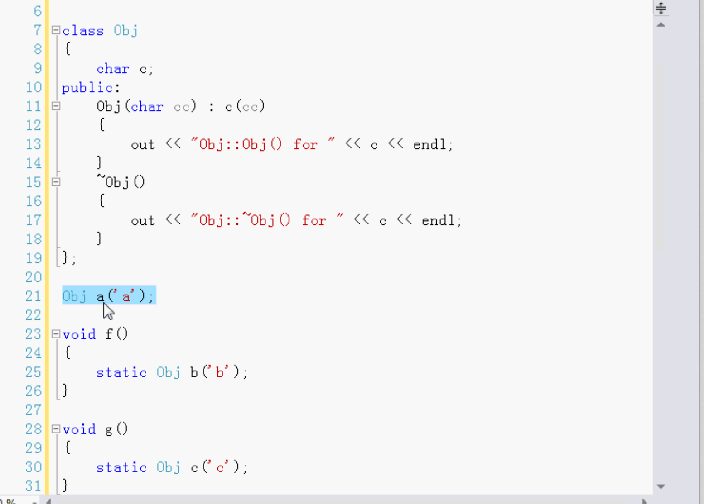
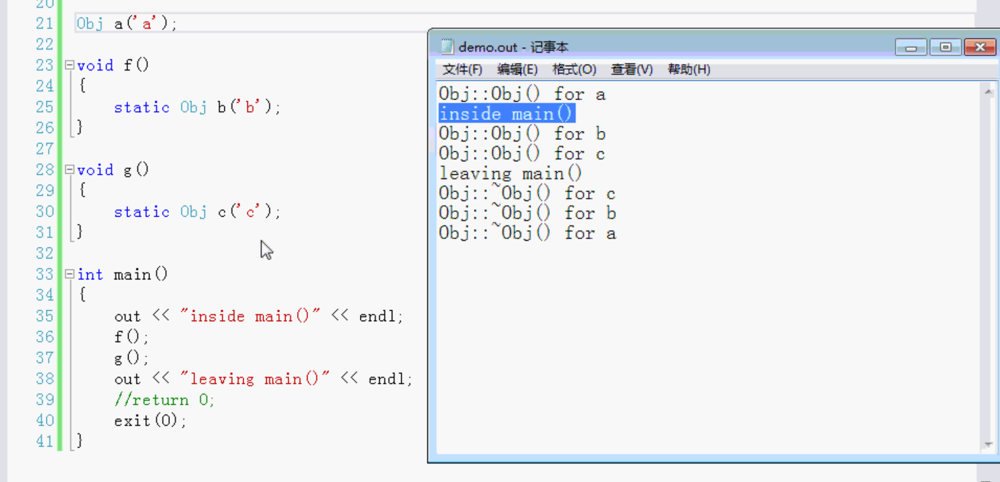

# static

## 函数内部的静态变量

- 使用static定义变量
- 静态数据区，静态数据区一直等程序停止才会消失。

### 函数内部的变量

#### 普通的变量：

调用的时候在堆栈上分配内存，函数调用结束之后变量就没了。

下次再调用的时候，会重新生成新的变量。

#### 静态的变量：

不是在堆栈上，在静态数据区，第一次的时候分配变量内存，调用结束后，静态数据区变量没有撤销，一直保存，每次调用函数，用的都是之前的变量数据。

函数内部的静态变量，不能在其它函数里调用，作用域只在自己函数内部。

只是生命期延长了，用的值是同一个变量。

如果不用函数内部的静态变量，则需要使用全局变量。

尽可能的不要使用全局变量，使用静态变量是一个非常好的设计方法。

例：

```c++
#include <iostream>

using namespace std;

char *a = "abcdefghijklmnopqrstuvwxyz";

char oneChar(const char *charArray) {
	  //static 只执行一次， 赋一次值。 以后都是同一个s。
    static const char *s = charArray;
    if (*s == '\0') {
        return 0;
    }
    return *s++;
}

//运行结果会把每一个字符输出。
void test() {
    char c;
    while ((c = oneChar(a)) != 0) {
        cout << c << endl;
    }
}
```

## 静态数据成员和静态成员函数

### 静态数据成员

存钱银行会给利息，每一个人的利率都是一样的，不需要给每个人一个利率。改变利率也不方便。

利率做成全局变量也可以，但是不太好。因为只有账号的类需要使用，其它的类不需要使用。

所以写在类里面，做成静态的。这就叫静态数据成员。C++会把它保存在单独的数据区里。

```c++
//银行账号
class Account {
public:
    Account(std::string name, double money);
    double getAmount() const;//获取Amount
    void deposit(double money);//存钱
private://私有成员变量
    std::string owner;//姓名
    double amount;		//金额
    static double interestRate;//利率。这只是一个声明，没有分配内存
};
```

interestRate在.h文件中只是声明，没有分配内存。不能初始化。

还需要在.cpp中定义。并且还可以初始化。static不需要写。在这时分配内存。

#### 静态成员函数只能访问静态数据成员，只能调用静态成员函数

要想修改静态的成员函数（利率），定义的函数也得是静态的。只有静态成员函数才能访问静态数据成员。

修改静态数据成员的函数写成静态的。

静态的成员函数，用类去调用，而不是某一个对象。

静态的函数只能使用静态的数据成员和函数，不能使用非静态的成员，也不能调用非静态的成员函数。

非静态成员函数可以访问静态的成员函数。也可以调用静态的数据成员。

静态的数据成员属于类，不属于任何对象，所以不能够使用`this->`。

非静态的成员函数才可以用`this->`。

**静态成员函数和静态数据成员是对全局函数全局变量的改进。**

#### 静态数据成员的存储定义和初始化

非静态成员也叫实例成员，静态成员也叫类成员，是所有的类的对象共享的。

```c++
class Person
{
  //每个person对象都有一个自己的m
  int m;
  //所有的person共用一个n
  static int n; 	//这只是一个声明，
}

int Person::n;	//	定义这个静态成员，分配内存。如果没有这一行，后面使用n 改变n的值不会起作用，因为没有分配内存。
```

非静态的成员，在创建对象的时候分配内存。

静态的成员，因为它不属于对象，所以创建对象的时候并不会分配内存。需要再写一行定义，分配内存。

静态的成员是和类关联在一起。

构造函数后面加一个冒号：初始化列表。非静态的可以在构造函数初始化列表初始化，但是不能初始化静态成员，因为静态的成员不属于一个对象，

静态成员不是一个对象的组成部分。

对静态成员初始化是直接分配内存的时候初始化：

```c++
int Person::n = 200;
```

在类的外面定义 分配内存 初始化。在类里声明。

#### 嵌套类和局部类的静态成员

例外：

静态的常量的整型 可以在类里面初始化。

这个例外仅仅是针对静态的常态的整型。数组 double都不行。

```c++
#include <iostream>
using namespace std;

//静态成员也可以是自定义的类型。一个自己写的类class。
class X {
    int i;
public:
    X(int ii):i(ii){}
};

class Person {
public:
    int m;
    static const int k = 99;
    static const long l = 12345;
    static const double d;
    static const int scIns[];
    
    static int n;//这只是一个声明

    static X x;
    static const X x2;
    static const X x3[];
    
    Person();
    
    //嵌套类
    class Inner {
        static int i;
    };
};

//定义 分配内存
int Person::Inner::i = 55;
int Person::n = 500;//定义静态常量，分配内存
const double d = 1.2;
const int scIns[] = {1,2,3,4,5};

X Person::x(8);
const X Person::x2(9);
const X Person::x3[] = {X(1), X(2), X(3), X(4)};
```

#### 局部类：

在一个函数的内部定义一个类

在复杂的数据结构中，嵌套类是可以定义静态成员的，局部类不可以定义静态成员。

#### 主要：

声明和定义

### 静态成员函数

```c++
#include <iostream>
using namespace std;
class Test {
    int i;
    static int j;
public:
    //类里面有静态成员函数
    static void f();//静态
    static void f2(){}
    
    void g(){}//非静态
};

int Test::j;
void Test::f() {
    cout << "Test::f()" << endl;
}
```

可以通过对象来调用f。还可以通过类调用f，不需要创建对象。

静态的成员函数相当于是对象共用的全局函数，和类关联在一起的，通过类调用。

静态的数据成员，在源文件中要写上定义：

也可以进行初始化

- 静态的函数

  可以对静态成员操作，不可以对非静态成员操作。可以调用静态函数，不可以调用非静态的。

  静态的是所有对象共用的，属于类。

  静态成员 静态函数：相当于全局函数。全局变量。但并不一样，是在类里的。

  静态成员静态函数替代全局成员全局函数。这样写比较好。

- 非静态函数：

  可以对非静态的变量操作，也可以对静态的操作。可以操作自己的，可以操作共用的。

  可以调用普通非静态函数，也可以调用静态的函数。

## 静态对象

- 函数内部的静态对象
- 静态对象的析构函数
- 全局静态对象

静态对象和普通的静态变量是一样的，普通的静态变量是C++内置的类型，静态对象是我们自己写的类型。



静态变量，C++会自动的初始化，i默认值是0。x会调用X类的无参数的构造函数，或者是有参数并且参数有默认值的构造函数。有参数没有默认值的话会报错。

因为是静态的，只有整个程序运行结束之后，才会调用析构函数。



a是全局的对象，b和c是函数内部的 静态对象，全局对象也是静态的。



结束之后要把所有的静态对象销毁。调用析构函数。销毁的顺序是创建的顺序相反的。

全局的静态对象是什么时候构建的：在main函数之前就创建了

全局的对象前面加static是其它的意思。有其他功能。

static在不同的地方的含义是不同的。