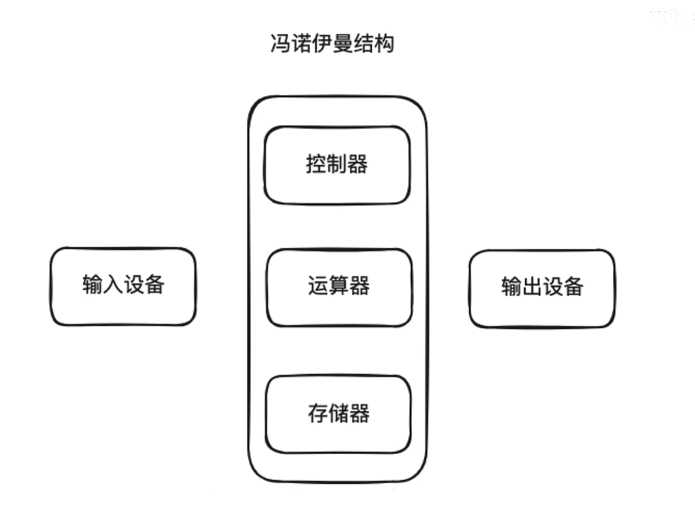

# IO

计算机组成原理中，会接触到冯诺依曼结构。

上面的输入输出就代表了IO的过程

IO主要是磁盘IO和网络IO。

如果每个应用都直接去操作磁盘或者网络的话，操作系统就乱套了，为了将应用程序的执行环境和操作系统内核的执行环境隔离开来，操作系统划分了用户空间和内核空间。

应用运行在用户空间，一些系统性的操作都在内核空间完成，当用户空间的程序想要使用系统性操作，比如操作系统磁盘IO的时候，需要向内核空间发起一次系统调用（System Call）。

### 同步阻塞IO模型

应用程序发起一个读数据的请求，内核空间去准备数据，数据准备就绪之后，把数据拷贝给应用，这个过程中线程一直处于堵塞状态，这就是同步阻塞IO模型。

### 同步非阻塞IO模型

应用程序发起读IO请求后，会立即返回执行其它的任务，但是需要周期性的轮询去确定数据是否准备好，等到数据准备就绪后，执行从内核空间拷贝数据到用户空间的操作，这个拷贝过程依旧是阻塞的，这个过程比较消化CPU。

### IO多路复用模型

Linux中的select、poll、epoll都可以实现IO多路复用模型，在这个模型下，应用程序可以同时监视多个IO操作，当发现有数据准备就绪之后，内核系统会通知应用，这个时候应用再来读取数据，实现从内核空间到用户空间的数据拷贝，这个拷贝过程依旧是阻塞状态。IO多路复用相比轮询方式，显著减少了对CPU的消耗。

### 异步IO模型

比IO多路复用模型更快的模型，AIO基于回调机制实现。首先也是发起一个读请求，但是会直接返回，接着就不需要再管了，当数据准备完成后会通过回调的方式去做数据的拷贝。