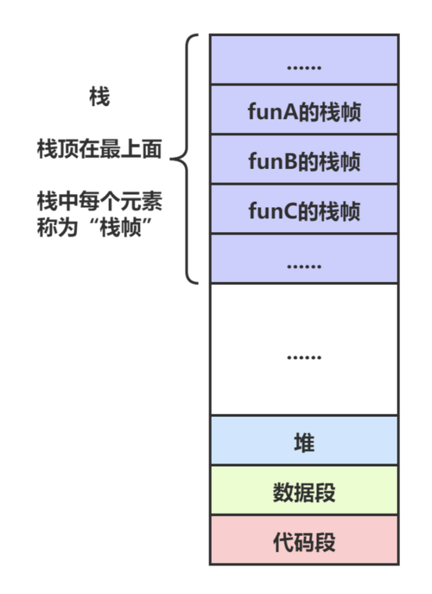
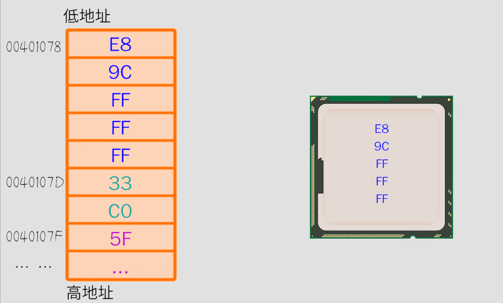

# 内存管理



CPU内部有个核心模块叫ALU，专门用来做逻辑运算和数学计算，比如1+1=10。

人类做算数运算的时候，如果算式比较复杂（例如：9527+2233+666），没法一次性算出结果，会先计算9527+2233，得到临时结果11760，再把临时结果和666相加。同理，在算式复杂的时候ALU也是这么做的，把临时结果找个地方存放一下。

于是工程师在CPU中又设计了一些可以存放数字的模块，叫做寄存器（AX、BX、CX、DX等）。ALU把临时结果保存在寄存器中，需要的时候再拿出来用，这就解决了复杂算式分步计算的问题。

为了实现更复杂的计算，能不能做更多的寄存器？

不能，这会增加CPU设计的复杂性以及成本，于是之只能从外部请帮手了，要求：读写速度要快，因为CPU速度很快，内存。

在内存中划出一片专门的区域，用来临时存储数据，这个区域叫做栈stack。（内存中还有一个区域叫堆heap）。

内存：


栈底固定不动，栈顶是可以变化的，堆栈里没有数据的时候，栈顶和栈底是重合的，当需要在栈里存数据的时候，就把栈顶的位置往上挪（即低地址方向），数据放进去，这个动作叫做压栈或入栈PUSH。当需要从栈里取出数据的时候，就先把数据复制到CPU中的寄存器，然后把栈顶的位置往下挪，这个动作叫做弹栈或出栈POP。

**出栈后，这个数据还在堆栈里，但是已经被当作垃圾了。**

### 堆栈在编程中常见的应用

#### 堆栈和函数调用

程序在运行的时候，是以机器码的形式躺平在内存里面的，每一句机器码都有自己的位置，称为地址。



CPU执行程序的时候就是把程序中的每一句机器码挨个拿过来，分析出这句机器码是干啥的，然后做响应的操作，该计算的计算，该取数据的取数据，该跳转的跳转。

函数

函数就是一堆代码的打包。函数调用就是CPU在执行一个函数中的代码时，临时跳转到另一个函数，执行到另一个函数的代码，执行完成之后，再跳转回来，叫做函数跳转和返回。

从函数A跳转到函数B，函数B执行完之后，返回到原来的函数A。所以跳转的时候，CPU把函数A的地址在栈中记下来（入栈），返回的时候就知道执行哪一句了，返回之后再弹栈。

为什么用栈

函数调用都是嵌套的，A函数调B函数，B函数调C函数...

每一次函数调用都会消耗堆栈的空间，而整个堆栈的大小是有限（固定大小）的，如果函数无限调用下去而从来不返回，堆栈就被塞满了，这个时候再试图把数据压栈就会导致错误，叫做堆栈溢出（Stack Overflow），程序就崩溃了。

## 内存5⼤区

### 堆区heap

存放通过 alloc ， new ， malloc 等创建出来的变量。 ⼀般以0x6开头。

### 栈区stack

存放局部变量，⽅法参数，对象的指针 等。 

栈是线程独有的，栈在线程开始的时候初始化，每个线程的栈互相独⽴。⼀般以0x7开头。

栈的内存⼤⼩有限，主线程1MB，其他线程512KB 。

### 全局区、静态区、常量区

存放全局变量、static静态变量、const常量。 ⼀般以0x1开头 。

内存在编译阶段进⾏分配，程序运⾏时会⼀直存储在内存中，只有当程序结束后才会由操作系统释放。

### 代码区

存放编译⽣成的⼆进制代码。

栈、静态区由系统处理，程序员管理的是堆区。

## 内存管理方案

对象的管理机制，ARC，MRC，自动释放池管理，小对象管理，线程池，GC 垃圾回收机制。

NONPOINTER_ISA ， Tagged Pointer ， SideTable

### tagged pointer 

Tagged Ponter 针对的是⼩对象类型，⽐如NSNumber、NSDate、NSString、NSIndexPath（跟长度有关系）。

Tagged Pointer 是⼀种被打上了tagged标记的指针（指针+值）。

Tagged Pointer 指针，它表示的不再是地址，⽽是真正的值。小对象不受retain release影响，能够⼤幅度的提升它的访问速度和创建销毁的速度。**因为在栈上，不必在堆上为其分配内存，节省了很多内存开销。**

在性能上， Tagged Pointer 有3倍的空间效率的提升，以及106倍的创建和销毁速度的提升。

### NSString

NSString是一个类簇（Class Clusters），最后生成的对象类型，取决于我们调用的初始化方法。不同的对象类型的管理方式不一样（在retainCount上有所体现）

<table> 
  <tr><th>类型</th><th>初始化后的retainCount</th><th>说明</th></tr>
  <tr><td>__NSCFConstantString</td><td>-1</td><td>系统维护，reatin和release不起作用（程序中内容相同的常量字符串只有一个）</td></tr>
  <tr><td>__NSCFString</td><td>1</td><td>与其它OC对象一样维护retainCount</td></tr>
  <tr><td>__NSTaggedPointerString</td><td>-1</td><td>reatin和release不起作用</td></tr>
</table>
## 引用计数

Objective-C提供了三种内存管理方式：manual retain-release（MRR，手动管理），automatic reference counting（ARC，自动引用计数），garbage collection（垃圾回收）。iOS不支持垃圾回收。

内存管理的目的是：

1. 不要释放或者覆盖还在使用的内存，这会引起程序崩溃；

2. 释放不再使用的内存，防止内存泄露。内存资源是宝贵的。

MRR手动管理内存基于引用计数，需要开发者发消息给某块内存（或者说是对象）来改变这块内存的引用计数以实现内存管理

ARC技术则是编译器代替开发者完成相应的工作。

**一块内存如果计数是零，也就是没有使用者（owner），那么objective-C的运行环境会自动回收这块内存。**

**objective-C的内存管理遵守下面这个简单的策略：**

注：文档中把引用计数加1的操作称为“拥有”（own，或者take ownership of）某块对象/内存；把引用计数减1的操作称为放弃（relinquish）这块对象/内存。拥有对象时，你可以放心地读写或者返回对象；当对象被所有人放弃时，objective-C的运行环境会回收这个对象。

1. 创建对象

   alloc，new，copy或者mutalbeCopy等方法创建的对象的初始引用计数是1。

2. 给对象发送retain消息后，你拥有了这个对象

3. 不需要使用该对象时，发送release或者autorelease消息放弃这个对象

4. 不要对不拥有的对象发送“放弃”的消息

注：简单的赋值不会拥有某个对象。比如：

```objective-c
NSString *name = person.fullName;
```

上面这个赋值操作不会拥有这个对象（这仅仅是个指针赋值操作）；这和C++语言里的某些基于引用计数的类的行为是有区别的。想拥有一个objective-C对象，必须发送“创建”或者retain消息给该对象。

dealloc方法

dealloc方法用来释放这个对象所占的内存(包括成员变量)和其它资源。

**不要使用dealloc方法来管理稀缺资源，比如文件，网络链接等。因为由于bug或者程序意外退出，dealloc方法不能保证一定会被调用。**

### Accessor Methods和内存管理

Accessor Methods，也就是对象的property（属性）的getter和setter方法。显然，如果getter返回的对象已经被运行环境回收了，那么这个getter的返回值是毫无意义的。需要在setter方法里“拥有”相应的property。

```objective-c
@interface Counter : NSObject
@property (nonatomic, retain) NSNumber *count;
@end

//getter方法仅仅返回成员变量就可以
-(NSNumber *)count {
  return _count;
}

//setter方法需要保证对这个成员变量的“拥有”：
-(void)setCount:(NSNumber *)newCount {
  [newCount retain];          //拥有新值
  [_count release];             //放弃老值
  _count = newCount;       //简单赋值
}
```

## retain流程

- 判断是否是 Tagged Pointer ， Tagged Pointer 不需要维护引⽤计数，直接返回。
- 如果不是 Tagged Pointer ，获取对象的 isa ，然后判断是否是 NONPOINTER_ISA
- 如果不是 NONPOINTER_ISA ，交给散列表处理，对其引⽤计数进⾏ ++ 操作，然后返回判断是否正在析构，如果是直接返回。
- 如果是 NONPOINTER_ISA ，对 isa 的 extra_rc 进⾏ ++ 操作。如果超出了 extra_rc 的最⼤存储范围，就将⼀半的引⽤计数保存在 extra_rc ，并且把 isa的 has_sidetable_rc 置为1，然后将另⼀半的引⽤计数保存到散列表

当引⽤计数超出isa的extra_rc的最⼤存储范围时，为什么要extra_rc和散列表中各存⼀半，而不是把所有的引⽤计数的值都存到散列表⾥⾯？

通过isa可以很容易的拿到extra_rc，通过extra_rc进⾏引⽤计数的存储是很⽅便的。散列表是先拿到SideTable这张表，再在表中拿到引⽤计数表，才能进⾏操作，表操作还要做加锁和解锁操作，⾮常浪费性能。所以SideTable存⼀半，这样的话++和--都能够在extra_rc⾥⾯对引⽤计数进⾏操作，效率更⾼。

## release流程

- 判断是否是 Tagged Pointer ， Tagged Pointer 不需要维护引⽤计数，直接返回
- 如果不是 Tagged Pointer ，获取对象的 isa ，然后判断是否是 NONPOINTER_ISA
- 如果不是 NONPOINTER_ISA ，交给散列表处理，对其引⽤计数进⾏ -- 操作，如果散列表的引⽤计数清零，对该对象执⾏ dealloc 操作，然后返回
- 如果是 NONPOINTER_ISA ，对 isa 的 extra_rc 进⾏ -- 操作，当 extra_rc 计数为0，则需要向散列表的引⽤计数借位
  - 判断 isa 的 has_sidetable_rc 是否为1，如果不为1，对该对象执⾏ dealloc 操作。
  - 如果 isa 的 has_sidetable_rc 为1，获取散列表的引⽤计数，如果散列表的引⽤计数为0，对该对象执⾏ dealloc 操作
  - 如果散列表的引⽤计数⼤于0，将引⽤计数-1，然后存⼊ isa 的 extra_rc

## 散列表

多张散列表Sidetables，8或64张表。

```c++
struct SideTable {
    spinlock_t slock;				//自旋锁。保证线程的读写安全
    RefcountMap refcnts;		//引用计数表，哈希表
    weak_table_t weak_table;//全局的弱引用表。哈希表

    SideTable() {
        memset(&weak_table, 0, sizeof(weak_table));
    }

    ~SideTable() {
        _objc_fatal("Do not delete SideTable.");
    }

    void lock() { slock.lock(); }
    void unlock() { slock.unlock(); }
    void forceReset() { slock.forceReset(); }

    // Address-ordered lock discipline for a pair of side tables.

    template<HaveOld, HaveNew>
    static void lockTwo(SideTable *lock1, SideTable *lock2);
    template<HaveOld, HaveNew>
    static void unlockTwo(SideTable *lock1, SideTable *lock2);
};
```

为什么是Sidetables

多张表的话，如果释放完了可以进行回收这张表。

Teacher Person等等都集中在一个表里，会有性能的消耗。

每个对象都开一张表的话，加锁等也会耗费性能。
