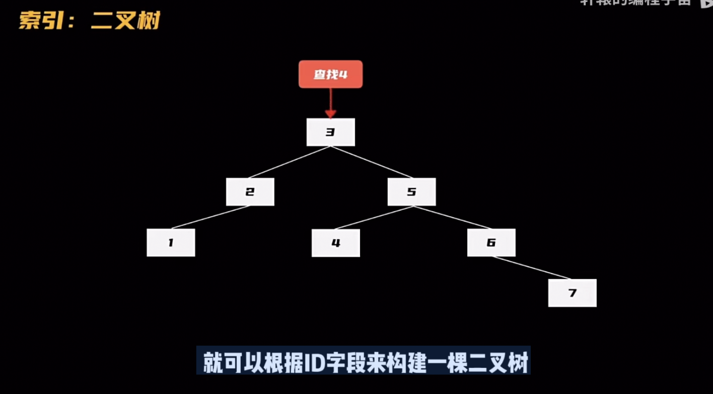
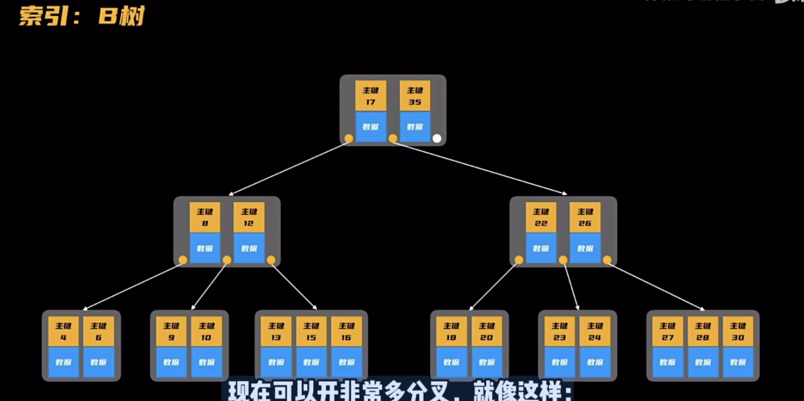
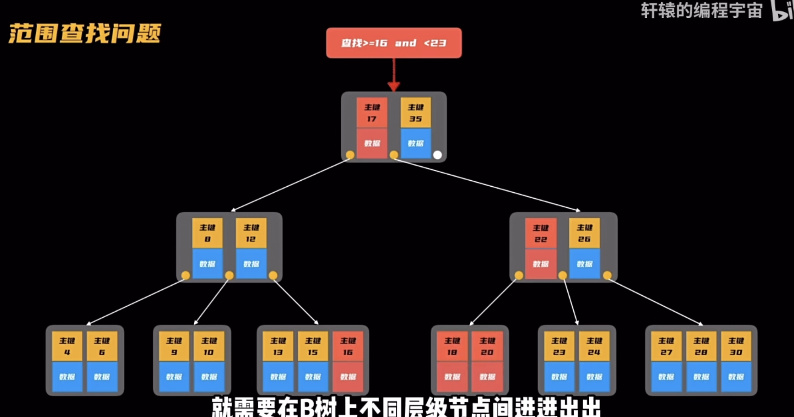
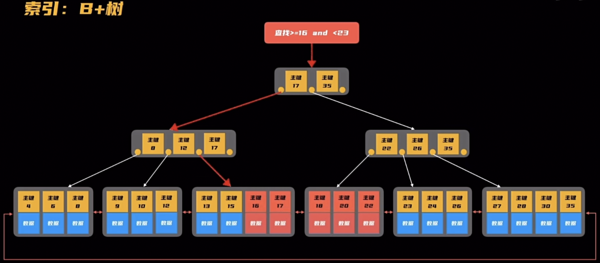

# MySQL

## 索引原理

作为一个数据库，首要任务的就是把数据存储好，并快速地查询出用戶需要的数据。

### 索引：二叉树

有一本数学教材，现在要翻到讲三角函数的那一页，该怎么办？

沒有了目录，就只有两种办法：要么一页一页的翻，要么随机翻。查到找到三角函数的那一页。

对干数据库也是一样的道理，如果数据表没有“目录”，那要查询满足条件的记录行，就得全表扫描。现在的互联网应用，数据量都非常大，百万干万都很常见了，这要是全表扫描，那可就恼火了。

为了加快查询速度，得给数据表也设置目录，这就是素引，想要实现查询，最简单的办法就是二分法查找。比如要根据ID来查找，就可以根据ID字段来构建一棵二叉树。

顺着这棵二叉树，就能找到要查询的內容。但普通的二叉树有一个毛病，随着新的数据节点不断插入，很有可能数据全都插到了同一边去，极端情況下甚至变成了一个链表，为了防止这种情况的出现，可以把二叉树升级一下，变成一棵平衡二叉树。

当数据量变大以后，这棵平衡二叉树就会变得非常高。第一层1个节点，第二层最多2个节点，第三层最多4个，以此类推，即便是存1000行数据记录，二叉树都会变成10层，查找一个数据可能就需要经过多次分叉，每一次分叉都需要读取一次硬盘数据，这样一来，一次查询就要进行多次IO操作，而硬盘的速度慢如蜗牛，要等待这么多次IO的完成，程库员估计急的想砸了我。

### 索引：B树

原来的二叉树一个节点只存储了一个数据，而在B树里**一个节点可以有许多个数据**，并且它们按序排列起来，不仅如此，原来二叉树的一个节点最多只能开两个分叉，现在可以开非常多分叉，就像这样：

查找的时候，先在根节点中查找，因为节点里的所有数据都是有序排列的，在这里面按照二分法就可以快速定位到，如果没查到，就根据数据节点所在的区间来到下一级分叉的节点，继续这个过程，因为分叉很多，所以这棵B树变得非常扁平化，即便是非常大的数据量，也只需要很少几次IO访问就能完成查找，这一下查询速度查接起飞了，有很多数据库小伙伴都采用了B树来作为数据存储和索引的数据结构。

### 索引：B+树

B树还是有一些问题：

查找性能不稳定：有些在根节点或者根节点附近能找到，搜秦起来就很快，如果在叶子节点上，那查询起来就很慢，有的快有的慢，这对追求性能稳定的程序员们来说，就不是太友好。

范围查找问题：它也不适合用来做范国查找（查找>=16 and < 23），因为数据散落在不同的节点上，要查询某个范围的数据，就需要在B树上不同层级节点间进进出出，非常麻烦。

所以在B树基础上，改进了一下

- 把数据全部都放在叶子节点上，这样不管查询㖿个数据，最终都会走到叶子结点，解决了查询性能不稳定的问题。
- 其次，上面的这些节点都不存储数据了，腾出来的空间用来存储指向其他节点的指针，这样一来获得了一个额外的收获：中间节点可以分的叉更多了，整个树变得更加扁平，进一步减少IO的次数。
- 最后，再把叶子结点用指针连接起来，这样就能解决范围查询的问题了，现在是B树的升级版，B+树！使用了这样的数据结构，查询性能提升了不少，几百万级別的数据都能轻松拿捏了！

除了使用B+树，在一些特定的场景下数据库还可以使用哈希表和位图来做索引，查起来比B+树更快！

## 程序交互流程

## MySQL

下载地址：https://dev.mysql.com/downloads/windows/installer/8.0.html

安装：Server only（只安装MySQL的服务器）|Next|Execute|输入Root密码|Next|Windows Service Name（后台进程名字，可以修改，使用默认的就可以）|一直Next或Execute|Finish。

默认端口号3306

### 是否安装成功：

电脑-->管理-->服务和应用程序-->服务-->输入m-->MySQL80正在运行。

## 图形客户端navicat

### 通过终端操作MySQL

`mysql -hlocalhost -uroot -p密码`

### 使用图形客户端navicat12连接MySQL服务器

#### 安装navicat：

直接解压安装包，双击navicat.exe，即可开始运行。

#### 连接测试navicat报错2059：

##### 1、配置环境变量

此电脑|属性|高级系统设置|环境变量|系统变量|path|编辑|新建|将bin路径`"C:\Program Files\MySQL\MySQL Server 8.0\bin"`粘贴|确定

将mysql命令注册到计算机里，能找到这个命令。

##### 2、终端输入下面命令

mysql -hlocalhost -uroot -p 密码`刚才设置的密码`

alter user 'root'@'localhost' identified by 'root' password expire never;

alter user 'root'@'localhost' identified with mysql_native_password by '刚才设置的密码';

## 数据类型

- BLOB是一个二进制大型对象，是一个可以存储大量数据的容器；LongBlob 最大存储 4G 
- tinyint类型：占1个字节，不指定unsigned(非负数)，值范围(-128,127)，指定了unsigned，值范围(0,255)

​	tinyint通常表示小范围的数值，或者表示true或false，通常值为0表示false,值为1表示true

## 数据库自身解决并发两种策略

### 悲观锁(Pessimistic Lock)

每次去拿数据的时候都认为别人会修改，所以每次在拿数据的时候都会上锁。

### 乐观锁(Optimistic Lock)

每次去拿数据的时候都认为别人不会修改，所以不会上锁，但是在更新的时候会判断一下在此期间别人有没有去更新这个数据，可以使用版本号version等机制。