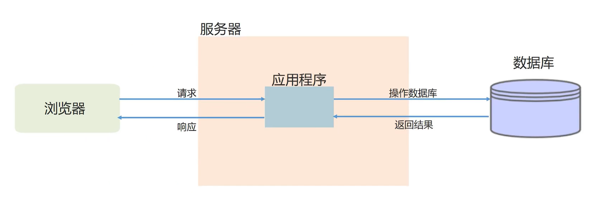
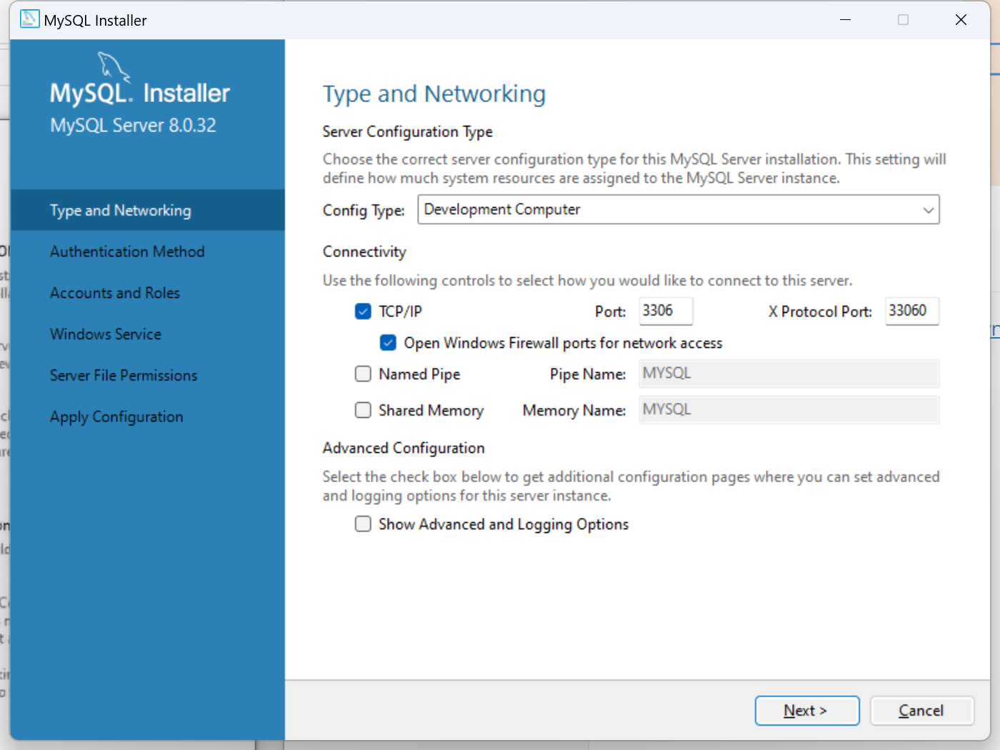

# 程序交互流程

## MySQL

下载地址：https://dev.mysql.com/downloads/windows/installer/8.0.html

安装：Server only（只安装MySQL的服务器）|Next|Execute|输入Root密码|Next|Windows Service Name（后台进程名字，可以修改，使用默认的就可以）|一直Next或Execute|Finish。

默认端口号3306

### 是否安装成功：

电脑-->管理-->服务和应用程序-->服务-->输入m-->MySQL80正在运行。

## 图形客户端navicat

### 通过终端操作MySQL

`mysql -hlocalhost -uroot -p密码`

### 使用图形客户端navicat12连接MySQL服务器

#### 安装navicat：

直接解压安装包，双击navicat.exe，即可开始运行。

#### 连接测试navicat报错2059：

##### 1、配置环境变量

此电脑|属性|高级系统设置|环境变量|系统变量|path|编辑|新建|将bin路径`"C:\Program Files\MySQL\MySQL Server 8.0\bin"`粘贴|确定

将mysql命令注册到计算机里，能找到这个命令。

##### 2、终端输入下面命令

mysql -hlocalhost -uroot -p 密码`刚才设置的密码`

alter user 'root'@'localhost' identified by 'root' password expire never;

alter user 'root'@'localhost' identified with mysql_native_password by '刚才设置的密码';