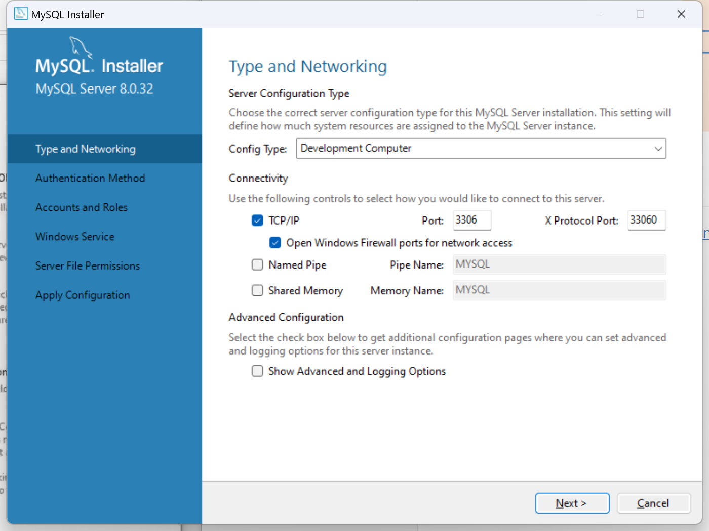

# 程序交互流程

## MySQL

下载地址：https://dev.mysql.com/downloads/windows/installer/8.0.html

安装：Server only --> Next

默认端口号3306

### 是否安装成功：

电脑-->管理-->服务和应用程序-->服务-->输入m-->MySQL80正在运行。

### 图形客户端navicat

使用图形客户端navicat12连接MySQL：

MySQL服务器 <-- Navicat客户端

**安装navicat：**

直接解压安装包，双击其中的navicat.exe，即可开始运行。

#### 连接测试navicat报错2059后执行如下命令：

##### 1、配置环境变量

此电脑-属性-高级系统设置-环境变量-系统变量-path-编辑-新建-将bin路径`"C:\Program Files\MySQL\MySQL Server 8.0\bin"`粘贴

##### 2、终端输入下面命令

mysql -hlocalhost -uroot -p 密码`刚才设置的密码`

alter user 'root'@'localhost' identified by 'root' password expire never;

alter user 'root'@'localhost' identified with mysql_native_password by '刚才设置的密码';