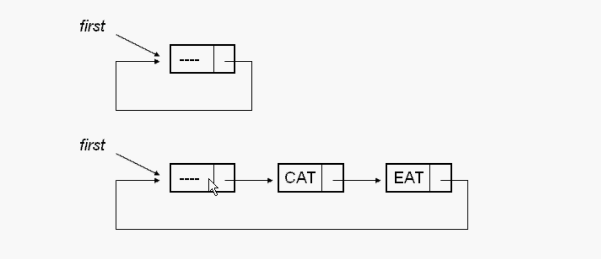

# 循环链表

特定算法需要循环链表，如：约瑟夫问题。

- 单向循环链表
- 带有表头结构的循环链表

循环：链表的最后一个节点的指针指向最前面的节点。链表形成了一个循环状。

链表有两种

1. 带表头结构
2. 不带表头结构

**循环链表必须使用带表头结构的。**因为如果链表是空的，则需要自己指向自己来循环。

普通链表要不要表头都可以。

表头就是一个节点，里面没有数据。

第一个节点叫表头结构 里面不保存数据 

根据需要设计数据结构。

## 判断一个链表是循环链表

用两个指针：

一个指针是快指针（跳一个节点遍历），遍历快（p=p->netxt->next)

一个指针逐步遍历，慢指针

如果在遍历当中，如果发现这两个指针有可能是出现NULL指针的话，那他便是单链表。否则是循环链表链表（本来这个证明已经够了，但如何让死循环的函数停止，给我们一个返回一个循环链表的结构呢？这里的方法是：如果在循环链表中，慢指针一定可能和快指针重叠，（类似于运动员超跑一样）。