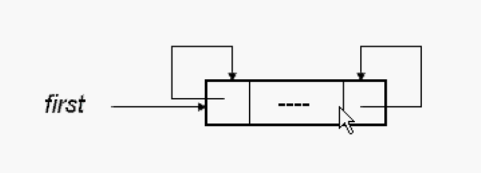

# 双向链表

链表有两种：

1. 单向
2. 双向

双向链表即可以next向下，也可以向上。双向的移动。

## 三个域

双向链表至少有三个域

1. 左链域 llink  是一个指针 指向上一个节点
2. 右链域 rlink  是一个指针 指向下一个节点
3. 数据域 data

#### 双向链表可以是循环链表，也可以不是循环链表。

#### 双向链表可以有表头结构。

有表头结构对空链表易于处理。

**表头不是第一个节点，表头节点数据是空的。**

1. 没有数据时

   刚开始的时候，表头节点左链域指针指向自己，右链域的指针也指向自己。

   例如：下面的空链表，只有一个表头。

   

2. 有数据

   表头下一个节点指向第一个节点，第一个节点的下一个指向第二个节点，最后一个节点的下一个节点指向表头节点，表头节点的上一个指向自己。
   
   

## 带表头结构的双向链表（不是循环的）

前置声明

节点中有一个链表的友元，链表可以使用节点的东西。

### Insert

### delete

主要的就是调整指针

节点是指针* 则创建的时候是new， 使用成员变量用->。

这是一个简单的，学习用的，主要是原理。

可以自己写复杂的  模版类（保存任何类型） 带有迭代器。 更加完善的代码。

双向链表比单向链表灵活，多了一个指针。一般用双向的不用单向的。