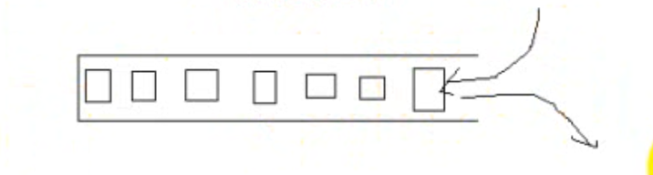
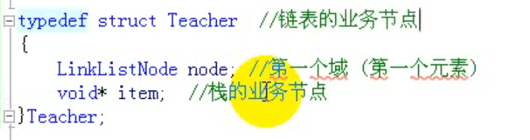
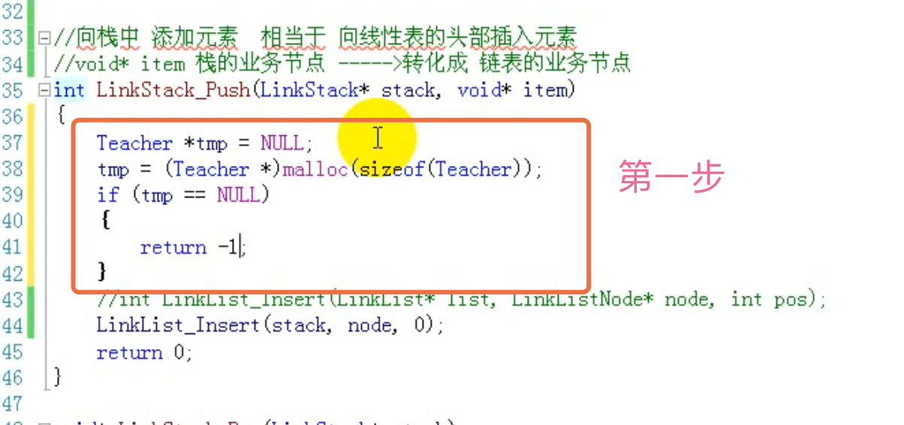

# 栈

栈是一种容器。利用链表做的，堆栈里面是Link。

## 栈的顺序存储
线性表的顺序存储模拟栈的顺序存储。在尾部添加或删除元素，不会涉及到数组的元素大量移动，所以在后面好。

## 栈的链式存储
链式存储没有容量，顺序存储才有。
线性表的链式存储模拟栈的链式存储。

线性表是单向的 如果是尾部插入删除 需要跳指针。
如果是头部的 则不需要遍历。

难点：
栈的业务结点转化成链表的业务结点
栈的业务结点  void *item

插入的时候不希望函数运行完 内存消失 所以要malloc内存。

清空栈的时候 涉及到 栈元素生命周期的管理

所有入栈的结点都是malloc；若要清空栈，把栈中元素弹出，并且释放结点内存。
清空栈：里面调用弹出栈的方法。
pop弹出方法中已经释放结点内存。
销毁栈：调用清空栈的方法 和销毁链表的方法。

LinkList模拟LinkStack
添加元素 都是添加元素的地址。

## 应用

### 1、编译器检测括号是否匹配 

利用就近匹配的特性

##### 算法思路：

>- 从第一个字符开始扫描
>- 当遇见普通字符时忽略
>- 当遇见左符号时压入栈中
>- 当遇见右符号时从栈中弹出栈顶符号，并进行匹配
>  - 匹配成功：继续读入下一个字符
>  - 匹配失败：立即停止，并报错
>- 结束：
>  - 成功：所有字符扫描完毕，且栈为空
>  - 失败：匹配失败或所有字符扫描完毕但栈非空

​	

​	当需要检测成对出现但又互不相邻的事物时

​	可以使用栈"先进后出"的特性

​	栈非常适合于需要"就近匹配"的场合

### 2、中缀 后缀

计算机的本质工作就是做数学运算，那计算机可以读入字符串"9 + (3 - 1) * 5 + 8 / 2"并计算值吗？

后缀表达式 ==? 符合计算机运算

波兰科学家在20世纪50年代提出了一种将运算符放在数字后面的后缀表达式对应的，我们习惯的数学表达式叫中缀表达式===?符合人类思考习惯

实例：

>中缀 => 后缀
>
>5 + 4 => 5 4 +	
>
>1 + 2 * 3 => 1 2 3 * +
>
>8 + (3 - 1) * 5 => 8 3 1 - 5 * +

中缀表达式符合人类的阅读和思维习惯

后缀表达式符合计算机的“运算习惯”

#### 如何将中缀表达式转换成后缀表达式？

##### 中缀转后缀算法：

- 遍历中缀表达式中的数字和符号
- 对于数字：直接输出
- 对于符号：
  - 左括号：进栈
  - 运算符号：与栈顶符号进行优先级比较
    - 若栈顶符号优先级低：此符合进栈（默认栈顶若是左括号，左括号优先级最低）
    - 若栈顶符号优先级不低：将栈顶符号弹出并输出，之后进栈
  - 右括号：将栈顶符号弹出并输出，直到匹配左括号
- 遍历结束：将栈中的所有符号弹出并输出

#### 计算机是如何基于后缀表达式计算的？

8 3 1 - 5 * +

遍历后缀表达式中的数字和符号

- 对于数字：进栈
- 对于符号：
  - 从栈中弹出右操作数
  - 从栈中弹出左操作数
  - 根据符号进行运算
  - 将运算结果压入栈中
- 遍历结果：栈中的唯一数字为计算结果

把中缀表达式转换成后缀表达式 是编译器做的。