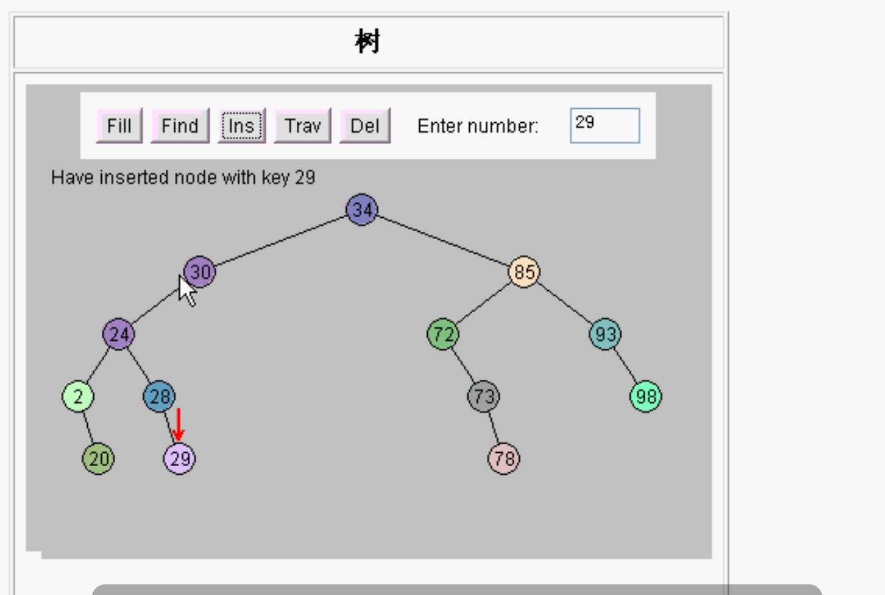

# 树

- 数组的优点、缺点
- 链表的优点、缺点
- 树 = 数组的优点 + 链表的优点 
  - 树基本没有缺点。 唯一缺点只是设计树写的代码比较多。
- 树的术语
  - 结点
  - 兄弟结点
  - 度（ 结点有几个子结点 度就是拥有子树的个数）
  - 树的度（结点可以有多个子树，树中最大的结点的度就叫树的度）
  - 叶结点（没有子结点的结点，也叫终端结点）
  - 树的高度（深度，树一共有几层）
  - 父结点
  - 子结点
  - 祖先节点（父节点，父节点的父节点，父节点的父节点的父节点，一直到根都是祖先节点）

树可以有多个叉，二叉，三叉，五叉等。

计算机中最常用的数据结构是二叉。

如果只有一个叉的话，那就退化成链表了。

#### 学习目的：

编程 如何设计一个二叉树。保存数据，对树操作。

### 数组

数组要连续的使用，中间不能有空的。有空位置更麻烦。

插入数据 

​	如果在中间插入数据的话， 所有后面的数据都要移动，空出来位置，去插入。如果数组有一百万个数，插入一个数据，几十万个数据都要向后移动，所以数组的插入非常慢。

删除数据

​	找到数据，删除，位置就空了，为了不留空位，后面的都要向前移动。

- 缺点：

  插入删除都比较慢。需要移动数据。

- 优点：

  可以进行二分查找（折半查找）。数组排好序就可以折半再折半。

### 链表：

数组的缺点就是链表的优点

- 优点：

  链表插入和删除的时候都比较快。

  在中间插入数据，后面的数据都不需要移动，只需要改一下前一个指针和后一个指针。

  删除：删除数据，不需要把后面所有的数据进行移动，只需要把前面的结点的指针直接指向后面的就可以了。

- 缺点：

  不能进行二分查找。因为链表没有下标，没有指明第几个，只有下一个指向。

### 树：

链表和数组优点的组合，既可以插入删除很快，又可以二分查找。

##### 二叉查找树特点：

>树根
>
>左边的节点都比根小  右边的节点都比根大。

插入29。

>第0层：	1个结点				2的0次方
>
>第1层：	2个结点				2的1次方
>
>第2层：	4个结点				2的2次方
>
>第3层：	8个结点				2的3次方
>
>第4层：	16个结点				2的4次方
>
>...
>
>第10层：	1024个结点		2的10次方
>
>第20层：	100万（1M）	2的20次方
>
>第30层：	10亿（1G）		2的30次方

插入数据：

100万个数据 20次就可以完成。向左向右。

10亿个数据 30次就可以完成。向左向右。

删除数据：

同理，向左向右，先找到那个数。

10亿个数据里面找某一个数，向左向右，最多30次完成。

树的查找 就有数组的优点，折半查找的优点。有链表的优点，插入很快，删除也很快。