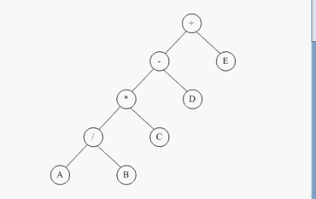

# 二叉树

所有形式的树都可以表示成一个二叉树，二叉树最常用。

## 有两种方法去做树：

1. 数组表示。使用数组做二叉树。容易造成比较多的存储空间浪费。
2. 链表表示。一般情况使用链表去做二叉树。

## 二叉树的遍历

- 前序遍历
- 中序遍历
- 后序遍历
- 层序遍历

上面对树的遍历方式。三种是递归，最后一种是用队列。

使用C++模版类设计二叉树。

两个类：

1. 树

   一棵树有很多的节点。

2. 节点

   - 数据域

   - 左孩子

   - 右孩子

### 中序遍历  

递归左子树

显示当前节点

递归右节点

### 前序遍历

当前的节点放在前面。

### 后序遍历

同理,只不过是Visit放到了后面。

#### 调试：



前序中序后序是节点和左右子节点访问的时机不同。 

上图中序遍历过程：

>左子树+E
>
>左子树-D+E
>
>左子树*C-D+E
>
>左子树/B*C-D+E
>
>A/B*C-D+E

#### 调试代码：

```c++
//测试
void test()
{
    BinaryTree<char> tree;
    TreeNode<char> 加,减,乘,除,a,b,c,d,e;
    加.data = '+';
    减.data = '-';
    乘.data = '*';
    除.data = '/';
    a.data = 'A';
    b.data = 'B';
    c.data = 'C';
    d.data = 'D';
    e.data = 'E';
    
    tree.root = &加;
    加.leftChild = &减;
    加.rightChild = &e;
    减.leftChild = &乘;
    减.rightChild = &d;
    乘.leftChild = &除;
    乘.rightChild = &c;
    除.leftChild = &a;
    除.rightChild = &b;
    
    //中序遍历
    tree.InOrder();
    //前序遍历
    tree.PreOrder();
}
```

### 层序遍历

先显示第一层，再显示第二层，再显示第三层。。。

一层一层的显示。

需要使用**队列**数据结构来实现。`#include <queue>`

队列里是未显示的，准备要显示的。

显示的节点 左右子结点放队列里。

每显示一个就把它的左子放到队列里，右子也放到队列里，然后再从队列里拿出来去显示并把它左右子结点放队列。

要显示的下一个都是从队列里面拿。

显示的时候先把左子放队列 右子放队列，然后再取出来显示。

代码：

使用一个循环

先从根节点开始

如果有左子就push放队列里 有右子就把右子放队列里。

如果队列是空的，那就结束了。如果不是空的，就从队列的队头取一个节点，这个节点就是下一个显示的节点，然后把它从队列删掉pop。


