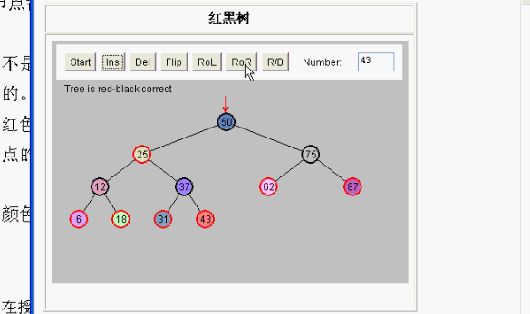
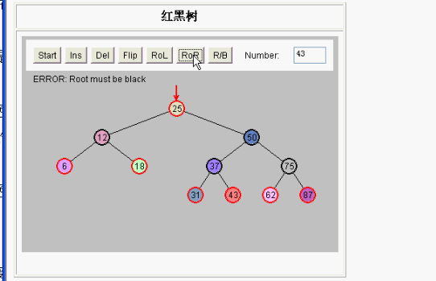
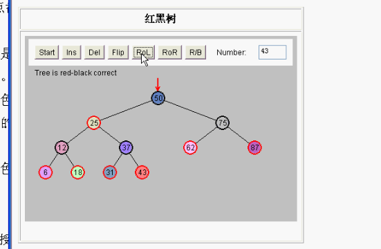

# 红黑树

红黑树是一种高级的二叉查找树。

- 平衡树和非平衡树
- 红黑树特征：节点都有颜色，插入和删除节点时要遵守红黑规则
- 红黑规则

  1. 每一个节点不是红色的就是黑色的
2. 根总是黑色的
  3. 如果节点是红色的，则它的子节点必须是黑色的。不能有连续的红的，但是可以有连续的黑的。
4. 从根到叶节点的每条路径，必须包含相同数目的黑色节点。

如果满足上面4个规则，就可以产生一个红黑树，如果不是红黑树的需要下面的修正方法。

- 修正方法

  1. 改变节点的颜色
  2. 旋转

学习的普通的二叉查找树是没什么用的，普通的二叉查找树会不平衡，在特殊的情况下会退化成链表，链表的查找性能比较差。没有二叉查找树的快速查找功能了。真正用到的是红黑树。

在插入新的节点的时候，动态进行平衡，左子树和右子树节点差不多，动态调整根节点。最有名的就是红黑树。

在C++标准库容器（STL）中的`map` ，`multimap`，`set`， `multiset`等内部的数据结构都是红黑树。

insert 都会平衡。这样查找的时候速度快。

```c++
#include <set>
#include <map>
using namespace std;//要导入名称空间 因为这几个都在std名称空间里

//测试
void test()
{
    //这些都是红黑树
  	//C++标准库容器
    set<int>                    a;
    multiset<int>               b;
    map<int, int>               c;
    multimap<int, int>          d;
    
    a.insert(50);
    a.insert(40);
    a.insert(30);
    
}
```

每次新插入的节点都是红的，因为插入红色节点不容易违反规则，如果插入的红色违反了规则，就对红黑树进行修正。可以对节点变颜色。

向右旋转：

原：



向右旋转后：



再向左转：




在旋转中 移动子树。 

节点要么是红色的要么是黑色的，根必须是黑色的。不能有连续的红色节点，但是可以有连续的黑色节点。

根到叶子节点 都有相同的黑色节点。

如果违反规则，改变颜色或者旋转，重新使树平衡。

使用C C++ java任何一种语言编写红黑树都比较复杂。一般都需要几百行代码。一般大学不需要自己写，但是研究生博士生需要自己动手写红黑树。

插入过程中，动态的进行平衡。

