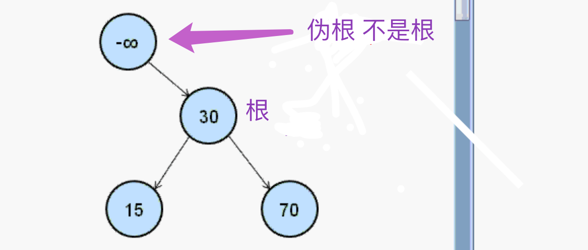
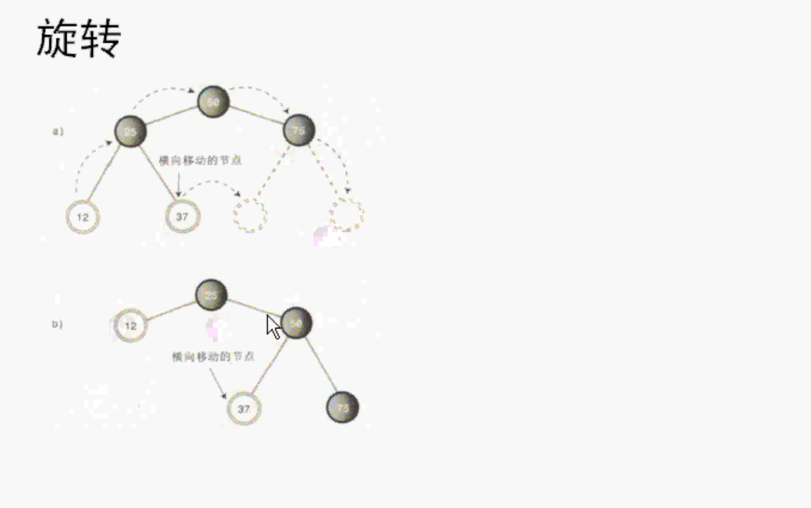
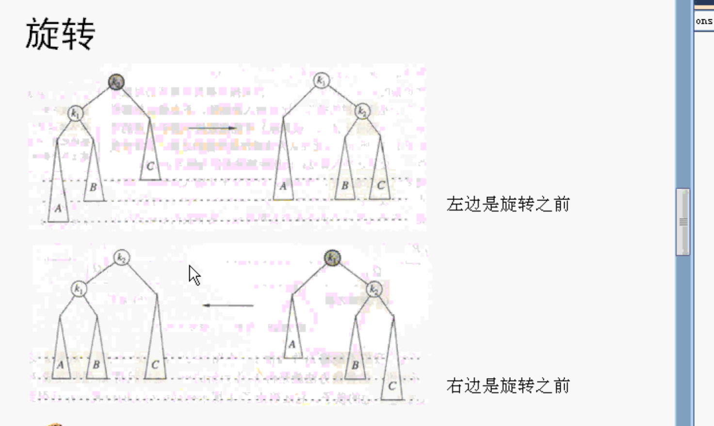
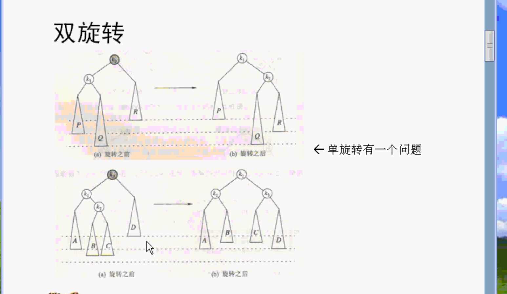
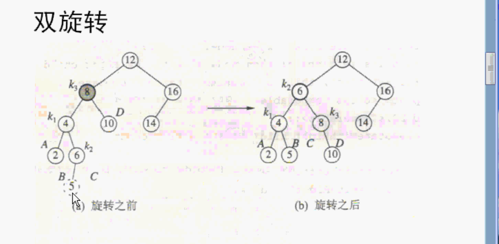
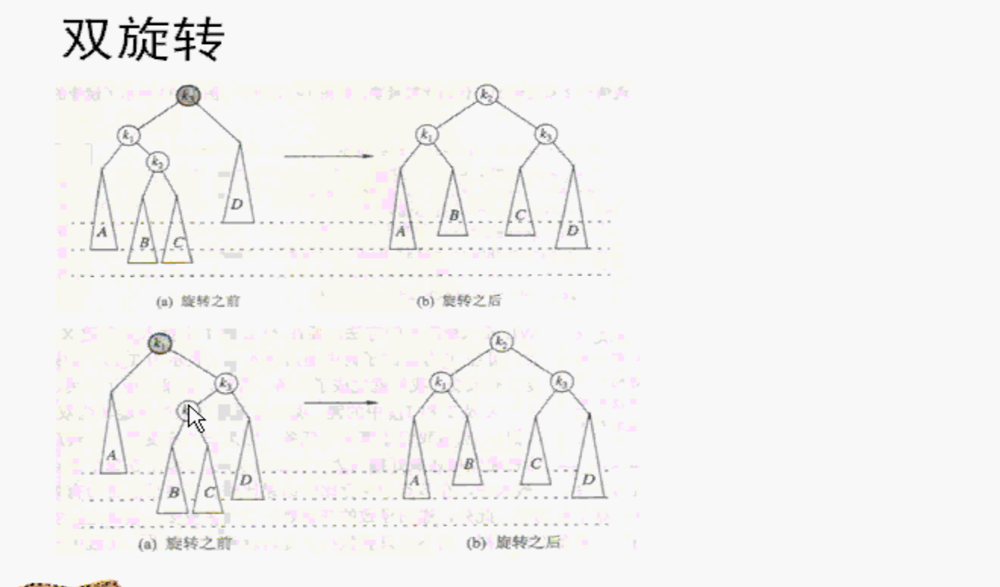
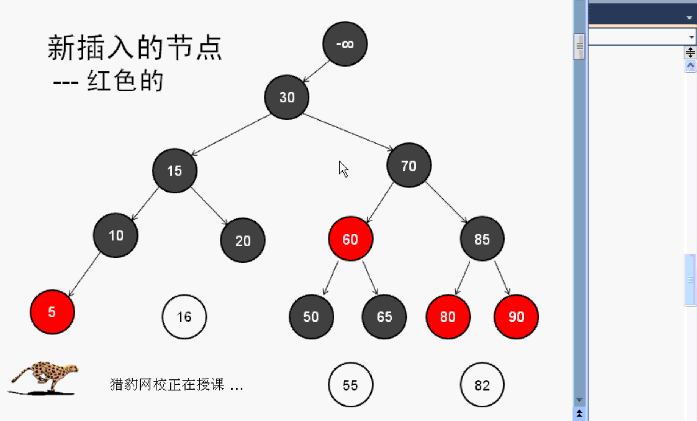
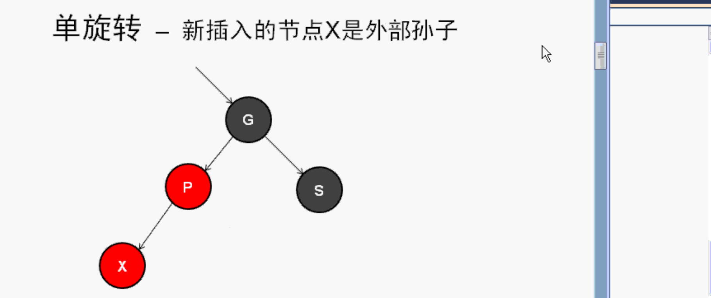
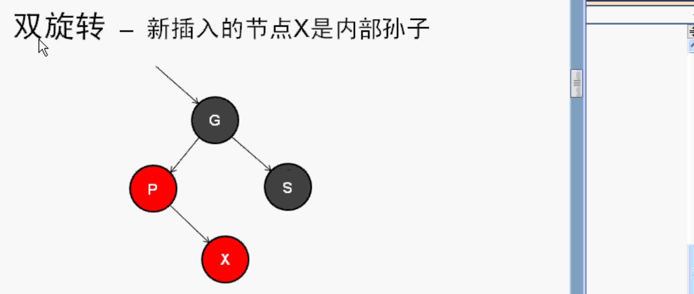
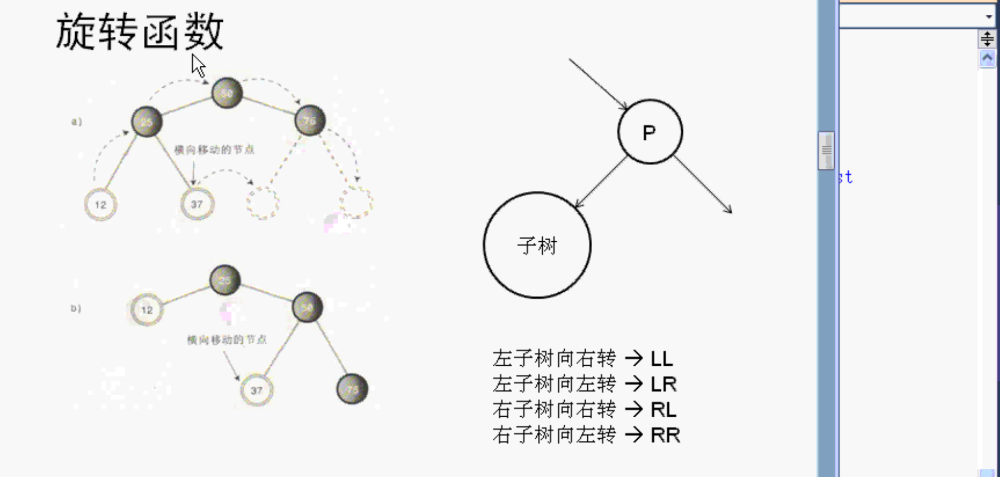

# 使用C++设计红黑树

两个类：

1. 红黑树
   1. insert 插入的时候 创建新的节点。
2. 红黑树的节点（红黑节点）
   1. 颜色（红色或者黑色）
   2. 因为红黑树是二叉树 所以有左子节点 右子节点 指针。
   3. 节点保存的数据（模版类型）

- class RedBlackTree 红黑树 是二叉树
- class RedBlackNode 红黑节点
- nullNode 
- header 伪根 右子是树的根
- insert() 插入数据 插入的时候会创建节点
  - 单旋转（rotateWithLeftChild和rotateWithRightChild是单旋转，单旋转有时候有问题）
    - rotateWithLeftChild() 带着左孩子转 就是向右转
    - rotateWithRightChild() 带着右孩子转就是向左转
  - 双旋转

  - 处理有两个红色孩子的节点
  - 插入节点后，处理红色的父节点

代码都写在.h文件中。

使用C++的类模版

定义一个红黑树类

定义一个红黑树的节点类

先做两个前置声明。

```c++
//两个前置声明
template <class Comparable>
class RedBlackTree;

template <class Comparable>
class RedBlackNode;
```

然后再定义树：

## 红黑树：

两个非常重要的私有成员，两个节点。

红黑树的头header。是一个指针，指向红黑树的头。



节点的类型名字太长，可以定义一个别名Node。

还有一个指针，nullNode空节点。子结点有是空的，叶子节点的子结点也是空的，header的左子结点也是空的。

构造函数。

刚开始创建一个树，没有根，只有一个指针（节点），这个节点的右指针指向根，但是空的红黑树没有根。左子是null，右子也是null，以后指向根。

```c++
//类的完整定义
template <class Comparable>
class RedBlackTree
{
public:
    RedBlackTree(const Comparable & negInf);//构造函数
    ~RedBlackTree();//析构函数
    
    //找指定的数
    Cref<Comparable> find(const Comparable & x) const;//找的数是x。 如果返回指针（找不到就返回空指针） 如果返回引用（找不到怎么办 C++引用必须引用对象 不能是空的，所以自己做引用类型Cref,Cref也是模版）
    Cref<Comparable> findMin() const;//找最小的数
    Cref<Comparable> findMax() const;
    
    //判断是不是空树
    bool isEmpty() const;
    //清空
    void makeEmpty() const;
    
    enum {RED,BLACK};//节点颜色，红色，黑色。
    
    void insert(const Comparable & x);//插入 会创建新的节点
    
    typedef RedBlackNode<Comparable> Node;//定义别名，原名太长了。
//private: //为了测试，临时改成puglic
public:
    //两个重要的私有成员
    Node *header;//红黑树的头 -∞
    Node *nullNode;//空节点
    
    //插入过程 需要下面几个节点
    Node *current;  //指向当前节点
    Node *parent;   //指向当前节点的父节点
    Node *grand;    //指向当前节点的祖父节点
    Node *great;    //指向当前节点的曾祖父节点
    
    void reclaimMemory(Node *t) const;//清除节点 清空函数会用到
    
    //带着左孩子 向右转
    void rotateWithLeftChild(Node * & k2) const;
    //带着右孩子 向左转
    void rotateWithRightChild(Node * & k1) const;
    
    ///双旋转
    //带着左孩子向右转
    void doubleRotateWithLeftChild(Node * & k3) const;
    //带着右孩子向左转
    void doubleRotateWithRightChild(Node * & k1) const;
    
    //通用的函数 旋转 改变颜色
    void handleReorient(const Comparable & item);//重新调整
        
    /// 旋转通用函数
    /// @param item 被转节点
    /// @param parent 被转的父节点
    RedBlackNode<Comparable> * rotate(const Comparable & item, Node *parent) const;
};
```


### 构造函数：

对树的两个数据成员进行初始化。

空的红黑树只有一个伪根，没有根。左子右子都是空null。

空节点：其左子节点右子节点都是空的。

头header：构造函数的参数传进来的`-99999`，创建一个节点。左子右子开始的时候都是空节点，开始插入了右子就是根。

```c++
//构造函数
template <class Comparable>
RedBlackTree<Comparable>::RedBlackTree(const Comparable & negInf)
{
    //初始化
    nullNode = new Node();
    nullNode->left = nullNode->right = nullNode;//左子右子都是空的
    header = new Node(negInf);
    header->left = header->right = nullNode;
}
```


### 析构函数：

因为构造函数中用了new，所以在析构函数中要写上对应的delete。

在析构函数里，要使用makeEmpty清空。makeEmpty在后面会了解。

```c++
//析构函数
template <class Comparable>
RedBlackTree<Comparable>::~RedBlackTree()
{
    //构造函数用的new 析构要delete
    makeEmpty();
    delete nullNode;
    delete header;
}
```


## 红黑节点：

存数据，左子右子。还有一个颜色（红，黑）。

```c++
template <class Comparable>
class RedBlackNode
{
    //private: //为了测试，临时改成puglic
public:
    Comparable element;
    RedBlackNode *left;
    RedBlackNode *right;
    int color;
    
    RedBlackNode(const Comparable & theElement = Comparable(),
                 RedBlackNode *lt = NULL,
                 RedBlackNode *rt = NULL,
                 int c = RedBlackTree<Comparable>::BLACK)
    : element(theElement),left(lt),right(rt),color(c){}//构造函数 颜色默认黑色
    
    friend class RedBlackTree<Comparable>;
};
```

颜色做成枚举，放在树里。

因为4个变量都是私有的，所以要把树做成节点的友元类。这样树就可以操作节点的数据成员了。

### 节点的构造函数：

参数比较多，4个：

第一个参数是树传进来的`-99999`，保持到该节点的数据。

左子节点（默认NULL），

右子节点（默认NULL），

颜色：默认黑色。

一共四个参数。对应四个成员变量。

## Insert :

从空的红黑树插入节点，插入的节点就是根，以后继续插入insert新的节点。

插入的是模版类型，插入之后，创建节点放到红黑树里。

插入过程中，需要几个新的指针：

1. 指向当前节点 current
2. 当前节点父节点 parent
3. 祖父节点 grand
4. 曾祖父节点 great

#### 算法：

- 刚开始插入的时候，current，parent，grand三个节点都等于header。

- 空指针的数据为传入的数据。

- 循环：

  在红黑树里找到位置，把新节点插入到红黑树里。

  循环就是从根开始去查找插入的位置。不断的向左向右找位置。新的节点的位置。查找的时候可能会遇到一个节点的两个孩子都是红色的，需要做处理调整（单旋转或者双旋转）。

  先要判断是否有重复的，二叉树不允许有重复的。

  循环结束有两个情况：

  1. 有相等的数据结束循环 
  2. 没有相同的数据找到最后current是nullNode最后的子节点结束循环。

- 如果current不等于nullNode，则有重复的，抛出异常。等于nullNode，则找到了位置。

  找到位置之后，current就挂到父节点parent上

- 然后找位置，左还是右。

红黑树最重要的是平衡，平衡的时候需要parent，grand，great节点。


current等于nullNode，current是空节点，那么创建current节点，把它挂在父节点上。

挂在父节点：根据值和父节点的值大小，判断是左子还是右子。

其中父节点在循环的时候已经找到了。

```c++
template <class Comparable>
void RedBlackTree<Comparable>::insert(const Comparable &x)
{
    //开始的时候 current等于header
    current = parent = grand = header;
    //把要插入的数据先放到空指针里
    nullNode->element = x;
    
    //找合适的位置  开始的时候current等于header 从根开始不断的向左向右找位置
    //使用循环查找新的节点插入的位置。
    while (current->element != x) {
        great = grand;
        grand = parent;
        parent = current;
        //做平衡的时候要用到上面的几个节点
        
        //小就找左子 大就找右子
        current = x < current->element ? current->left : current->right;
        
        //在循环中可能遇到一个节点的两个孩子都是红色的，需要做处理
        //进行检查 如果当前节点和左孩子颜色是红色的并且右孩子的颜色也是红色的 这时候就需要做处理调整。
        //变成左儿子是红色的 右儿子是黑色的
        if (current->left->color == RED && current->right->color == RED) {
            handleReorient(x);
        }
    }
    
    //找到了相等了 找到了重复的抛出异常
    if (current != nullNode) {
        throw DuplicateItemException();
    }
    current = new Node(x,nullNode,nullNode);
    //新节点插入
    if (x < parent->element) {
        parent->left = current;
    } else {
        parent->right = current;
    }
    //上面的代码 实现二叉树
    //自动平衡 --》 红黑树
    //自动平衡是重点 需要用到旋转
    
    //新插入的节点是红色的 父节点也是红色的 需要再做一个处理 旋转
    handleReorient(x);//这个函数是通用的函数，改变颜色，旋转

}
```

最后还要使用一下handleReorient(x)，父节点是红的，新插入的也是红的，最后也要做一次处理。

#### 自动平衡：

insert有自动平衡才是红黑树，没有自动平衡则只是普通的二叉查找树。

insert需要加上平衡的代码。自动平衡代码是红黑树重点。

需要用到旋转：

1. 向右转
2. 向左转

##### 向右转：

节点有上升和下降，旋转的意思是顺时针方向转动或者逆时针方向转动。



37是根节点50的内侧孙子节点，12是外侧孙子。

向右转：

37节点横向移动

50根下降，25儿子上升，12外侧孙子上升，37内侧孙子横向移动。

如果25下面还有子节点，子子孙孙，会跟着一起旋转。

**内侧孙子子树横向移动。**

需要写两个函数实现向左转，向右转。

适应这两种情况：

1. 节点下面有子子孙孙的。
2. 节点下面没有子子孙孙的，叶子节点。



旋转之后，**高度**就平衡了。旋转就调整了红黑树的**高度**。

#### 旋转函数：

红黑树旋转：

##### 向右转：

k1是k2的左子，k2是参数指定的。

k2的左边就是k1的右边（横向移动）。

k1的右边就是k2。

K2 变成k1。让k1替代k2的位置变成根，k1上升。把k2位置变成k1。

k1的左边和k2的右边不变，还是原来的子节点。

代码：

```c++
//旋转 向右转
template <class Comparable>
void RedBlackTree<Comparable>::rotateWithLeftChild(Node * & k2) const
{
    Node *k1 = k2->left;//k1是k2的左子
    k2->left = k1->right;//横向移动
    k1->right = k2;//旋转之后k1的右边就是k2
    k2 = k1;//k1上升，变成了根
}
```

##### 向左转：

K2 是新定义的节点，k1是传进来的。k2是k1的右子节点，

K1的right就是原来k2的left。（横向移动）

旋转以后的k2的left就等于k1。

k1就等于k2。旋转以后k2就接替了k1。变成了根。原来k1是根，现在k2变成了根。

代码：

```c++
//向左转
template <class Comparable>
void RedBlackTree<Comparable>::rotateWithRightChild(Node * & k1) const
{
    Node *k2 = k1->right;
    k1->right = k2->left;//横向移动
    k2->left = k1;//旋转之后的k2的left是k1
    k1 = k2;//
}
```

这两个旋转函数要用在insert函数里。自动平衡要用。

### 双旋转

上面两个旋转时单旋转，单旋转有时候有问题：

如下图：Q原来是k1右子树，旋转之后变成了k2的左子树，但是Q子树比较深，深度并没有发生变化。针对这种情况，单旋转不能很好的进行平衡。

一个平衡的二叉树，所有子树深度都要差不多。

旋转的原因：改变不同子树的深度，让所有子树深度差不多。

旋转之前和旋转之后深度变化不大的问题（单旋转问题），此时使用双旋转代替。

双旋转：旋转了以后，把深的节点给分开了，B留在左边，C去到右边，B和C的高度度比原来小了，这样就比原来的深度减少，不那么深了。

把子树分开。



要实现这种旋转，需要旋转两次。

第一次 k2转到k1位置，第二次再旋转到k3根那里。

### 例：



上图5是新增加的节点，做一个双旋转，5就到了后面的图的位置。

关键看6的位置：

1. 第一次旋转 6到4的位置
2. 第二次旋转 6又到了8的位置

双旋转实际上是两个单旋转。

#### 旋转算法：

上图例子旋转：对8进行双旋转

1. 第一次旋转是 8 的儿子4孙子6进行旋转 6到4的位置
2. 第二次是8和它的儿子（变成了6），孙子一起旋转。6转到8的位置。

#### 双旋转总结：

1. 第一次是节点的儿子和孙子进行旋转，
2. 第二次是节点和它新的儿子进行旋转。



上图中：上面的是带着左孩子向右转，下面的是带着右孩子向左转。

#### 带着左孩子向右转：

相当于两次单旋转 

1. 第一次向左转：左儿子和孙子向左转。
2. 第二次节点向右转。

一次左转，一次右转。

代码：

```c++
///带着左孩子向右转
template <class Comparable>
void RedBlackTree<Comparable>::doubleRotateWithLeftChild(Node * & k3) const
{
    rotateWithRightChild(k3->left);
    rotateWithLeftChild(k3);
}
```

#### 第二种双旋转：

节点的右儿子和孙子向右转，然后节点和儿子再向左转。

```c++
template <class Comparable>
void RedBlackTree<Comparable>::doubleRotateWithRightChild(Node *&k1) const
{
    rotateWithLeftChild(k1->right);
    rotateWithRightChild(k1);
}
```

双旋转和单旋转都是给insert用的。根据红黑规则。

红黑树里增加新的节点，插入的 时候要自动平衡，自动平衡要用到单旋转或双旋转（根据情况）。还有改变颜色。

### 例

下图每一个分支都是3个黑色节点。而且没有连续两个红色的节点。连续两个红节点是不允许的，连续两个黑的是可以的。

- 插入红色的节点比较容易，因为不会破坏红黑规则。
  - 如果新插16节点，应该插入20的左子，并且规定所有新插入的节点都是红色的，因为如果是黑色的，那么新插入的节点的那个路径多一个，破坏了红黑树规则。所以新插入的节点都是红色的，不会破坏原有的红黑规则。
  - 插入节点55。和节点16一样，从根节点开始找到位置，并且是红色节点，完全符合红黑规则。
- 新插入节点是红色的，它的父节点也是红的，破坏红黑规则。这个时候需要对调整：旋转（单旋转，双旋转），改变颜色
  - 插入节点82，新插入的节点是红色的，但是它的父节点也是红色的。破坏了红色规则，这时候就需要调整。82应在80的右子，只是破坏了规则，需要调整（旋转，改变颜色）




#### 什么时候需要单旋转，什么时候需要双旋转：

- 单旋转

  新插入的节点X是爷爷节点G的外部孙子，新插入的节点是红色的，父节点也是红色的。新插入节点是外部孙子。那么就做一次单旋转。

- 双旋转

  下面的第二个图，如果新插入节点X是爷爷G的是内部孙子，那么就要做双旋转。





#### 总结：

新插入的节点是红色的，如果父节点是黑色的，则直接插入，如果父节点是红色的，则根据上面的做单旋转或双旋转。

#### 处理有两个红色孩子的节点：

如果一个节点有两个红色孩子的节点，则这个节点也需要处理。

这几种情况，需要在insert函数里做出来。


### 旋转函数做成通用的旋转函数



记录旋转节点的父节点P，然后整个旋转相当于P的子树的旋转。

子树可能是P的左子，可能是P的右子。并且子树可能向左转也可能向右转。一共有四种情况。写一个函数实现这四种旋转，并且它有一个返回结果。

下面函数返回结果是一个节点（根），

第一个参数：被旋转的节点

第二个参数：父节点P

根据大小来判断：

比父节点小，则左边。否则右边。

左子树向左转：

左子树向右转：

如果比左边的小，则向右转。

rotate在内部判断大小，决定怎么转。

```c++
//旋转通用函数
template <class Comparable>
/// 通用函数 根据大小 自动旋转
/// @param item 被旋转节点
/// @param theParent 父节点
RedBlackNode<Comparable> * RedBlackTree<Comparable>::rotate(const Comparable &item, Node *theParent) const
{
    //分四种情况
    //根据大小判断，红黑树是二叉树
    //左子向左转 向右转
    //左子树
    if (item < theParent->element) {
        //向左转向右转 根据大小判断
        //比左边的小 向右转。
        item < theParent->left->element ? rotateWithLeftChild(theParent->left) :
        rotateWithRightChild(theParent->left);
        return theParent->left;
    }
    //右子树
    else {
        item < theParent->right->element ?
        rotateWithLeftChild(theParent->right) :
        rotateWithRightChild(theParent->right);
        return theParent->right;
    }
}
```


### 重新调整函数：

要么单旋转，要么双旋转。还要改变颜色。

##### 首先变色

新插入的是红色的。

insert的while循环中找到节点的两个子节点红的，那么需要变色，current是insert两个子节点是红色的需要变色的节点。

##### 然后旋转：

如果父节点是红色的，需要旋转。因为新插入的是红的。

把爷爷节点的颜色变成红的

然后判断新插入的节点是内部孙子还是外部孙子，内部孙子的话，小于爷爷，大于爸爸。

如果即小于爷爷又小于爸爸，或者即大于爷爷又大于爸爸，则是外部孙子。

内部孙子不会同时小于爸爸和爷爷。同时大于爸爸和爷爷。

如果是内部孙子的话，就加一次旋转。

如果是外部孙子的话，只需一次旋转。

```c++
///这个函数在insert函数调了两次
template <class Comparable>
void RedBlackTree<Comparable>::handleReorient(const Comparable &item)
{
    //变色
    current->color = RED;//变红色 遇到节点有两个红色的孩子 则节点要变色
    //左右两个孩子变黑色
    current->left->color = BLACK;
    current->right->color = BLACK;

    //如果父节点是红色的 需要旋转
    if (parent->color == RED) {
        //先把爷爷节点变成黑色
        grand->color = RED;
        //然后判断内部孙子 外部孙子
        //内部孙子：小于爷爷 大于爸爸 或大于爷爷 小于爸爸。
        //内部孙子不会同时比爷爷和爸爸小 不会比爷爷和爸爸同时大
        if (item < grand->element != item < parent->element) {//不会同时大 同时小
            //内部孙子
            //加多一次旋转 双旋转
            parent = rotate(item, grand);
        }
        //外部孙子 只做一次旋转
        current = rotate(item, great);
        //当前节点变黑的 因为父节点是红的
        current->color = BLACK;
        
        //如果一个节点比爷爷小 比爸爸小 则是左外部孙子
        //如果一个节点比爷爷大 比爸爸大 则是右外部孙子
    }
    //最后把根节点变黑的。根节点必须是黑的
    header->right->color = BLACK;
}
```

旋转之后，把当前节点变成黑的。因为父节点是红的。

最后把根节点变成黑的。

这个函数在insert的时候调用了两次。


### 调用测试

```c++
//测试
void test()
{
    const int NEG_INF = -99999;
    RedBlackTree<int> t(NEG_INF);//很大的负数，一个节点都没有 是空的。一个特殊的节点。伪根。
    t.insert(50);
    t.insert(40);
    t.insert(30); //如果这里不是红黑树 就退化成链表的。
    //动态调整 红黑树根动态变化 保证根的左子树右子树深度基本一致 红色节点数一致
    //如果是普通的二叉查找树 根是50 不变
    //红黑树会自动调整平衡

    //根
    cout << t.header->right->element << endl;
    
    
//    cout << t.header->right->element << endl;
//    cout << t.header->right->right->left->element << endl;
//
//    //向左转
//    t.rotateWithRightChild(t.header->right);
}
```


## 重写异常：

自己写的异常类：

```c++
#pragma mark - 异常类
class DSException
{
public:
    DSException(const string & msg = "") : message(msg){}
    virtual ~DSException(){}//析构函数
    virtual string toString() const
    {
        return "Exception " + string(": ") + what();
    }
    virtual string what() const
    {
        return message;
    }
private:
    string message;
};
```

包括构造函数，析构函数。

#### 再写一个重复异常：

```c++
class DuplicateItemException : public DSException
{
public:
    DuplicateItemException(const string & msg = "") : DSException(msg){}
};
```

## 总结：

红黑树的根会动态的变化。因为要保证根左右子树的深度基本一致。

重点在插入的时候做了两次平衡调整。