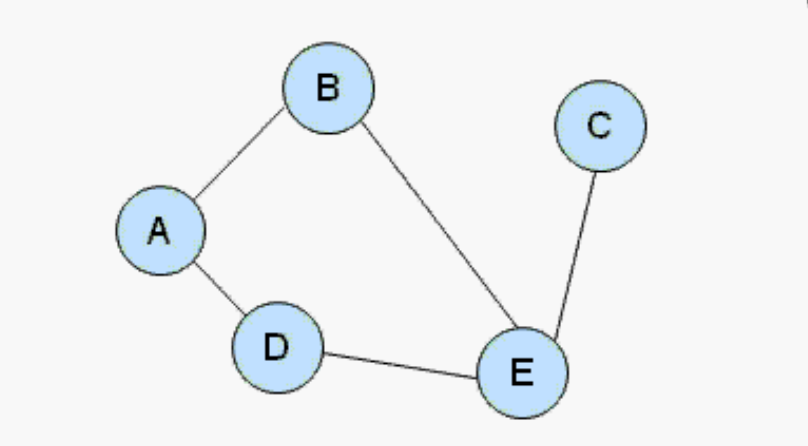
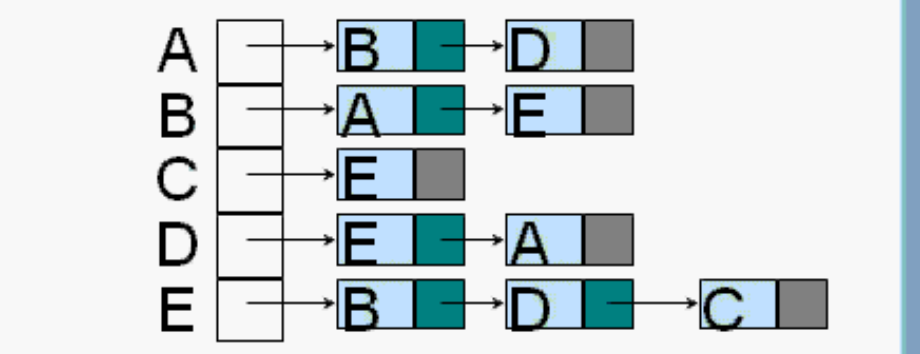
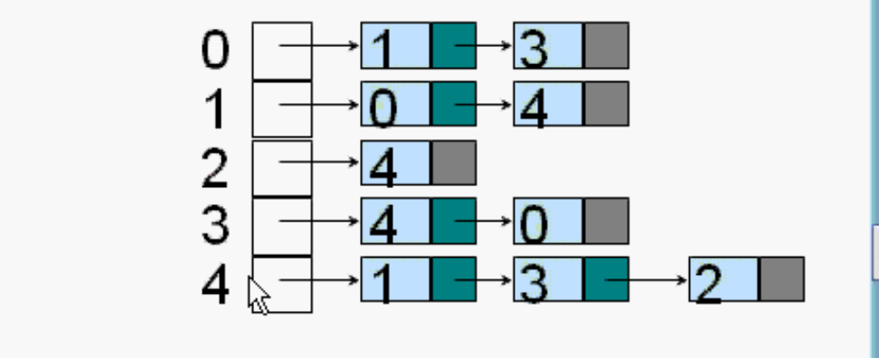

# 图_邻接表

用邻接表来设计图

一个图有很多的顶点，也有很多的边

顶点可以用C++的class来设计

边有两种设计

1. 邻接矩阵
2. 邻接表

例：

5 个顶点

针对每一个顶点，每一个顶点都设计一个链表，表示和它相连顶点的链接情况。有5个链表。

A和B相连，A和D相连。B和D没有前后顺序之分。

ABCDE也可以用序号表示，01234表示ABCDE。在实际编程的时候，都是用序号来做邻接表。

下面用C++实现一个例子

用C++模版类来设计图

### 顶点

自己定义顶点。保存各种数据。

### 图

- 私有的数据成员
  - 数组 保存所有的顶点
  - 链表
  - 一共有几个顶点 最多可以有几个顶点
  - 当前的顶点树
- 构造函数
  - 传过来最多几个顶点
  - 创建一个数组保存所有节点
  - 定义第二个数组，链表。这里是5个链表。
  - 当前顶点数为0.
- 析构函数
  - 把两个new对应的delete写出来
- 两个成员函数
  - 给图增加一个顶点
  - 增加一条边（用的两个顶点的序号）
- 两个测试函数
  - 打印所有顶点
  - 打印邻接表

两个数组。

因为用的模版 所以可以是任何类型。char或者自己定义的class。