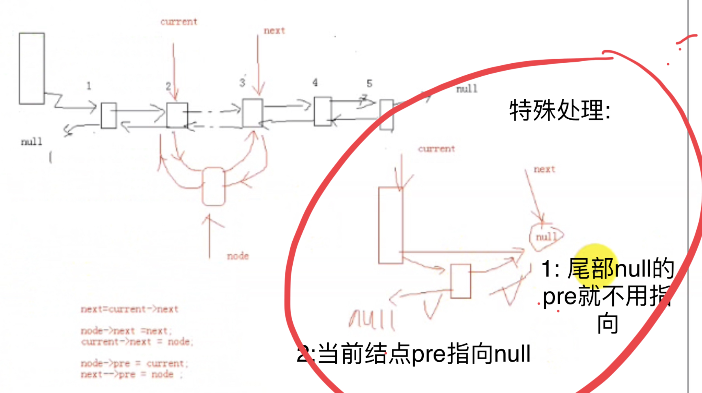

# 线性表

线性关系，相当于一条线。

对于⾮空的线性表和线性结构**,**其特点如下**:** 

-  存在唯⼀的⼀个被称作**”**第⼀个**”**的数据元素**;** 
- 存在唯⼀的⼀个被称作**”**最后⼀个**"**的数据元素
- 除了第⼀个之外**,**结构中的每个数据元素均有⼀个前驱
- 除了最后⼀个之外**,**结构中的每个数据元素都有⼀个后继**.** 

## 线性表的顺序存储

顺序存储需要移动元素，清空线性表时不需要清空元素，只需要设置length = 0。

### 优点：

- 无需为线性表汇中的逻辑关系增加额外的空间
- 可以快速的获取表中合法位置的元素

### 缺点：

- 插入和删除操作需要移动大量元素
- 当线性表长度变化较大时难以确定存储空间的容量

## 线性表的链式存储

指针  内存  内存首地址

## 注

删除结点的时候要把结点地址甩出去，底层库不释放（因为不知道上层业务在堆还是栈），生命周期不归底层库管理，需要上层业务自己释放指针，否则有内存泄漏。

## 思想

链表的算法和具体业务结点的分离

链表的容量和链表的实际长度是两个不同的概念

结构体3部分：

1. length  
2. cap容量  
3. 一级指针*node  （数组首地址）

结构体  使用  `->`
---

**链表的算法和链表的业务结点分离。**
包含不了所有结点大千世界，那么就让大千世界包含自己。
代码实现：
业务结点的第一个域（第一个元素） 放上链表node结点即可。结点重合。

1. 表头节点：
   链表中的第一个结点，包含指向第一个数据元素的指针以及链表自身的一些信息
2. 数据结点：
   链表中代表数据元素的结点，包含指向下一个数据元素的指针和数据元素的信息
3. 尾结点：
   链表中的最后一个数据结点，其下一元素指针为空，表示无后继

```c++
// 链表
typedef void LinkList;

// 链表的结点
typedef struct _tag_LinkListNode
{
    struct _tag_LinkListNode* next;
}LinkListNode;

LinkList* LinkListCreate();

void LinkList_Destroy(LinkList *list);

void LinkList_Clear(LinkList *list);

int LinkList_Length(LinkList *list);

int LinkList_Insert(LinkList *list, LinkListNode* node, int pos);

LinkListNode* LinkList_Get(LinkList *list, int pos);

LinkListNode* LinkList_Delete(LinkList *list, int pos);
```

这个小的结点等着被包含

小结点和业务结点的首地址重合！ 省去求偏移
---
- 传统链表
  next指针指向下一个数据域的地址。
  业务结点不同，链表next也要变，不好。

- 非传统链表 linux内核链表
  大千世界包含结点

链表

1. 指针指向谁就把谁的地址赋给指针
2. 分清楚 链表的操作逻辑和辅助指针变量之间的关系

- 优点：
  无需一次性定制链表的容量
  插入和删除无需移动数据元素
- 缺点：
  数据元素必须保存后继元素的位置信息
  获取指定数据的元素操作需要顺序访问之前的元素

**插入删除都需要找到前面的节点，因为可以根据前面的节点的next找到下一个节点。**

##  循环链表

在普通链表的基础上增加下面新操作：

1. 将游标重置指向链表中的第一个数据元素
2. 获取当前游标指向的数据元素
3. 将游标移动指向到链表中的下一个数据元素
4. 直接指定删除链表中的某个数据元素

```c++
#ifndef _CIRCLELIST_H_
#define _CIRCLELIST_H_

//链表
typedef void CircleList;
/*
typedef struct _tag_CircleListNode CircleListNode;
struct _tag_CircleListNode
{
	CircleListNode* next;
};
*/

//节点
typedef struct _tag_CircleListNode
{
	struct _tag_CircleListNode * next;
}CircleListNode;

CircleList* CircleList_Create();

void List_Destroy(CircleList* list);

void CircleList_Clear(CircleList* list);

int CircleList_Length(CircleList* list);

int CircleList_Insert(CircleList* list, CircleListNode* node, int pos);

CircleListNode* CircleList_Get(CircleList* list, int pos);

CircleListNode* CircleList_Delete(CircleList* list, int pos);

//add

//将游标重置指向链表中的第一个数据元素
CircleListNode* CircleList_Reset(CircleList* list);

//获取当前游标指向的数据元素
CircleListNode* CircleList_Current(CircleList* list);

//将游标移动指向到链表中的下一个数据元素
CircleListNode* CircleList_Next(CircleList* list);

//直接指定删除链表中的某个数据元素
CircleListNode* CircleList_DeleteNode(CircleList* list, CircleListNode* node);

#endif
```

插入元素的分析：

1. 普通插入元素（中间位置）

   和单向链表是一样

2. 尾插法

   和单链表是一样的，单链表的写法支持尾插法；

   因：辅助指针向后跳length次，指向最后面那个元素

3. 头插法 要连成一个环（添加处理）

   要进行头插法，需要求出尾节点，和单链表不一样的地方，保证是循环链表

   头插法 特殊处理  要尾部结点连接插入头部的新结点，构成环。

4. 第一次插入元素时，让游标指向0号结点

尾插法和普通链表一样。

插入第一个元素 相当于头插法和尾插法重叠。

```c++
#include <stdio.h>
#include <malloc.h>
#include "CircleList.h"

typedef struct _tag_CircleList
{
	CircleListNode header;
	CircleListNode* slider;
	int length;
} TCircleList;

CircleList* CircleList_Create() // O(1)
{
	TCircleList* ret = (TCircleList*)malloc(sizeof(TCircleList));
	if (ret == NULL)
	{
		return NULL;
	}
	
	ret->length = 0;
	ret->header.next = NULL;
	ret->slider = NULL;
	return ret;
}

void CircleList_Destroy(CircleList* list) // O(1)
{
	if (list == NULL)
	{
		return ;
	}
	free(list);
}

void CircleList_Clear(CircleList* list) // O(1)
{
	TCircleList* sList = (TCircleList*)list;
	if (sList == NULL)
	{
		return ;
	}
	sList->length = 0;
	sList->header.next = NULL;
	sList->slider = NULL;
}

int CircleList_Length(CircleList* list) // O(1)
{
	TCircleList* sList = (TCircleList*)list;
	int ret = -1;
	if (list == NULL)
	{
		return ret;
	}
	ret = sList->length;
	return ret;
}

int CircleList_Insert(CircleList* list, CircleListNode* node, int pos) // O(n)
{ 
	int ret = 0, i=0;
	TCircleList* sList = (TCircleList*)list;

	if (list == NULL || node== NULL || pos<0)
	{
		return -1;
	}
	//if( ret )
	{
		CircleListNode* current = (CircleListNode*)sList;

		for(i=0; (i<pos) && (current->next != NULL); i++)
		{
			current = current->next;
		}

		//current->next 0号节点的地址
		node->next = current->next; //1
		current->next = node; //2

		//若第一次插入节点
		if( sList->length == 0 )
		{
			sList->slider = node;
		}

		sList->length++;

		//若头插法 current仍然指向头部
		//（原因是：跳0步，没有跳走）
		if( current == (CircleListNode*)sList )
		{
			//获取最后一个元素
			CircleListNode* last = CircleList_Get(sList, sList->length - 1); 
			last->next = current->next; //3
		}
	}

	return ret;
}

CircleListNode* CircleList_Get(CircleList* list, int pos) // O(n)
{
	TCircleList* sList = (TCircleList*)list;
	CircleListNode* ret = NULL;
	int i = 0;

	if (list==NULL || pos<0)
	{
		return NULL;
	}
	//if( (sList != NULL) && (pos >= 0) && (sList->length > 0) )
	{
		CircleListNode* current = (CircleListNode*)sList;

		for(i=0; i<pos; i++)
		{
			current = current->next;
		}

		ret = current->next;
	}

	return ret;
}

CircleListNode* CircleList_Delete(CircleList* list, int pos) // O(n)
{
	TCircleList* sList = (TCircleList*)list;
	CircleListNode* ret = NULL;
	int i = 0;

	if( (sList != NULL) && (pos >= 0) && (sList->length > 0) )
	{
		CircleListNode* current = (CircleListNode*)sList;
		CircleListNode* last = NULL;

		for(i=0; i<pos; i++)
		{
			current = current->next;
		}

		//若删除第一个元素（头结点）
		if( current == (CircleListNode*)sList )
		{
			last = (CircleListNode*)CircleList_Get(sList, sList->length - 1);
		}

		//求要删除的元素
		ret = current->next;
		current->next = ret->next;

		sList->length--;

		//判断链表是否为空
		if( last != NULL )
		{
			sList->header.next = ret->next;
			last->next = ret->next;
		}

		//若删除的元素为游标所指的元素
		if( sList->slider == ret )
		{
			sList->slider = ret->next;
		}

		//若删除元素后，链表长度为0
		if( sList->length == 0 )
		{
			sList->header.next = NULL;
			sList->slider = NULL;
		}
	}

	return ret;
}

CircleListNode* CircleList_DeleteNode(CircleList* list, CircleListNode* node) // O(n)
{
	TCircleList* sList = (TCircleList*)list;
	CircleListNode* ret = NULL;
	int i = 0;

	if( sList != NULL )
	{
		CircleListNode* current = (CircleListNode*)sList;
		
		//查找node在循环链表中的位置i
		for(i=0; i<sList->length; i++)
		{
			if( current->next == node )
			{
				ret = current->next;
				break;
			}

			current = current->next;
		}
		
		//如果ret找到，根据i去删除	
		if( ret != NULL )
		{
			CircleList_Delete(sList, i);
		}
	}

	return ret;
}

CircleListNode* CircleList_Reset(CircleList* list) // O(1)
{
	TCircleList* sList = (TCircleList*)list;
	CircleListNode* ret = NULL;

	if( sList != NULL )
	{
		sList->slider = sList->header.next;
		ret = sList->slider;
	}

	return ret;
}

CircleListNode* CircleList_Current(CircleList* list) // O(1)
{
	TCircleList* sList = (TCircleList*)list;
	CircleListNode* ret = NULL;

	if( sList != NULL )
	{
		ret = sList->slider;
	}

	return ret;
}

//把当前位置返回，并且游标下移
CircleListNode* CircleList_Next(CircleList* list) // O(1)
{
	TCircleList* sList = (TCircleList*)list;
	CircleListNode* ret = NULL;

	if( (sList != NULL) && (sList->slider != NULL) )
	{
		ret = sList->slider;
		sList->slider = ret->next;
	}

	return ret;
}
```

## 链表 

单向循环链表插入，引入一个辅助指针变量，指向链表头部（不是第一个结点 而是链表的头部），然后指针跳位置。

## 双向链表

- 优点：
  双向链表在单链表单基础上增加了指向前驱的指针 功能上双向链表可以完全取代单链表的使用
  双向链表的next，pre和current操作可以高效的遍历链表中的所有元素
- 缺点：
  代码复杂。

双向链表 3个结点：current，ret，next
删除主要考虑特殊情况：头结点  只有一个结点。


用的时候就是 第一个域包含结点。

异常处理：
头结点，尾结点，链表为空 插入第一个结点。

### 双向链表的插入



### 双向链表的删除下面三个情况

第一种：

从中间删除


第二种：


第三种：


```
current->next = ret->next;
next->pre = current;
```

##### 难点:

特殊处理

