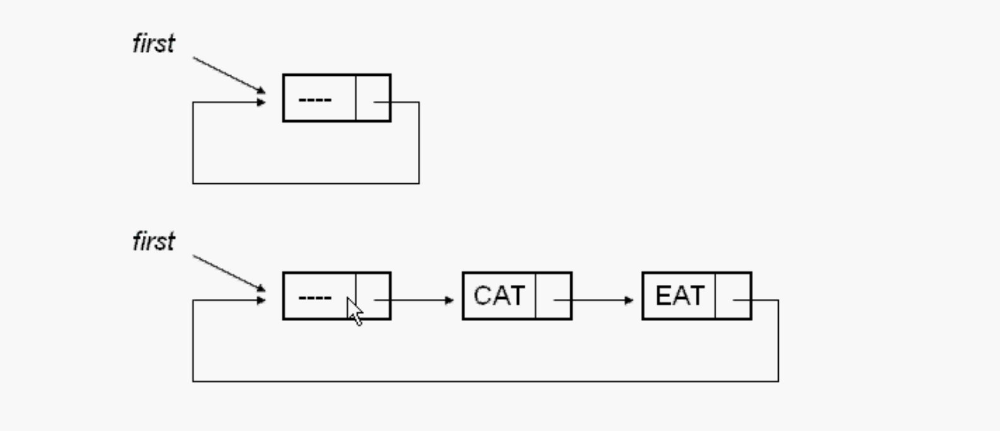
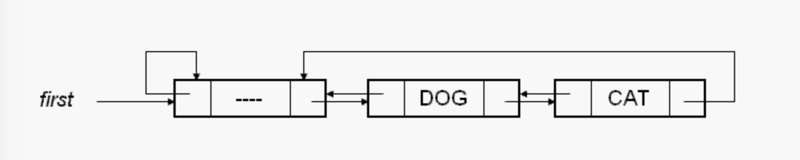

# 链表

C++做面向对象的设计，把数据做成私有的，封装。

1. 把Link（链表类）做成Node（节点类）的友元类

   前置声明。节点中有一个链表的友元，链表可以访问节点的东西。

2. 做成嵌套类

   把节点类做成链表类私有的成员类。

   一个类在另一个类的内部，外面的类就可以操作里面的类的私有数据成员。

   嵌套类里面的类的数据成员是public，不违反面向对象的风格。

### 节点

1. 数据域
2. 链接域

节点的数据域可以多个 更加复杂。

做链表设计的时候，根据需要节点保存各种各样数据。

节点的指针也可以有多个，可以相同也可以不相同。链表可以设计的很灵活。

一个节点只有一个指针指向下一个节点的叫单链表。

```c++
class NodeB;
//节点
class NodeA
{
private:
    //3个数据域
    int data1;
    char data2;
    float data3;
    //2个指针 指针可以有多个
    NodeA *linka;
    NodeB *linkb;
};

//第二个节点
class NodeB
{
private:
    int data;
    NodeB *link;
};
```

### 单链表为什么要增加头结点

1. 便于⾸元结点处理。

2. 便于空表和⾮空表的统⼀处理。

## 总结

链表的插入和删除需要先遍历查找位置。

插入和删除不需要后面所有的数据移动，主要的就是调整指针，改变指针（前一个数据和后一个数据）指向。

数组的插入和删除需要移动元素。可能还需要扩容。

链表不需要连续，数组是连续的。

## Delete

两个节点：

1. 一个当前节点 
2. 一个前一个节点

for循环中遍历查找要删除的节点

判断删除的是否有前一个节点：

- 有的话就前一个节点的下一个节点指向当前节点的下一个节点

- 没有的话，要删除的是第一个节点。第一个节点指向第一个节点的下一个节点。

把要删除的节点删除，释放内存

## Invert

第一种方法：使用迭代，遍历链表，使得链表每一个节点的下一个节点指针指向其前一个节点。

>**链表的指针指向反指**
>
>第一个节点的下一个指针指向null
>
>第二个节点的下一个指针指向第一个节点
>
>第三个节点的下一个指针指向第二个节点
>
>第四个节点的下一个指针指向第三个节点
>
>一直到最后一个节点的下一个指针指向其前一个节点

第二种方法：创建一个新的链表，把原链表的节点一个一个的插入新的链表中，每次都是头插。最后把原来链表清空销毁，返回新的链表。

## 循环链表

特定算法需要循环链表，如：约瑟夫问题。

- 单向循环链表

循环：链表的最后一个节点的指针指向最前面的节点。链表形成了一个循环状。

**循环链表必须使用带表头结构的。**因为如果链表是空的，则需要自己指向自己来循环。



**表头不是第一个节点，表头节点里面没有数据。**

### 判断一个链表是循环链表

用两个指针：

一个指针是快指针（跳一个节点遍历），遍历快（p=p->netxt->next)

一个指针逐步遍历，慢指针

如果在遍历当中，如果发现这两个指针出现NULL指针的话，停止循环，那它便是单链表。

如果在循环链表中，慢指针一定可能和快指针重叠，那它是循环链表链表。

## 双向链表

双向链表即可以next向下，也可以向上。双向的移动。

双向链表可以是循环链表，也可以不是循环链表。

### 节点

双向链表至少有三个域

1. 左链域 llink  是一个指针 指向上一个节点
2. 右链域 rlink  是一个指针 指向下一个节点
3. 数据域 data

### 带表头结构的双向链表

有表头结构对空链表易于处理。

#### 1、没有数据时

空链表，只有一个表头，表头节点左链域指针指向自己，右链域的指针也指向自己。


#### 2、有数据

表头下一个节点指向第一个节点，第一个节点的下一个指向第二个节点，最后一个节点的下一个节点指向表头节点，表头节点的上一个指向自己。



节点是指针* 则创建的时候是new， 使用成员变量用->。

可以自己写复杂的：模版类（保存任何类型）、带有迭代器。 更加完善的代码。

双向链表比单向链表灵活，多了一个指针。一般用双向的不用单向的。