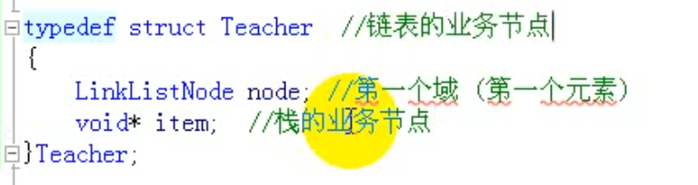
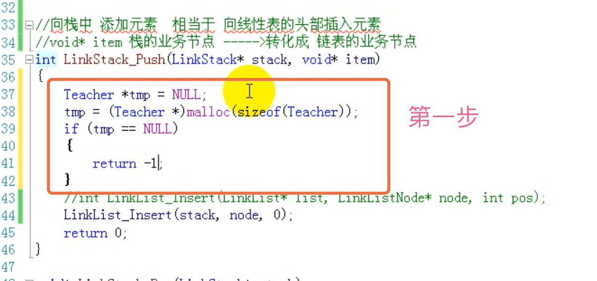

# 堆栈

堆栈是一种容器  存储各种数据 

栈是一种数据结构，系统软件或算法中用到栈。

### 堆栈特点

先进后出（FILO）或 后进先出（LIFO）

- 栈底，栈顶

## 栈的顺序存储（顺序栈）
使用数组实现。

线性表的顺序存储模拟栈的顺序存储。在尾部添加或删除元素，不会涉及到数组的元素大量移动，所以在后面好。


- 栈的操作
  1. Push（添加到数组中 先判断是否满了  数组满了 要扩大容量 旧数据拷贝到新到里面）
  2. Top
  3. Pop 删除栈顶数据，栈顶指向下一个
  4. IsEmpty

用动态数组设计栈。设计一个工具类实现数组满了 把原来的数组放大一倍。


inline 内联函数  快

#### 类的结构：

- 构造函数
- 析构函数
- 成员函数
- 私有成员（内部用的）

## 栈的链式存储（链式栈）

使用链表实现，堆栈里面是Link。

线性表的链式存储模拟栈的链式存储。

线性表是单向的 如果是尾部插入删除 需要跳指针。
如果是头部的 则不需要遍历。

用链表做的栈比数组在某方面灵活一些。链表做的堆栈，链表动态创建节点，插入数据速度比数组快。

链式存储没有容量，顺序存储才有。数组容量分配大小确定之后就不改变，当数组容量不够需要重新分配数组。

难点：
栈的业务结点转化成链表的业务结点
栈的业务结点  void *item



插入的时候不希望函数运行完 内存消失 所以要malloc内存。



清空栈涉及到栈元素生命周期的管理

所有入栈的结点都是malloc，清空栈时，把栈中元素弹出，并且释放结点内存。
清空栈：里面调用弹出栈的方法。pop弹出方法中已经释放结点内存。
销毁栈：调用清空栈的方法 和销毁链表的方法。

LinkList模拟LinkStack
添加元素 都是添加元素的地址。


### 栈的操作

1. Push（新数据放入堆栈）
2. Pop（把栈顶数据删除）
3. Top（返回栈顶数据，并不删除）

像一个桶一样，放入东西在最上面，拿的时候取最上面的，也就是最后放入的。

两个类

1. 堆栈类
2. 节点类

### 节点：

- 数据域

- 指向下一个节点的指针
- 节点的构造函数

```c++
template<class T> class LinkedStack;//前置声明

//链的节点
template<class T>
class ChainNode
{
    friend class LinkedStack<T>;
private:
    ChainNode(const T&theData, ChainNode *n = 0)
    : data(theData),link(n){}//构造函数
    //私有数据成员
    T data;//数据
    ChainNode<T> *link;//指针指向下一个节点
};
```

#### 链式堆栈：

里面有一个析构函数。析构函数要把里面所有的节点给清除掉。

```c++
//链式栈
template<class T>
class LinkedStack
{
public:
    LinkedStack():top(0){}//构造函数
//    ~LinkedStack(){MakeEmpty();}//析构函数
    bool IsEmpty() const;//堆栈是不是空的
    T& Top() const;//返回栈顶数据
    void Push(const T& e);
    void Pop();
    void MakeEmpty();//把所有数据析构
private:
    ChainNode<T> *top;
};
```

#### IsEmpty：

如果top指向0 那就是空的。

```c++
template<class T>
bool LinkedStack<T>::IsEmpty() const
{
    return top == 0;
}
```

#### Push：

top指针永远指向新放入的数据。

新的节点的指向下一个节点的指针 指向的是以前的top。

```c++
//把数据放进入 新放入的数据永远都是top，top指向新的节点。
template<class T>
void LinkedStack<T>::Push(const T &e)
{
    top = new ChainNode<T>(e,top);
}
```

#### Top:

返回栈顶的数据 

```c++
template<class T>
T& LinkedStack<T>::Top() const
{
    //如果堆栈是空的
    if (this->IsEmpty()) {
        throw "Stack is empty";
    } else {
        return top->data;
    }
}
```

#### Pop:

删除栈顶的数据

1. 用一个指针指向栈顶的节点
2. 栈顶向下移动（栈顶指向栈顶的下一个），栈顶的下一个变成栈顶。
3. 用delete 删除栈顶的节点，没有delete会有内存泄漏。

```c++
//删除栈顶元素
template<class T>
void LinkedStack<T>::Pop()
{
    //如果堆栈是空的
    if (this->IsEmpty()) {
        throw "Stack is empty Cannot delete";
    } else {
        ChainNode<T> *delNode = top;//用一个指针指向栈顶的数据
        top = top->link;//栈顶向下移动
        delete delNode;//删除 防止内存泄漏 和new对应
    }
}
```

##### delete和push中的new节点是对应的。Pop的时候要把它删除。

#### 析构函数：

析构函数要把所有的堆栈里有的节点 都清空删除掉。

一个循环 只要堆栈不是空的 就一直Pop。

```c++
//堆栈节点清空
template<class T>
void LinkedStack<T>::MakeEmpty()
{
    //如果堆栈不是空的。循环删除，直到为空。
    while (!IsEmpty()) {
        Pop();
    }
}
```

做的例子还是模版库。带有析构函数。

## 应用

### 1、编译器检测括号是否匹配 

利用就近匹配的特性

##### 算法思路：

>- 从第一个字符开始扫描
>- 当遇见普通字符时忽略
>- 当遇见左符号时压入栈中
>- 当遇见右符号时从栈中弹出栈顶符号，并进行匹配
>  - 匹配成功：继续读入下一个字符
>  - 匹配失败：立即停止，并报错
>- 结束：
>  - 成功：所有字符扫描完毕，且栈为空
>  - 失败：匹配失败或所有字符扫描完毕但栈非空

当需要检测成对出现但又互不相邻的事物时，可以使用栈"先进后出"的特性，栈非常适合于需要"就近匹配"的场合。

### 2、中缀 后缀

计算机的本质工作就是做数学运算，那计算机可以读入字符串"9 + (3 - 1) * 5 + 8 / 2"并计算值吗？

后缀表达式：将运算符放在数字后面，符合计算机的“运算习惯”。

中缀表达式，符合人类的阅读和思维习惯。

实例：

>中缀 => 后缀
>
>5 + 4 => 5 4 +	
>
>1 + 2 * 3 => 1 2 3 * +
>
>8 + (3 - 1) * 5 => 8 3 1 - 5 * +

#### 中缀表达式转换成后缀表达式

算法：

- 遍历中缀表达式中的数字和符号
- 对于数字：直接输出
- 对于符号：
  - 左括号：进栈
  - 运算符号：与栈顶符号进行优先级比较
    - 若栈顶符号优先级低：此符合进栈（默认栈顶若是左括号，左括号优先级最低）
    - 若栈顶符号优先级不低：将栈顶符号弹出并输出，之后进栈
  - 右括号：将栈顶符号弹出并输出，直到匹配左括号
- 遍历结束：将栈中的所有符号弹出并输出

把中缀表达式转换成后缀表达式 是编译器做的。

#### 计算机是如何基于后缀表达式计算的

8 3 1 - 5 * +

遍历后缀表达式中的数字和符号

- 对于数字：进栈
- 对于符号：
  - 从栈中弹出右操作数
  - 从栈中弹出左操作数
  - 根据符号进行运算
  - 将运算结果压入栈中
- 遍历结果：栈中的唯一数字为计算结果
