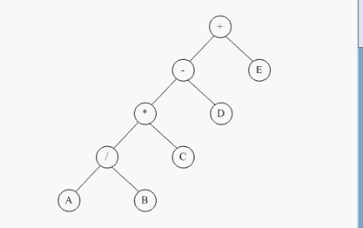

# 二叉树

所有形式的树都可以表示成一个二叉树，二叉树最常用。

### 有两种方法去做树：

1. 数组表示。使用数组做二叉树。容易造成比较多的存储空间浪费。
2. 链表表示。一般情况使用链表去做二叉树。

## 二叉树的遍历

### 1、中序遍历  

递归左子树

显示当前节点

递归右节点

### 2、前序遍历

当前的节点放在前面。

### 3、后序遍历

同理,只不过是Visit放到了后面。

前序中序后序是节点和左右子节点访问的时机不同。 



上图中序遍历过程：

>左子树+E
>
>左子树-D+E
>
>左子树*C-D+E
>
>左子树/B*C-D+E
>
>A/B*C-D+E

### 4、层序遍历

先显示第一层，再显示第二层，再显示第三层。。。

一层一层的显示。

需要使用**队列**数据结构来实现。`#include <queue>`

队列里是未显示的，准备要显示的。

显示的节点 左右子结点放队列里。

每显示一个就把它的左子放到队列里，右子也放到队列里，然后再从队列里拿出来去显示并把它左右子结点放队列。

要显示的下一个都是从队列里面拿。

显示的时候先把左子放队列 右子放队列，然后再取出来显示。

代码：

使用一个循环

先从根节点开始

如果有左子就push放队列里 有右子就把右子放队列里。

如果队列是空的，那就结束了。如果不是空的，就从队列的队头取一个节点，这个节点就是下一个显示的节点，然后把它从队列删掉pop。

上面对树的遍历方式。三种是递归，最后一种是用队列。

## 二叉查找树

BST：Binary Search Tree

二叉查找树的性质
1. 每一元素有一个键值，而且不允许重复
2. 左子树的键值都小于根节点的键值
3. 右子树的键值都大于根节点的键值
4. 左右子树都是二叉查找树

插入29。


>第0层：	1个结点				2的0次方
>
>第1层：	2个结点				2的1次方
>
>第2层：	4个结点				2的2次方
>
>第3层：	8个结点				2的3次方
>
>第4层：	16个结点				2的4次方
>
>...
>
>第10层：	1024个结点		2的10次方
>
>第20层：	100万（1M）	2的20次方
>
>第30层：	10亿（1G）		2的30次方

插入数据：

100万个数据 20次就可以完成。向左向右。

10亿个数据 30次就可以完成。向左向右。

删除数据：

同理，向左向右，先找到那个数。

10亿个数据里面找某一个数，向左向右，最多30次完成。

树的查找 就有数组的优点，折半查找的优点。有链表的优点，插入很快，删除也很快。

二叉查找树可以进行快速的查找。查找速度非常快，找10次，就可以找2的10次方那么多。

插入的速度也很快。插入和查找一样，左右向下一层层查找。

### 使用C++模版类设计二叉树

### 树的节点

1. 有数据域（Element）
2. 有左孩子（指针）
3. 有右孩子（指针）

display是显示节点数据。显示数据还有它左子树右子树所有数据。用递归的算法显示。

算法：

首先显示节点的位置，位置上有的数据为空。再显示它的数据。

如果有左孩子，继续对左孩子递归。

二叉树特点：左孩子位置`2*i`，右孩子`2*i+1`。

因为里面的数据和方法都是私有的，BST树访问节点的话需要前置声明，定义友元类。然后树就可以操作节点了。

### 数据（Element）

用模版类设计。里面包含key，这样做的好处是可以方便的添加其他的更多数据变量。

```c++
//节点中的数据
template<class Type>
class Element
{
public:
    Type key;
    //使用Element可以很容易的添加更多新的数据，不止一个。
};
```

### 树

一棵树有很多的节点。

#### 私有成员

- 根。拿到了根就相当于拿到了二叉查找树。

#### 树的方法

##### 构造函数

##### Insert 插入 

首先拿到根 然后用另外一个指针 用来指向当前正在操作的节点的父结点。

插入首先进行查找。

找到合适的位置 插进去。

使用一个循环进行查找。

找到位置，创建节点，然后插入进去。

先从根进行查找。

插入的数据 和根（p）判断：

- 如果等于根的key则重复
- 如果小于根，则在左边
- 如果大于根，则在右边。

 改变p，向下一层查找，改变p之前要用q把p存起来。

当循环结束之后，则就找到了一个位置（q），然后创建一个新的节点，进行插入到对应的位置。新的节点没有左孩子也没有右孩子，只有数据，数据就是插入的数据。

最后把p接到树上。

如果没根 则p就是根

如果有根 则判断插入的树和q的数据大小，比q小则是左子，比q大则是右子。

插入成功或不成功返回一个boolen值。也可以用枚举自己做一个Boolean。

##### Delete删除

先找到然后再删除。

##### Search 查找 

###### 1、递归查找

二叉树很大，可以从根查找，也可以从某一个节点位置开始查找。

从根开始找就是找整个树。

如果找的节点数据为空，则直接返回

如果找的数据刚好等于节点的数据。则找到了

如果找的数据小于节点的数据，则继续递归找左子树，左孩子。

否则就是大于，去找右子树。

###### 2、迭代查找

迭代就是循环，没有使用递归。

算法：

使用一个循环，一个指针开始的时候指向根，只要是有效节点就一直循环，无效节点就返回。

如果找的过程中找到了就返回。

如果没找到，就判断查找的数据如果比当前的节点小，那么就指向左孩子，否则就指向右孩子。

如果循环结束了也没有返回值 则没有找到。返回nil（空指针）。

##### 遍历

中序遍历（InOrder），前序遍历（PreOrder），后序遍历（PostOrder）。

二叉查找树是二叉树，也可以中序遍历 先序后序遍历。中序遍历就能得到从小到大的一个排列。

### 二叉查找树优缺点

优点：二叉查找树 查找和插入的速度都很快。向左向右找位置。也不需要移动位置。

缺点：空的树，插入数据，以后插的数据都比之前的小，则变成了一个链表。链表不能快速的二叉查找。有这种可能。这种特殊情况。

一般的二叉查找树都是不平衡的，二叉查找树不会自动的平衡。

## 平衡二叉查找树

二叉查找树插入、删除、查找等操作的时间复杂度和树的高度成正比。

例如：树有n个节点，高度为h，理想情况下h近似为logn，时间复杂度是：O(logn)。

如果插入数据分布不均匀，退化成链表，此时h就为O(n)。

平衡二叉查找树

1. 任意节点的左右子树高度相差**不大于1**
2. 左右子树都是平衡二叉树

## AVL树

严格符合平衡二叉查找树的定义，是一种高度平衡的二叉树。

## 红黑树

实际使用不需要完全平衡，高效的平衡二叉查找树是整棵树的相对平衡，左右子树高度相差不是很大即可。

动态选一个中间值 做根节点。使得左边的节点和右边的节点差不多。要求二叉树有**动态平衡功能**。叫红黑树。
