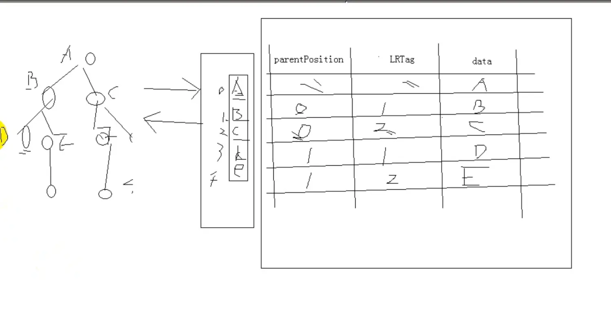
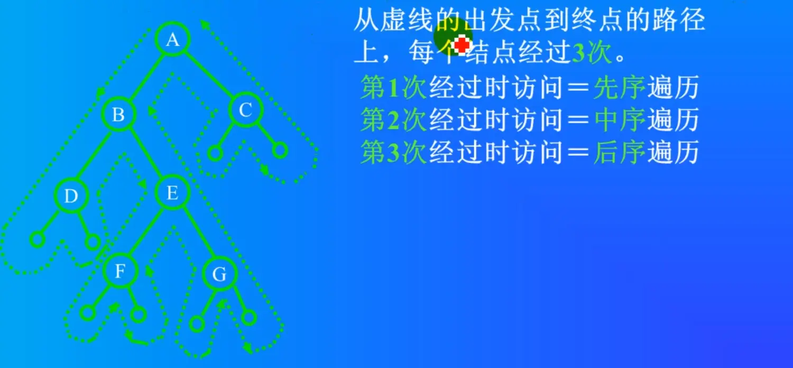
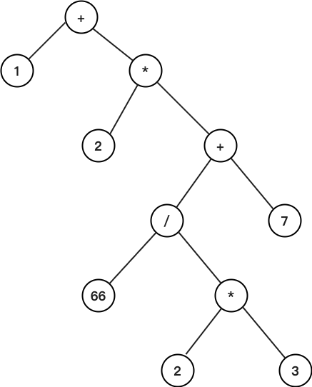
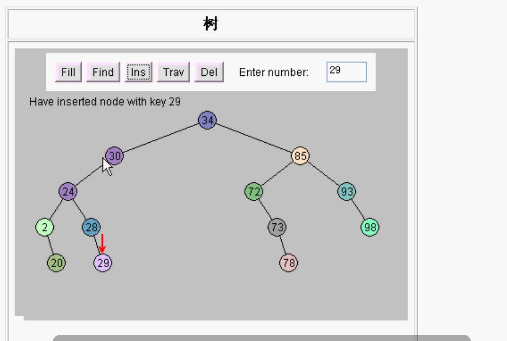

# 树

## 链表

数组的缺点就是链表的优点

- 优点：

  链表插入和删除的时候都比较快。

  在中间插入数据，后面的数据都不需要移动，只需要改一下前一个指针和后一个指针。

  删除：删除数据，不需要把后面所有的数据进行移动，只需要把前面的结点的指针直接指向后面的就可以了。

- 缺点：

  不能进行二分查找。因为链表没有下标，没有指明第几个，只有下一个指向。

## 树

- 树的优点是链表和数组优点的组合：既可以插入删除很快，又可以二分查找。
- 树基本没有缺点。 唯一缺点只是设计树写的代码比较多。

## 树的术语

- 结点
- 兄弟结点
- 度（ 结点有几个子结点，度就是拥有子树的个数）
- 树的度（结点可以有多个子树，树中最大的结点的度就叫树的度）
- 叶结点（没有子结点的结点，也叫终端结点）
- 树的高度（深度，树一共有几层）
- 父结点
- 子结点
- 祖先节点（父节点，父节点的父节点，父节点的父节点的父节点，一直到根都是祖先节点）

树可以有多个叉，二叉，三叉，五叉等。如果只有一个叉的话，就退化成链表了。

## 二叉树

所有形式的树都可以表示成一个二叉树，计算机中最常用的数据结构是二叉树。

两大块儿：
1. 二叉树的几个性质
2. 二叉树的几种存储
    几种表示方法

**树是线性表和递归组成的。**

## 两种方法去做树

### 1、树的顺序存储  

数组表示。使用数组做二叉树。容易造成比较多的存储空间浪费。

满二叉树和完全二叉树：在顺序存储方式下可以复原。

借助下标：对完全二叉树，若从上至下，从左至右编号，则编号为`i`的结点，其左孩子编号必为`2i`，其右孩子编号必为`2i+1`；其双亲的编号必为`i/2`（`i=1时为根，除外`）。

### 2、树的链式存储  

一般情况使用链表去做二叉树。

## 树的表示法
### 1、二叉链表示法

```c++
//二叉树的二叉链表存储表示
typedef  struct BiTNode {
    int data;
    struct BiTNode *lchild, *rchild;//左右孩子指针
}BiTNode, *BiTree;

void main()
{
    BiTNode t1, t2, t3, t4, t5;
    t1.data = 1;
    t2.data = 2;
    t3.data = 3;
    t4.data = 4;
    t5.data = 5;
    //建立关系
    t1.lchild = &t2;
    t1.rchild = &t3;
    t2.lchild = &t4;
    t3.lchild = &t5;
}

//通过指针方式 建立树
void main()
{
    BiTNode *p1, *p2, *p3, *p4, *p5;
    p1 = (BiTNode *)malloc(sizeof (BiTNode));
    p2 = (BiTNode *)malloc(sizeof (BiTNode));
    p3 = (BiTNode *)malloc(sizeof (BiTNode));
    p4 = (BiTNode *)malloc(sizeof (BiTNode));
    p5 = (BiTNode *)malloc(sizeof (BiTNode));
    p1->data = 1;
    p2->data = 2;
    p3->data = 3;
    p4->data = 4;
    p5->data = 5;
    //建立关系
    p1->lchild = p2;
    p1->rchild = p3;
    p2->lchild = p4;
    p3->lchild = p5;
}
```

### 2、三叉链表示法：

data lchild rchild parent

### 3、双亲链表

```c++
//节点
#define MAX_TREE_SIZE 100
typedef struct BPTNode
{
    int data;//数据域
    int parentPosition; //指向双亲的指针 //数组下标，表示父结点位置
    char LRTag; //左右孩子标志域
}BPTNode;

//树
typedef struct BPTree
{
    BPTNode nodes[MAX_TREE_SIZE];//树也是集合，把节点存储到数组中
    int mum_node; //节点数目
    int root;//根结点的位置。注意此域存储的是父亲节点在数组的下标
}BPTree;


void test()
{
    BPTree tree;
    //根结点
    tree.nodes[0].parentPosition = 1000;
    //B
    tree.nodes[1].parentPosition = 0;
    tree.nodes[1].data = 'B';
    tree.nodes[1].LRTag = 1;
    //c
    tree.nodes[2].parentPosition = 0;
    tree.nodes[2].data = 'C';
    tree.nodes[2].LRTag = 2;
}
```

在子结点里面保存了双亲的位置信息


### 4、线索表示法

## 树在db中存储

相当于两个表：

1. 节点表：把每一个结点信息存入数据库

2. 节点关系表：把树和树之间的关系存入数据库

存和复原难，所以要转成二叉树。

三叉树不转二叉树的存法：


注：
需要memset
memset：指针指向的内存空间如果是空结点 指向NULL。

树和图
需要定义好数据结构，即定义结构体。

## 二叉树的基本操作

### 1、树的递归遍历



#### 1.1、中序（根）遍历  

递归左子树

显示当前节点

递归右节点

#### 1.2、先序（根）遍历

当前的节点放在前面。

#### 1.3、后序（根）遍历

同理,只不过是Visit放到了后面。

前序、中序、后序经过的路径是一样的，只是节点和左右子节点访问的时机不同。

### 2、树的非递归遍历
先序和中序遍历用到栈，（先进后出）弹栈顶。后序遍历用队列 。

非递归中序遍历：

1. 当左子树为空或者左子树已经访问完毕以后，再访问根

   访问完毕根以后，再访问右子树

2. 为什么是栈，而不是其他（比如说是队列）

   先走到的后访问，后走到的先访问，显然是栈结构

#### 代码实现思想：

步骤1：

从根开始一直往左走，判断是否有左子树，如果结点有左子树，该结点入栈。

如果结点没有左子树，访问该结点。

步骤2：

如果结点有右子树，重复步骤1

如果结点没有右子树（结点访问完毕），栈非空，根据栈顶指示回退，访问栈顶元素，并访问右子树，重复步骤1

如果如果没有右子树，栈为空，表示遍历结束

注意：入栈的结束表示，本身没有被访问过，同时右子树也没有被访问过。

#### 2.1、层序遍历

先显示第一层，再显示第二层，再显示第三层。。。

使用**队列**数据结构来实现。`#include <queue>`

队列里是待显示的。

显示的节点 左右子结点放队列里。

每显示一个就把它的左子结点和右子结点放到队列里。

要显示的下一个都是从队列里面拿。

显示的时候先把左子和右子放队列，然后再取出来显示。

代码：

使用一个循环

先从根节点开始

如果有左子就push放队列里，有右子就把右子放队列里。

如果队列是空的，那就结束了。如果不是空的，就从队列的队头取一个节点，这个节点就是下一个显示的节点，然后把它从队列删掉pop。

#### 中缀表达式

中缀表达式是人习惯的表达方式。

后缀表达式是计算机喜欢的表达方式

通过栈可以方便的将中缀形式变换为中缀表达式的计算过程类似程序编译。



中缀表达式：`1+2*(66/(2*3)+7)`

字符串解析、词法语法分析、优先级分析。数据结构选择树。

二叉树。叶子结点是数字。对这个二叉树进行中序遍历生成中缀表达式，进行后序遍历生成后缀表达式。

### 3、求叶子结点的数目

思路：用任何一种遍历算法，凡是左右指针均空者，则为叶子，将其统计并打印出来。

```c++
void countLeaf(BiTNode *T, int *sum)
{
    if (T != NULL) {
        if (T->lchild == NULL && T->rchild == NULL) {
            (*sum) ++;
        }
        if (T->lchild) {
            countLeaf3(T->lchild, sum);
        }
        if (T->rchild) {
            countLeaf3(T->rchild, sum);
        }
    }
}
```

### 4、copy二叉树

一个结点一个结点的拷贝。拷贝根结点 拷贝左子树 拷贝右子树。
如果只有一个结点，则拷贝这个结点，左右孩子指向NULL。如果有左子树，拷贝左子树根，判断左子树的根是否有左右孩子，递归循环这种操作。
拷贝也得malloc内存。

### 5、求树的深度（高度）

求左子树的高度  求右子树的高度 哪个大取哪一个 最后再加1 （根）
左子树也是这样求，右子树也是这样求。

```c++
int Depth(BiTNode *T)
{
    int deptleft = 0;
    int deptright = 0;
    int deptval = 0;
    if (T == NULL) {
        deptval = 0;
        return deptval;
    }
    //左子树高度
    deptleft = Depth(T->lchild);
    //右子树高度
    deptright = Depth(T->rchild);
    
    //+1
    deptval = 1 + (deptleft > deptright ? deptleft : deptright);
    return deptval;
}
```

#### 创建树
创建树的时候用先序创建 
销毁树的时候用后序销毁树
不能先把根给释放了  还得缓存

1、中序、先序建树

> 算法：
> 1. 通过先序遍历找到根结点A，再通过A在中序遍历的位置找出左子树，右子树
> 2. 在A的左子树中，找左子树的根结点（在先序中找），转步骤1
> 3. 在A的右子树中，找右子树的根结点（在先序中找），转步骤1

先序遍历可以找到根，中序遍历可以找到是左子树还是右子树。

方法就是先先序找到根结点再中序找到左右子树，再先序、再中序，一直循环。

2、中缀和后缀建树

要唯一
- 通过中序遍历和先序遍历可以确定一个树
- 通过中序遍历和后序遍历可以确定一个树
- 通过先序遍历和后序遍历确定不了一个树。
单独先序遍历，能求解根，但不能求解左子树和右子树的结束、开始分界线。

## 树的线索化
普通二叉树只能找到结点的左右孩子信息，而该结点的直接前驱和直接后继只能在遍历过程中获得。如果将遍历后对应的前驱和后继预存起来，则从第一个结点开始就能很快“顺藤摸瓜” 遍历整个树了。

### 二叉线索树作用

像链表那样遍历一棵树。

修改链表之间的关系，结点添加两个域。

### 判断是线索化的域还是左（右）孩子的域

1. 若结点有左子树，则lchild指向其左孩子；
   否则，lchild指向其直接前驱(即线索);
2. 若结点有右子树，则rchild指向其右孩子；
   否则，rchild指向其直接后继(即线索)。

为了避免混淆，增加两个标志域：`lchild  |  LTag  |  data  |  RTag  |  rchild`

当Tag域为0时,表示正常情况

当Tag域为1时,表示线索情况

结点的空余指针域 左孩子指向前驱 右孩子指向后继

### 如何进行二叉树的线索

由于线索化的实质是将二叉链表中的空指针改为指向前驱或后继的线索。而前驱或后继的信息只有在遍历时才能得到。因此线索化的过程即为在遍历的过程中修改空指针的过程。为了记下遍历过程中访问结点的先后关系，附设一个指针pre始终指向刚刚访问过的结点，若指针p指向当前访问的结点，则pre指向它的前驱。

让当前指针的左孩子 指向pre结点
让pre结点的右孩子 指向后继p

### 最优二叉树（霍夫曼树）
树的带权路径长度
例：
组建一个网络，耗费最小 WPL最小。

- 霍夫曼树是一种特殊的二叉树
- 霍夫曼树应用于信息编码和数据压缩领域
- 霍夫曼树是现代压缩算法的基础

## 二叉查找树

BST：Binary Search Tree

二叉查找树的性质

1. 每一元素有一个键值，而且不允许重复
2. 左子树的键值都小于根节点的键值
3. 右子树的键值都大于根节点的键值
4. 左右子树都是二叉查找树

插入29。




>第0层：	1个结点				2的0次方
>
>第1层：	2个结点				2的1次方
>
>第2层：	4个结点				2的2次方
>
>第3层：	8个结点				2的3次方
>
>第4层：	16个结点				2的4次方
>
>...
>
>第10层：	1024个结点		2的10次方
>
>第20层：	100万（1M）	2的20次方
>
>第30层：	10亿（1G）		2的30次方

插入数据：

100万个数据 20次就可以完成。向左向右。

10亿个数据 30次就可以完成。向左向右。

删除数据：

同理，向左向右，先找到那个数。

10亿个数据里面找某一个数，向左向右，最多30次完成。

树的查找 就有数组的优点，折半查找的优点。有链表的优点，插入很快，删除也很快。

二叉查找树可以进行快速的查找。查找速度非常快，找10次，就可以找2的10次方那么多。

插入的速度也很快。插入和查找一样，左右向下一层层查找。

### 使用C++模版类设计二叉树

### 1、树的节点

#### 1.1、数据域（Element）

用模版类设计。里面包含key，好处是可以方便的添加其他的更多数据变量。

```c++
//节点中的数据
template<class Type>
class Element
{
public:
    Type key;
    //使用Element可以很容易的添加更多新的数据，不止一个。
};
```

#### 1.2、左孩子（指针）

#### 1.3、右孩子（指针）

display是显示节点数据。显示数据还有它左子树右子树所有数据。用递归的算法显示。

算法：

首先显示节点的位置，位置上有的数据为空。再显示它的数据。

如果有左孩子，继续对左孩子递归。

二叉树特点：左孩子位置`2*i`，右孩子`2*i+1`。

因为里面的数据和方法都是私有的，BST树访问节点的话需要前置声明，定义友元类。然后树就可以操作节点了。

### 2、树

一棵树有很多的节点。

#### 1、私有成员

根。拿到了根就相当于拿到了二叉查找树。

#### 2、树的方法

#### 2.1、构造函数

#### 2.2、Insert 插入 

首先拿到根，然后用另外一个指针 用来指向当前正在操作的节点的父结点。

插入首先进行查找。

找到合适的位置插进去。

使用一个循环进行查找。

找到位置，创建节点，然后插入进去。

先从根进行查找。

插入的数据和根（p）判断：

- 如果等于根的key则重复
- 如果小于根，则在左边
- 如果大于根，则在右边。

 改变p，向下一层查找，改变p之前要用q把p存起来。

当循环结束之后，则就找到了一个位置（q），然后创建一个新的节点，进行插入到对应的位置。新的节点没有左孩子也没有右孩子，只有数据，数据就是插入的数据。

最后把p接到树上。

如果没根 则p就是根

如果有根 则判断插入的树和q的数据大小，比q小则是左子，比q大则是右子。

插入成功或不成功返回一个boolen值。也可以用枚举自己做一个Boolean。

#### 2.3、Delete删除

先找到然后再删除。

#### 2.4、Search 查找 

#### 2.4.1、递归查找

二叉树很大，可以从根查找，也可以从某一个节点位置开始查找。

从根开始找就是找整个树。

如果找的节点数据为空，则直接返回

如果找的数据刚好等于节点的数据。则找到了

如果找的数据小于节点的数据，则继续递归找左子树，左孩子。

否则就是大于，去找右子树。

#### 2.4.2、迭代查找

迭代就是循环，没有使用递归。

算法：

使用一个循环，一个指针开始的时候指向根，只要是有效节点就一直循环，无效节点就返回。

如果找的过程中找到了就返回。

如果没找到，就判断查找的数据如果比当前的节点小，那么就指向左孩子，否则就指向右孩子。

如果循环结束了也没有返回值 则没有找到。返回nil（空指针）。

#### 遍历

二叉查找树是二叉树，也可以中序遍历（InOrder）、先序遍历（PreOrder）、后序遍历（PostOrder）。中序遍历可以得到从小到大的一个排列。

### 二叉查找树优缺点

优点：查找和插入的速度都很快。向左向右找位置。也不需要移动位置。

缺点：空的树，插入数据，以后插的数据都比之前的小，则变成了一个链表。链表不能快速的二叉查找。有这种情况。

一般的二叉查找树都是不平衡的，二叉查找树不会自动的平衡。

## 平衡二叉查找树

二叉查找树插入、删除、查找等操作的时间复杂度和树的高度成正比。

例如：树有n个节点，高度为h，理想情况下h近似为logn，时间复杂度是：O(logn)。

如果插入数据分布不均匀，退化成链表，此时h就为O(n)。

平衡二叉查找树

1. 任意节点的左右子树高度相差**不大于1**
2. 左右子树都是平衡二叉树

## AVL树

严格符合平衡二叉查找树的定义，是一种高度平衡的二叉树。

## 红黑树

实际使用不需要完全平衡，高效的平衡二叉查找树是整棵树的相对平衡，左右子树高度相差不是很大即可。

动态选一个中间值 做根节点。使得左边的节点和右边的节点差不多。要求二叉树有**动态平衡功能**。叫红黑树。

## 省市区

存储一个省市区可以用树结构
