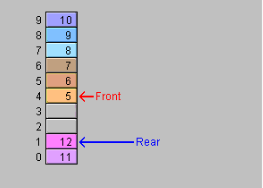

# queue

C++有做好的队列模版库`#include <queue>//C++ STL中的队列`。

- 使用C++模版类

队列一般用来做重要的系统软件开发，

作用：设计一个线程池，线程池需要一个工作列表，工作列表用队列设计。

- 操作系统和客服系统中，都是应用了一种数据结构来实现刚才所提到的先进先出的排队功能，这就是队列。
- 队列（queue）只允许在一端进行插入操作，在另一端进行删除操作的特殊线性表，不允许在中间部位进行操作。
- 队列在程序设计中用的非常频繁。比如用键盘进行各种字母或数字的输入，到显示器上如笔记本软件上的输出，其实就是队列的典型。
- 队列是一种先进先出（First in First Out）的线性表，简称FIFO，允许插入的一端称为队尾（Rear），允许删除的一端称为队头（Front）。

队列是两端进行操作，头插尾删或者尾插头删都可以。

结点的内存管理：
添加插入结点的时候要malloc内存。

向队列中添加元素，相当于 向线性表的尾部添加元素
注：
需要把栈的item（栈的业务结点）转化成链表的LinkListNode
设计队列的业务结点的数据结构：

如果清空队列 需要显式的把队列中的所有结点 搞出来
释放每一个结点

删除结点的方法已经对结点的内存进行的释放管理，所以清空队列直接调用删除结点方法。
销毁队列调用清空队列方法。

## 顺序队列

使用可变的数组，大小可以增加一倍。

队首队尾做成一个环形的，删除以后空白的空间可以再利用。队尾就跑在队首的前面了。

在本次例子设计中，队首位置留空的。这样push和pop会快一点。牺牲了一个位置空间，但是加快了速度。

### Push

push如果是最后一个，需要把队尾变成数组第一个，充分利用空余空间，

放数据放的多，删数据少。一直push插入。容量满了。需要扩大一倍，拷贝数据到新的数组。

无论是否发生回绕，都是按照队首到队尾的顺序去拷贝到新的数组中，新的数组第一个是队首数据，最后一个是队尾数据。

### 扩大容量增加一倍

#### 满了第一种情况：

没有发生回绕，直接copy下来。

| 队首 |      |      |      |      |      |      | 队尾 |
| :--: | :--: | :--: | :--: | :--: | :--: | :--: | :--: |
|      |  A   |  B   |  C   |  D   |  E   |  F   |  G   |

#### 满了第二种情况：

发生了回绕，要重新排序，排成`ABCDEFG` 有两个拷贝。

队尾是`G`，队首是最后一个。（队首也可以设置成第一个，第一个位置留空。）

|      |      |      |      | 队尾 | 队首 |      |      |
| :--: | :--: | :--: | :--: | :--: | :--: | :--: | :--: |
|  C   |  D   |  E   |  F   |  G   |      |  A   |  B   |

#### 增大一倍之后：

|      |      |      |      |      |      | 队尾 |      |      |      |      |      |      |      |      | 队首 |
| :--: | :--: | :--: | :--: | :--: | :--: | :--: | :--: | ---- | ---- | ---- | ---- | ---- | ---- | ---- | :--: |
|  A   |  B   |  C   |  D   |  E   |  F   |  G   |      |      |      |      |      |      |      |      |      |

## 链式队列

用链表做的队列叫链式队列。

数组缺点：

1. 数组大小固定 一旦创建了数组 数组大小就不能改变

   数组需要做一个环绕的算法，充分利用数组中空余的元素位置。即使可以环绕数组仍可能不够大，还需要扩大倍增。 所以用数组设计队列程序设计复杂。

   链表就简单一点，一个节点指向下一个节点，可以动态创建新的节点，没有不够用的问题。

2. 数组不够大的时候，容量不够，需要倍增。

   放大一倍之后，一半的空间是空闲的。数组不可能都是满的，会有空闲的，浪费空间。平均会浪费25%。

链表做的：

比数组做的每一个节点多一个指针，数组不需要指针，链表需要多一个存储空间来存储指针，指针占用字节比较少。

用链表做的一个不多一个不少，填充度百分之百。存储空间浪费的少。

## 队列

两个指针：队首，队尾。

入队有new 出队有delete。
