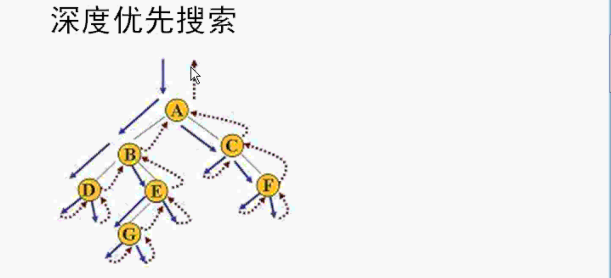
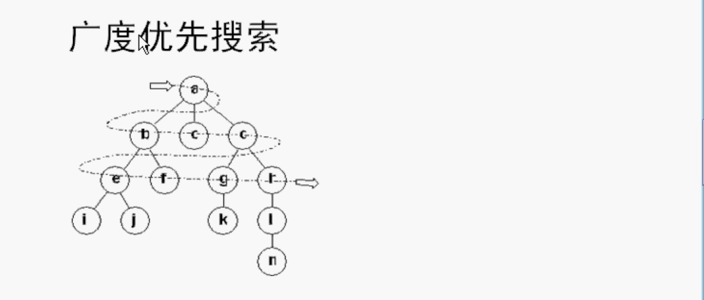
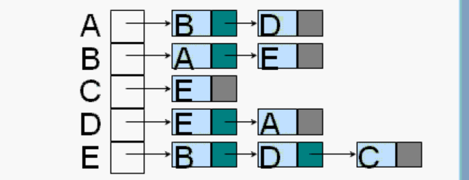

# 图

图有很多的顶点、很多的边。

图是一个class。顶点也是一个class（可以是复杂的顶点）。

## 边（线）

边有两种设计

1. 邻接表
2. 邻接矩阵

## 图_邻接矩阵

一个顶点和其他顶点是否是相邻，相邻为1，不相邻为0。

5个顶点，就是5行5列二维数组组成的矩阵。


- **定义一个数组，保存所有顶点。**

- 实际数组顶点个数

- **定义一个二维数组做邻接矩阵。**

- 构造函数
  - 顶点数为0
  - 二维数组初始化为0
- 析构函数
- 增加一个顶点
- 增加一个边
- 打印矩阵

### 邻接矩阵的搜索算法

搜索算法也叫遍历。

按照一定的顺序把图的每一个顶点访问一遍。

1. DFS --> 深度优先搜索

   使用堆栈，因为每经过一个就放到堆栈里，向回返的时候要利用堆栈，从堆栈里再取出来。

2. BFS --> 广度优先搜索

   使用队列，把a周围的顶点都放队列里，从队列里先放的先取出来，再处理取出来的顶点，把它周围的顶点再放到队列里，一直循环。

### 深度优先



从起点开始沿着一条路径一直走到底。

只要能向下走就向下走，能走多深走多深，只要有下一个顶点就一直向下走，走到底走不了了再往回返，返回上一个顶点，然后继续向下走。

深度优先遍历的时候，遍历过的都放到堆栈里，一直向下走，走到底的时候，再从堆栈里得到上一个顶点，返回的时候要利用堆栈得到。

### 广度优先（宽度优先）



从a顶点开始，先把a周围的所有的顶点走一遍，再把b周围所有的顶点来一遍，然后c，d，。。。

先进入队列的先处理，b，c，d，进入队列，先处理b周围的顶点，再处理c的，再处理d的，按照顺序。

b周围的顶点再放入队列，c，d同理。

### 例


对上面的邻接矩阵 深度优先搜索的结果：A，B，E，C，D。广度优先搜索结果：A，B，D，E，C。

使用前面写过的邻接矩阵做的图添加深度优先搜索算法。

两个类

- 顶点
  - 用bool变量记录顶点是否被搜索过，搜索过程中不允许重复搜索。
- 图
  - 定义一个成员函数，用来显示某一个顶点。
  - 再加一个成员函数，获得邻接的下一个访问的顶点。返回下一个顶点的下标。没找到的话返回-1。

### 深度优先搜索

定义一个堆栈，堆栈里保存的是顶点的下标。

从第一个顶点开始，把它设置为访问过了。把访问过的顶点压入堆栈，一直向下走，走到最后一个顶点不能走了，按照堆栈原路返回，返回的时候要从堆栈里找顶点。

当堆栈是空的时候，就结束了。

找相邻的没有访问过的下一个顶点：

1. 有可能没有下一个：如果是-1就是没有，则向上返回。
2. 有下一个：找到的是下标。然后把找到的下一个的顶点放到堆栈。并且把找到的顶点设置为已经访问过了。

最后要把所有的顶点都设置为未访问过。这样搜索过一次之后，还可以再搜索。

```c++
/// 深度优先搜索 使用C++做好的堆栈stack
void Graph::DFS()
{
    //定义一个堆栈 堆栈里面保存的是顶点的下标
    stack<int> gStack;
    //从第一个顶点开始 把第一个顶点设为true 显示第一个顶点
    vertexList[0]->wasVisited = true;
    showVertex(0);
    gStack.push(0);//把访问过的顶点压入堆栈，因为访问完了要返回 从堆栈里找到每一个顶点
    int v;
    while (gStack.size() > 0) {//当堆栈是空的时候，搜索就结束了
        v = getAdjUnvisitedVertex(gStack.top());//找相邻的没有访问过的下一个。一直找。找到的是下标。
        //没找到 最后一个顶点没有下一个 有可能没有下一个
        if (v == -1) {
            gStack.pop();//向回返回
        }
        //找到了
        else {
            vertexList[v]->wasVisited = true;
            showVertex(v);//把下一个显示出来
            gStack.push(v);//把下一个放入堆栈
        }
    }
    cout << endl;
    //最后把所有的顶点处理一下，因为深度优先搜索的时候把顶点都变成了true，访问完了要把顶点都变成false，这样以后可以再进行重复搜索。
    for (int j = 0; j < nVerts; j++) {
        vertexList[j]->wasVisited = false;
    }
}
```

### 广度优先搜索

广度优先搜索又叫宽度优先搜索

使用队列`#include <queue>//C++ STL中的队列`

先把第一个顶点相邻的所有的顶点都访问一遍。然后再访问第二层。

本质上广度优先搜索是一层一层的访问。

广度优先搜索使用队列，把访问过的每一个顶点放入队列。

访问第一个顶点，把它相邻的顶点放入队列，访问第二层，把相邻的放入队列，以此类推。

使用的是队列，从第一个顶点开始。访问过的每一个顶点都要放入队列。

用一个循环，如果队列里面有顶点，就继续循环，为空则结束。

取出顶点a，在删除a。获取和a相邻接的所有的未访问过的。和a相邻接的为-1则找完了。

访问过的每一个顶点都要访问队列，因为访问下一层的时候要用。

结束之后，再把所有顶点是否访问过置为false， 这样以后还能再遍历。

```c++
//广度优先
void Graph::BFS()
{
    queue<int> qQueue;//队列里面保存的顶点的下标
    vertexList[0] -> wasVisited = true;
    showVertex(0);//把顶点显示出来
    qQueue.push(0);//访问过的每一个顶点都要放入队列
    int vert1, vert2;//定义两个变量
    //如果队列里面有顶点 不是空的 就一直循环
    while (qQueue.size() > 0) {
        vert1 = qQueue.front();
        qQueue.pop();
        vert2 = getAdjUnvisitedVertex(vert1);//和vert1相邻接的未访问过的顶点。可能有多个。所以需要下面循环 找到所有相邻接的顶点。
        while (vert2 != -1) {
            vertexList[vert2] -> wasVisited = true;
            showVertex(vert2);//把顶点显示出来
            qQueue.push(vert2);//访问过的每一个顶点都要放入队列，访问下一层的时候要用
            vert2 = getAdjUnvisitedVertex(vert1);//和vert1相邻接的未访问过的顶点。可能有多个。所以需要循环 找到所有相邻接的顶点。
        }
    }
    cout << endl;//加一个换行
    //最后把所有的顶点处理一下，访问完了要把顶点都变成false，这样以后可以再进行重复搜索。
    for (int j = 0; j < nVerts; j++) {
        vertexList[j]->wasVisited = false;
    }
}
```

本次学习是用的邻接矩阵 用的数组。也可以使用邻接表，对链表进行操作。需要做一些修改。

## 图_邻接表

使用邻接矩阵表示图。 存在浪费。邻接矩阵里面有很多0，数组有空。并且邻接矩阵是对称的，一半是多余的。 

特点是简单

最好是用邻接表来设计图。用到链表，复杂一点点。

例：5 个顶点


针对每一个顶点，每一个顶点都设计一个链表，表示和它相连顶点的链接情况。有5个链表。

A和B相连，A和D相连。B和D没有前后顺序之分。



ABCDE也可以用序号表示，01234表示ABCDE。在实际编程的时候，都是用序号来做邻接表。


### 顶点

自己定义顶点。保存各种数据。

### 图

- 私有的数据成员
  - 数组 保存所有的顶点
  - 链表
  - 一共有几个顶点 最多可以有几个顶点
  - 当前的顶点树
- 构造函数
  - 传过来最多几个顶点
  - 创建一个数组保存所有节点
  - 定义第二个数组，链表。这里是5个链表。
  - 当前顶点数为0
- 析构函数
  - 把两个new对应的delete写出来
- 两个成员函数
  - 给图增加一个顶点
  - 增加一条边（用的两个顶点的序号）
- 两个测试函数
  - 打印所有顶点
  - 打印邻接表

用C++模版类来设计图，模版可以是任何类型（char或者自己定义的class）。
