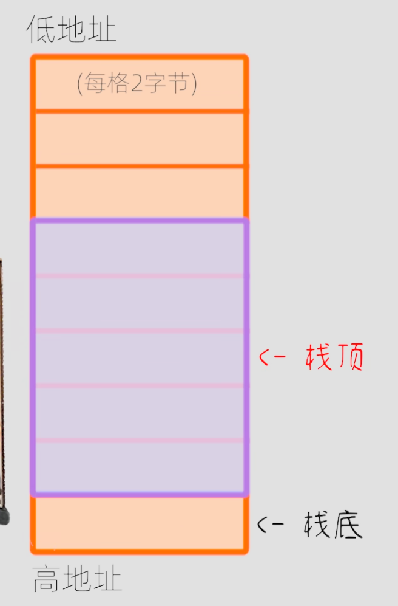
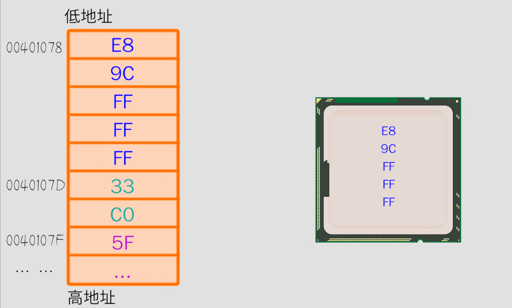

# 堆栈

堆栈是一种容器  存储各种数据 

栈是一种数据结构，系统软件或算法中用到栈。


CPU内部有个核心模块叫ALU，专门用来做逻辑运算和数学计算，比如1+1=10。

人做算数运算的时候，如果算式比较复杂（9527+2233+666），没法一次性算出结果，会先计算9527+2233，得到临时结果11760，再把临时结果和666相加。同理，再算式复杂的时候ALU也是这么做的，把临时结果找个地方存放一下，于是工程师在CPU里又设计了一些可以存放数字的模块，叫做寄存器（AX、BX、CX、DX等）。ALU把临时结果保存在寄存器中，需要的时候再拿出来用，这就解决了复杂算式分布计算的问题。

为了实现更复杂的计算，能不能做更多的寄存器？

不能，这会增加CPU设计的复杂性以及成本，于是之只能从外部请帮手了，要求：读写速度要快，因为CPU速度很快，内存。

在内存中划出一片专门的区域，用来临时存储数据，这个区域叫做栈stack。（注意：内存中还有一个区域叫堆heap）。

内存：



栈底固定不动，栈顶是可以变化的，堆栈里没有数据的时候，栈顶和栈底是重合的，当需要在栈里存数据的时候，就把栈顶的位置往上挪（即低地址方向），数据放进去，这个动作叫做压栈或入栈PUSH。当需要从栈里取出数据的时候，就先把数据复制到CPU中的寄存器，然后把栈顶的位置往下挪，这个动作叫做弹栈或出栈POP。

出栈后，这个数据还在堆栈里，但是已经被当作垃圾了。

#### 堆栈在编程中常见的应用

堆栈和函数调用

程序在运行的时候，是以机器码的形式躺平在内存里面的，每一句机器码都有自己的位置，称为地址，



CPU执行程序的时候就是把程序中的每一句机器码挨个拿过来，分析出这句机器码是干啥的，然后做响应的操作，该计算的计算，该取数据的取数据，该跳转的跳转。

函数

函数就是一堆代码的打包。函数调用就是CPU在执行一个函数中的代码时，临时跳转到另一个函数，执行到另一个函数的代码，执行完成之后，再跳转回来，叫做函数跳转和返回。

从函数A跳转到函数B，函数B执行完之后，返回到原来的函数A。所以跳转的时候，CPU把函数A的地址在栈中记下来（入栈），返回的时候就知道执行哪一句了，返回之后再弹栈。

为什么用栈

函数调用都是嵌套的，A函数调B函数，B函数调C函数...

每一次函数调用都会消耗堆栈的空间，而整个堆栈的大小是有限（固定大小）的，如果函数无限调用下去而从来不返回，堆栈就被塞满了，这个时候再试图把数据压栈就会导致错误，叫做堆栈溢出（Stack Overflow），程序就崩溃了，

## 堆栈特点

先进后出（FILO）或 后进先出（LIFO）

## 栈的操作

1. Push（新数据放入堆栈）
2. Pop（把栈顶数据删除）
3. Top（返回栈顶数据，并不删除）

像一个桶一样，放入东西在最上面，拿的时候取最上面的，也就是最后放入的。

## 顺序存储（顺序栈）
使用动态数组实现。

线性表的顺序存储模拟栈的顺序存储。在尾部添加或删除元素，不会涉及到数组的元素大量移动，所以在后面好。


数据入栈时：添加到数组中，先判断是否满了，数组满了，把原来的数组容量放大一倍，旧数据拷贝到新到里面

## 链式存储（链式栈）

使用链表实现，堆栈里面是Link。

线性表的链式存储模拟栈的链式存储。

线性表是单向的 如果是尾部插入删除 需要跳指针，如果是头部插入删除 则不需要遍历。

用链表做的栈比数组在某方面灵活一些。链表做的堆栈，链表动态创建节点，插入数据速度比数组快。

链式存储没有容量，顺序存储才有。数组容量分配大小确定之后就不改变，当数组容量不够需要重新分配数组。

入栈：不希望函数运行完 内存消失，所以结点要malloc内存。

清空栈：涉及到栈元素生命周期的管理。把栈中元素弹出，并且释放结点内存。

清空栈：里面调用弹出栈的方法。pop弹出方法中已经释放结点内存。

销毁栈：调用清空栈的方法 和销毁链表的方法。

## 应用

### 1、编译器检测括号是否匹配 

利用就近匹配的特性

#### 算法思路

>- 从第一个字符开始扫描
>- 当遇见普通字符时忽略
>- 当遇见左符号时压入栈中
>- 当遇见右符号时从栈中弹出栈顶符号，并进行匹配
>  - 匹配成功：继续读入下一个字符
>  - 匹配失败：立即停止，并报错
>- 结束：
>  - 成功：所有字符扫描完毕，且栈为空
>  - 失败：匹配失败或所有字符扫描完毕但栈非空

当需要检测成对出现但又互不相邻的事物时，可以使用栈"先进后出"的特性，栈非常适合于需要"就近匹配"的场合。

### 2、中缀 后缀

计算机的本质工作就是做数学运算。

后缀表达式：将运算符放在数字后面，符合计算机的“运算习惯”。

中缀表达式，符合人类的阅读和思维习惯。

实例：

>中缀 => 后缀
>
>5 + 4 => 5 4 +	
>
>1 + 2 * 3 => 1 2 3 * +
>
>8 + (3 - 1) * 5 => 8 3 1 - 5 * +

#### 中缀表达式转换成后缀表达式

算法：

- 遍历中缀表达式中的数字和符号
- 对于数字：直接输出
- 对于符号：
  - 左括号：进栈
  - 运算符号：与栈顶符号进行优先级比较（左括号优先级最低）
    - 若栈顶符号优先级低：此符合进栈
    - 若栈顶符号优先级不低：将栈顶符号弹出并输出，之后进栈
  - 右括号：将栈顶符号弹出并输出，直到匹配左括号
- 遍历结束：将栈中的所有符号弹出并输出

把中缀表达式转换成后缀表达式是编译器做的。

#### 计算机是如何基于后缀表达式计算的

8 3 1 - 5 * +

遍历后缀表达式中的数字和符号

- 对于数字：进栈
- 对于符号：
  - 从栈中弹出右操作数
  - 从栈中弹出左操作数
  - 根据符号进行运算
  - 将运算结果压入栈中
- 遍历结果：栈中的唯一数字为计算结果

## Stack实现

开始的时候堆栈是空的，堆栈有一个头（header），头head是一个指针，开始的时候头head=0是一个空指针。

在堆栈中放入数据push，头head就指向第一个数据。然后放第二个数据，head就指向第二个数据。head始终指向最上面的那个。

一个一个数据是用链表做的。有指针指向下一个数据。链式栈。

代码

```c++
struct Stack
{
    //结构中嵌套结构
    struct Link //堆栈中的每一个数据都是Link。
    {
        void* data;//Link中的数据
        Link* next;//指针 指向下一个数据
        void initialize(void* dat, Link* nxt);//Link节点初始化
    }* head;//头
    
    void initialize();//堆栈初始化
    void push(void* dat);//把数据压入堆栈
    void* pop();//从堆栈中拿数据，只能从一头拿 不能从中间拿。把head指向的数据拿出来，head指向下一个。
    void* peak();//只看一下数据，不拿出来。
    void cleanup();
};
//初始化Link
void Stack::Link::initialize(void* dat, Link* nxt)
{
    data = dat;
    next = nxt;
}
//初始化堆栈
void Stack::initialize()
{
    head = 0;
}
// 把数据放入堆栈
void Stack::push(void* dat)
{
    //数据是保存在Link里面的
    Link* newLink = new Link;
    newLink -> initialize(dat, head);
    head = newLink;
}
//查看最上面的数 head
void* Stack::peak()
{
    //加一个检查，头指针不能是0，是0的话栈就是空的。
    return head->data;
}
//从堆栈中取数据
void* Stack::pop()
{
    if (head == 0) {
        return 0;
    }
    void* result = head->data;
    //head指向下一个指针，原来的head指向的就删除了
    Link* oldHead = head;
    head = head->next;
    delete oldHead;
    return result;
}
//清理堆栈
void Stack::cleanup()
{
    //加一个检查，如果head==0,则堆栈是空的。
    //这里并没有做真正的清理，让外部使用pop做清理，这里就只有一个是否为空的检查。
}
```

调用：

```c++
void test()
{
    ifstream in("Test.cpp");
    
    Stack textlines;
    textlines.initialize();//初始化
    
    string line;
    while (getline(in, line)) {
        textlines.push(new string(line));
    }
    
    string *s;
    while ((s = (string *)textlines.pop()) != 0) {
        cout << *s << endl;
        delete s;
    }
    
    textlines.cleanup();

//    cout << *(string *)textlines.peak() << endl;
    
}
```


