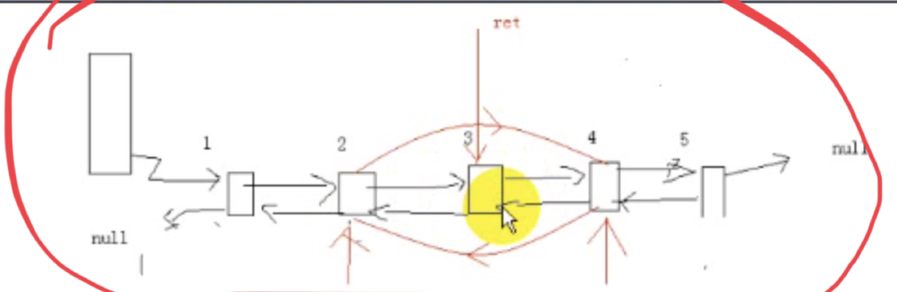

# 链表

## 节点

### 1、数据域

根据需要节点保存各种各样数据。节点的数据域可以多个。

### 2、链接域

节点的指针也可以有多个，可以相同也可以不同。

一个节点只有一个指针指向下一个节点的叫单链表。

```c++
class NodeB;
//节点
class NodeA
{
private:
    //3个数据域
    int data1;
    char data2;
    float data3;
    //2个指针 指针可以有多个
    NodeA *linka;
    NodeB *linkb;
};

//第二个节点
class NodeB
{
private:
    int data;
    NodeB *link;
};
```

## 单链表为什么要增加头结点

1. 便于⾸元结点处理。

2. 便于空表和非空表的统⼀处理。

## 总结

链表的插入和删除需要先遍历查找位置，然后改变指针（前一个数据和后一个数据）指向。

链表不需要连续，数组是连续的。

## Delete

两个节点：

1. 一个当前节点 
2. 一个前一个节点

for循环中遍历查找要删除的节点

判断删除的是否有前一个节点：

- 有的话，前一个节点的下一个节点指向当前节点的下一个节点

- 没有的话，要删除的是第一个节点。第一个节点指向第一个节点的下一个节点。

把要删除的节点删除，释放内存

## Invert

第一种方法：使用迭代，遍历链表，使得链表每一个节点的下一个节点指针指向其前一个节点。

>第一个节点的下一个指针指向null
>
>第二个节点的下一个指针指向第一个节点
>
>第三个节点的下一个指针指向第二个节点
>
>第四个节点的下一个指针指向第三个节点
>
>一直到最后一个节点的下一个指针指向其前一个节点

第二种方法：创建一个新的链表，把原链表的节点一个一个的插入新的链表中，每次都是头插。最后把原来链表清空销毁，返回新的链表。

## 循环链表

特定算法需要循环链表，如：约瑟夫问题。

循环：链表的最后一个节点的指针指向最前面的节点。

**循环链表必须使用带表头结构的。**因为如果链表是空的，则需要自己指向自己来循环。


### 表头

**表头不是第一个节点，表头节点里面没有数据。**

### 判断链表是循环链表

用两个指针：

一个指针是快指针（跳一个节点遍历），遍历快（p=p->netxt->next)

一个指针逐步遍历，慢指针

如果在遍历当中，如果发现这两个指针出现NULL指针的话，停止循环，那它便是单链表。

如果在循环链表中，慢指针和快指针重叠，那它是循环链表。

## 双向链表

双向链表即可以next向下，也可以向上，双向的移动。功能上双向链表可以完全取代单链表的使用。

双向链表可以是循环链表，也可以不是循环链表。

### 节点

双向链表至少有三个域

1. 数据域`data`
2. 左链域`llink`指针，指向上一个节点
3. 右链域`rlink`指针，指向下一个节点

### 带表头结构的双向链表

有表头结构对空链表易于处理。

#### 1、没有数据时

空链表，只有一个表头，表头节点左链域指针指向自己，右链域的指针也指向自己。


#### 2、有数据

表头下一个节点指向第一个节点，第一个节点的下一个指向第二个节点，最后一个节点的下一个节点指向表头节点，表头节点的上一个指向自己。


节点是指针`*`，创建的时候是`new`， 使用成员变量用`->`。

可以自己写复杂的：模版类（保存任何类型）、带有迭代器。 更加完善的代码。

### 双向链表的插入

异常处理：
头结点，尾结点，链表为空 插入第一个结点。


```c++
next = current->next;

node->next = next;
current->next = node;

node->pre = current;
next->pre = node;
```

特殊处理：


1. 尾部的null的pre就不用指向。
2. 当前节点pre指向null。

### 双向链表的删除

删除主要考虑特殊情况：头结点  只有一个结点。


用的时候就是 第一个域包含结点。

#### 1、从中间删除



#### 2、删除头节点


#### 3、只有一个节点时


```
current->next = ret->next;
next->pre = current;
```

