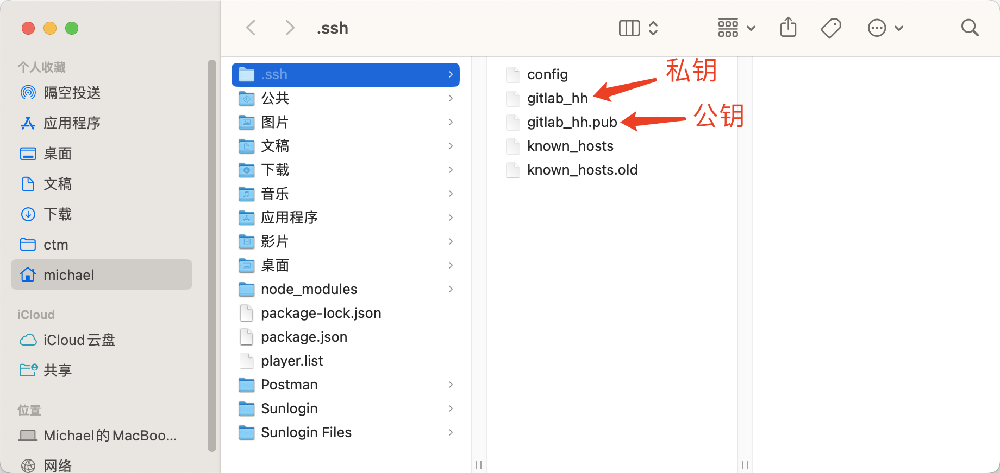
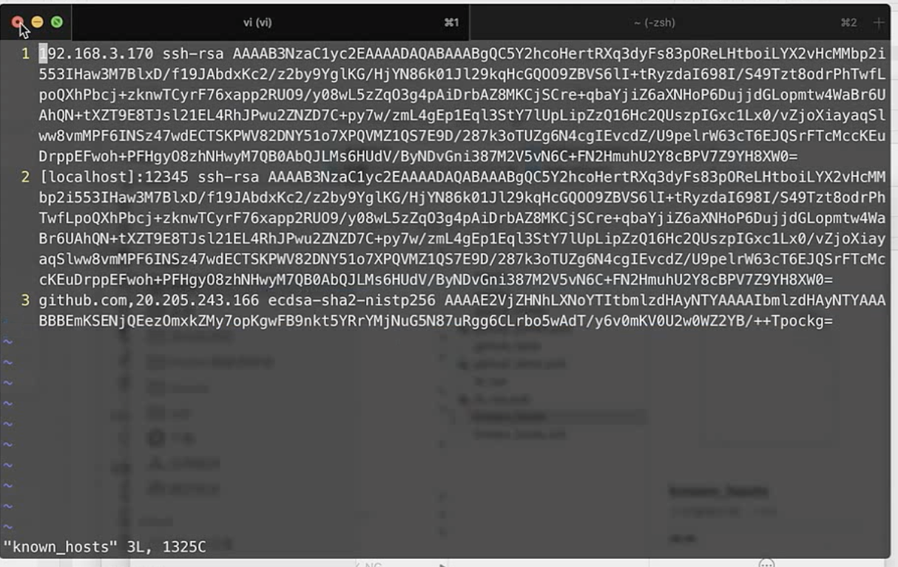

## GitHub上传文件不能超过100M的解决办法

上传项目到GitHub上，当某个文件大小超过100M时，就会上传失败，因为默认的限制了上传文件大小不能超过100M。如果需要上传超过100M的文件，就需要我们自己去修改配置。

首先，打开终端，进入项目所在的文件夹；

输入命令：`config http.postBuffer 524288000`

之前git中的配置是没有这一项的,执行完以上语句后输入：`git config -l`可以看到配置项的最下面多出了一行我们刚刚配置的内容. (52428000=500×1024×1024,即500M)

## SSH密钥免密登录

### 电脑生成公钥私钥

家目录创建.ssh文件夹`mkdir ~/.ssh`

`cd ~/.ssh`

`open .`

⽣成⼀对新的公钥、私钥。

`ssh-keygen -t rsa -b 4096 -C "cuihuihui@nmy.cn"`

```bash
lemonacc@LemonAccdeMacBook-Pro .ssh % ssh-keygen -t rsa -b 4096 -C "cuihuihui@nmy.cn"
Generating public/private rsa key pair.
Enter file in which to save the key (/Users/lemonacc/.ssh/id_rsa): gitlab_hh
Enter passphrase (empty for no passphrase): 
Enter same passphrase again: 
Your identification has been saved in gitlab_hh
Your public key has been saved in gitlab_hh.pub
The key fingerprint is:
SHA256:7+hnxolNmRv2j8t1Dx9o5k2u4A+zY7ksd+vTeJ4vLqg cuihuihui@nmy.cn
The key's randomart image is:
+---[RSA 4096]----+
|                 |
|                 |
|                 |
|                 |
|        S  o     |
|         .*   .  |
|         *.X.+=o.|
|        .+%*@*=*+|
|       .E===X@O*=|
+----[SHA256]-----+
lemonacc@LemonAccdeMacBook-Pro .ssh %
```



### 后台启动ssh-agent

```bash
lemonacc@LemonAccdeMacBook-Pro .ssh % eval "$(ssh-agent -s)"
Agent pid 20412
lemonacc@LemonAccdeMacBook-Pro .ssh %
```

### 修改`~/.ssh/config`文件

`vi ~/.ssh/config`

然后编辑内容，私钥的名字和路径。

```bash
Host 						git.nmy.cn
HostName        192.168.1.66
User            cuihuihui@nmy.com
AddKeysToAgent  yes
UseKeychain     yes
IdentityFile    ~/.ssh/gitlab_hh
```

### 验证是否可以连接

```bash
lemonacc@LemonAccdeMacBook-Pro ~ % ssh -T git@git.nmy.cn                       
The authenticity of host '192.168.1.66 (192.168.1.66)' can't be established.
ED25519 key fingerprint is SHA256:Ftr+xLxVgYwrZhNzkFYlPFCryD2LupmkWoiZmQtdtGI.
This key is not known by any other names
Are you sure you want to continue connecting (yes/no/[fingerprint])? yes
Warning: Permanently added '192.168.1.66' (ED25519) to the list of known hosts.
Welcome to GitLab, @cuihuihui!
```

known_hosts

里面记录了公钥和私钥

vi known_hosts

前面是git服务器地址，ssh-rsa后面是公钥的base64编码。


