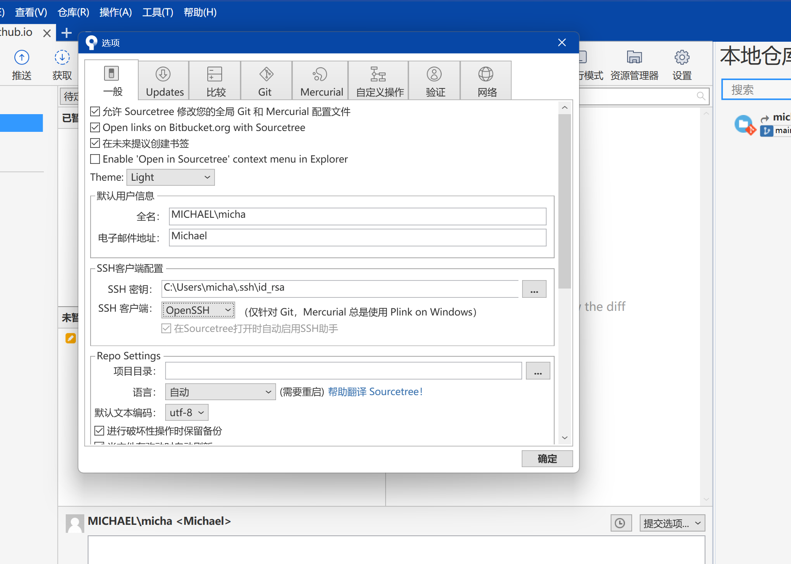

## GitHub上传文件不能超过100M的解决办法

上传项目到GitHub上，当某个文件大小超过100M时，就会上传失败，因为默认的限制了上传文件大小不能超过100M。如果需要上传超过100M的文件，就需要我们自己去修改配置。

首先，打开终端，进入项目所在的文件夹；

输入命令：`config http.postBuffer 524288000`

之前git中的配置是没有这一项的,执行完以上语句后输入：`git config -l`可以看到配置项的最下面多出了一行我们刚刚配置的内容. (52428000=500×1024×1024,即500M)

## SSH密钥免密登录

### 电脑生成公钥私钥

家目录创建.ssh文件夹`mkdir ~/.ssh`

`cd ~/.ssh`

`open .`

⽣成⼀对新的公钥、私钥。

`ssh-keygen`

`ssh-keygen -t rsa -b 4096 -C "cuihuihui@nmy.cn"`

```bash
Last login: Fri Jun  2 12:31:48 on ttys001
michael@localhost ~ % ssh-keygen
Generating public/private rsa key pair.
Enter file in which to save the key (/Users/michael/.ssh/id_rsa): 
Enter passphrase (empty for no passphrase): 
Enter same passphrase again: 
Your identification has been saved in /Users/michael/.ssh/id_rsa
Your public key has been saved in /Users/michael/.ssh/id_rsa.pub
The key fingerprint is:
SHA256:hBPZ+Tl+HVq7HLMF+ji0NMMMIjgoS9J8g2gD74dffMQ michael@localhost
The key's randomart image is:
+---[RSA 3072]----+
|      .o .       |
|.     .oo        |
|.= o .o... .     |
|++* = .oE =   +  |
|++.o + oSo = = + |
|. o . o . . @ = .|
|   o . .   + B * |
|    .       + =  |
|             .   |
+----[SHA256]-----+
michael@localhost ~ % 
```


### 后台启动ssh-agent

```bash
lemonacc@LemonAccdeMacBook-Pro .ssh % eval "$(ssh-agent -s)"
Agent pid 20412
lemonacc@LemonAccdeMacBook-Pro .ssh %
```

添加SSH密钥到SSH代理：运行以下命令将SSH私钥添加到SSH代理中：

```
ssh-add ~/.ssh/id_rsa
```

如果你使用的是非默认的密钥文件名或路径，请相应地修改命令。

### `~/.ssh/config`

`vi ~/.ssh/config`

然后编辑内容，私钥的名字和路径。

在文件中，你可以添加或编辑SSH连接的配置项。每个配置项应该以`Host`开头，后面跟着SSH连接的别名或主机名。例如：

```bash
Host		git.nmy.cn
	HostName        192.168.1.66
	User            cuihuihui@nmy.com
	AddKeysToAgent  yes
	UseKeychain     yes
	IdentityFile    ~/.ssh/gitlab_hh
Host		github.com
	HostName        github.com
	User            michaelstrongself@outlook.com
	AddKeysToAgent  yes
	UseKeychain     yes
	IdentityFile    ~/.ssh/id_rsa
Host myserver
    HostName 192.168.1.100
    User username
    Port 22
    IdentityFile ~/.ssh/private_key
```

在上面的例子中，`myserver`是连接的别名，`HostName`指定了服务器的IP地址或域名，`User`指定了登录用户名，`Port`指定了SSH连接的端口号，`IdentityFile`指定了私钥文件的路径。

### 验证是否可以连接

编辑`~/.ssh/config`文件保存并退出。现在可以使用SSH命令并引用配置文件中的别名来连接到相应的主机。例如：

```bash
ssh myserver
```

上述命令将会连接到配置文件中定义的`myserver`主机。

```bash
lemonacc@LemonAccdeMacBook-Pro ~ % ssh -T git@git.nmy.cn                       
The authenticity of host '192.168.1.66 (192.168.1.66)' can't be established.
ED25519 key fingerprint is SHA256:Ftr+xLxVgYwrZhNzkFYlPFCryD2LupmkWoiZmQtdtGI.
This key is not known by any other names
Are you sure you want to continue connecting (yes/no/[fingerprint])? yes
Warning: Permanently added '192.168.1.66' (ED25519) to the list of known hosts.
Welcome to GitLab, @cuihuihui!
```

known_hosts里面记录了公钥和私钥

```
192.168.1.66 ssh-ed25519 AAAAC3NzaC1lZDI1NTE5AAAAIJWq7fbZfohNZyp/MFlA7f/Q38BkG1RyIhH0eRI8WkYI
192.168.1.66 ecdsa-sha2-nistp256 AAAAE2VjZHNhLXNoYTItbmlzdHAyNTYAAAAIbmlzdHAyNTYAAABBBF7DbSjhH8oSFcg8Yq8Muh34JLYnJ+K773KDf3dXvUxkwbZsAFWITZASLuAVSDINbP74tHoCSHMiIwl9HlDTLVk=
github.com ssh-ed25519 AAAAC3NzaC1lZDI1NTE5AAAAIOMqqnkVzrm0SdG6UOoqKLsabgH5C9okWi0dh2l9GKJl
github.com ssh-rsa AAAAB3NzaC1yc2EAAAADAQABAAABgQCj7ndNxQowgcQnjshcLrqPEiiphnt+VTTvDP6mHBL9j1aNUkY4Ue1gvwnGLVlOhGeYrnZaMgRK6+PKCUXaDbC7qtbW8gIkhL7aGCsOr/C56SJMy/BCZfxd1nWzAOxSDPgVsmerOBYfNqltV9/hWCqBywINIR+5dIg6JTJ72pcEpEjcYgXkE2YEFXV1JHnsKgbLWNlhScqb2UmyRkQyytRLtL+38TGxkxCflmO+5Z8CSSNY7GidjMIZ7Q4zMjA2n1nGrlTDkzwDCsw+wqFPGQA179cnfGWOWRVruj16z6XyvxvjJwbz0wQZ75XK5tKSb7FNyeIEs4TT4jk+S4dhPeAUC5y+bDYirYgM4GC7uEnztnZyaVWQ7B381AK4Qdrwt51ZqExKbQpTUNn+EjqoTwvqNj4kqx5QUCI0ThS/YkOxJCXmPUWZbhjpCg56i+2aB6CmK2JGhn57K5mj0MNdBXA4/WnwH6XoPWJzK5Nyu2zB3nAZp+S5hpQs+p1vN1/wsjk=
github.com ecdsa-sha2-nistp256 AAAAE2VjZHNhLXNoYTItbmlzdHAyNTYAAAAIbmlzdHAyNTYAAABBBEmKSENjQEezOmxkZMy7opKgwFB9nkt5YRrYMjNuG5N87uRgg6CLrbo5wAdT/y6v0mKV0U2w0WZ2YB/++Tpockg=
```

前面是git服务器ip地址或者域名，ssh-rsa后面是公钥的base64编码。

## Windows配置SSH

生成 SSH 密钥对：一旦安装了 OpenSSH 客户端，你可以使用以下命令在 Windows 上生成 SSH 密钥对：

```bash
PS C:\Users\micha> ssh-keygen
Generating public/private rsa key pair.
Enter file in which to save the key (C:\Users\micha/.ssh/id_rsa):
```

按照提示输入密钥文件保存的路径和名称，或者直接按 Enter 使用默认路径和名称。接下来，你将被要求输入一个密码来保护你的私钥。

```bash
Created directory 'C:\\Users\\micha/.ssh'.
Enter passphrase (empty for no passphrase):
Enter same passphrase again:
Your identification has been saved in C:\Users\micha/.ssh/id_rsa
Your public key has been saved in C:\Users\micha/.ssh/id_rsa.pub
The key fingerprint is:
SHA256:q7Pe7tzvVMBNRHjVMiOPO+NJwFLl/dasO1BSnJXxJ/0 micha@Michael
The key's randomart image is:
+---[RSA 3072]----+
|           ..=+=*|
|          .oo+Ooo|
|         o  +*+++|
|        . o o.o++|
|        S. . +. E|
|         .  *. o |
|        .  o.=.  |
|      .+ . .o .. |
|     .+== .oo .. |
+----[SHA256]-----+
PS C:\Users\micha>
```

将公钥添加到 GitHub 帐户：使用以下命令来显示你的公钥：

```bash
cat ~/.ssh/id_rsa.pub
```

将输出的公钥复制到剪贴板。

1. 登录到你的 GitHub 帐户，转到 "Settings"（设置），然后选择 "SSH and GPG keys"（SSH 和 GPG 密钥）选项卡。
2. 点击 "New SSH key"（新的 SSH 密钥），然后在 "Title"（标题）字段中为该密钥提供一个描述性的名称。
3. 将你在步骤 3 中复制的公钥粘贴到 "Key"（密钥）字段中。
4. 点击 "Add SSH key"（添加 SSH 密钥）按钮。

现在，你应该已经成功将 SSH 密钥添加到 GitHub 帐户中。你可以尝试使用 SSH 克隆或推送到 GitHub 存储库，而无需每次都输入用户名和密码。

### sourcetree

报下面错误：

```
命令: git -c diff.mnemonicprefix=false -c core.quotepath=false --no-optional-locks ls-remote git@github.com:michaelssman/HHSpecs.git
输出: 
错误: The host key is not cached for this server:
  github.com (port 22)
You have no guarantee that the server is the computer
you think it is.
The server's ssh-ed25519 key fingerprint is:
  ssh-ed25519 255 SHA256:+DiY3wvvV6TuJJhbpZisF/zLDA0zPMSvHdkr4UvCOqU
If you trust this host, enter "y" to add the key to
PuTTY's cache and carry on connecting.
If you want to carry on connecting just once, without
adding the key to the cache, enter "n".
If you do not trust this host, press Return to abandon the
connection.
Store key in cache? (y/n, Return cancels connection, i for more info) fatal: Could not read from remote repository.

Please make sure you have the correct access rights
and the repository exists.
```

处理方法：

使用 OpenSSH 代替 PuTTY（推荐）

1. 打开 Sourcetree，并在菜单栏中选择 "Tools"（工具） -> "Options"（选项）。
2. 在 "Options" 窗口中，选择 "SSH" 选项卡。
3. 在 "SSH Client Configuration" 部分，将 "SSH Client" 设置为 "OpenSSH"。
4. 点击 "OK" 保存设置并关闭 "Options" 窗口。



