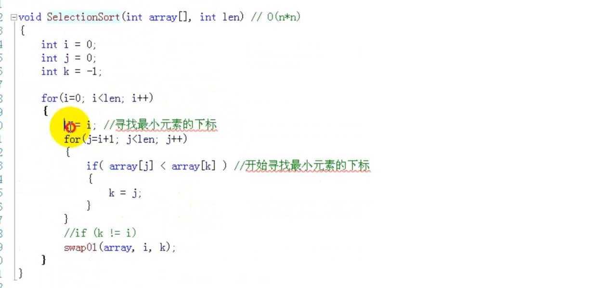
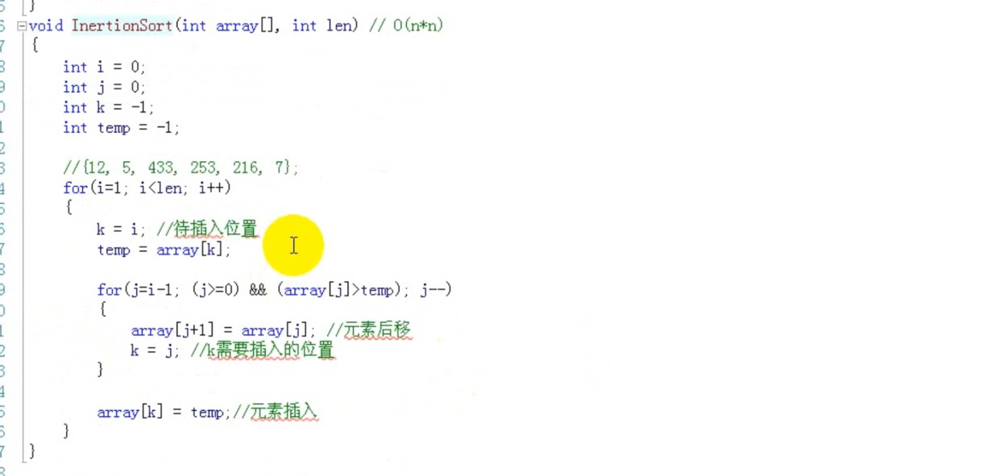
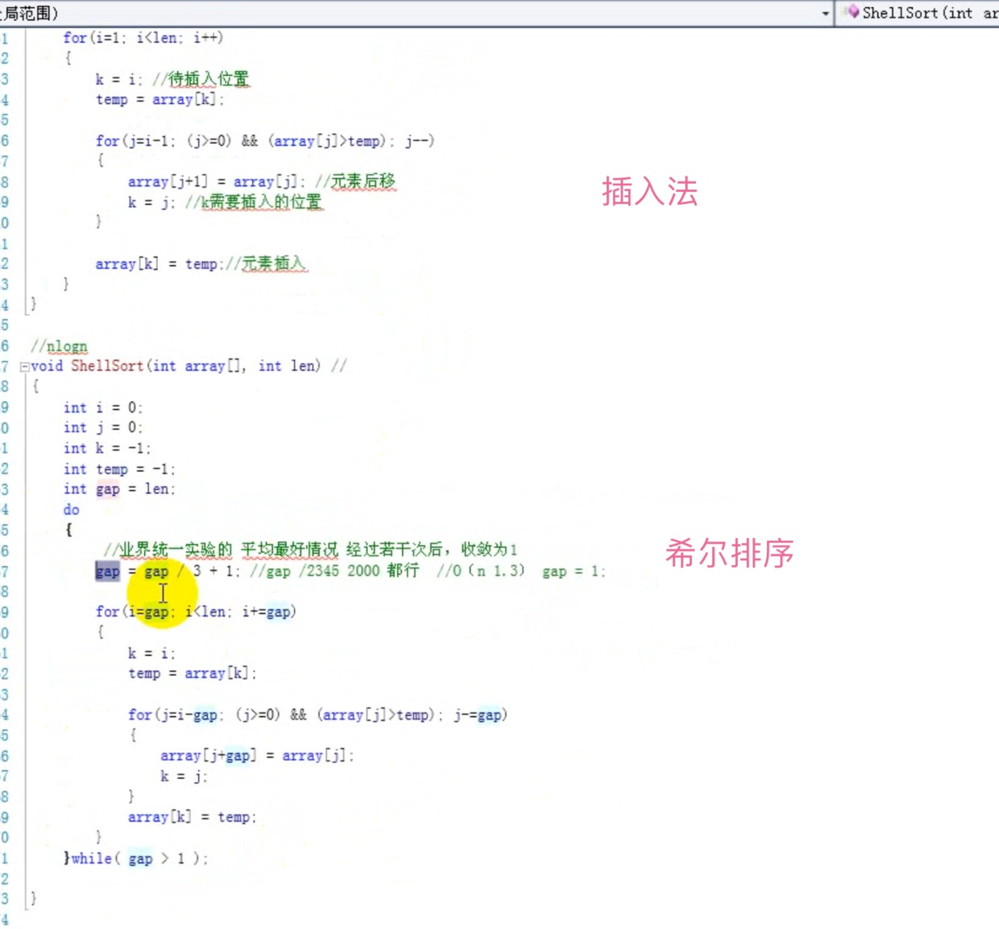
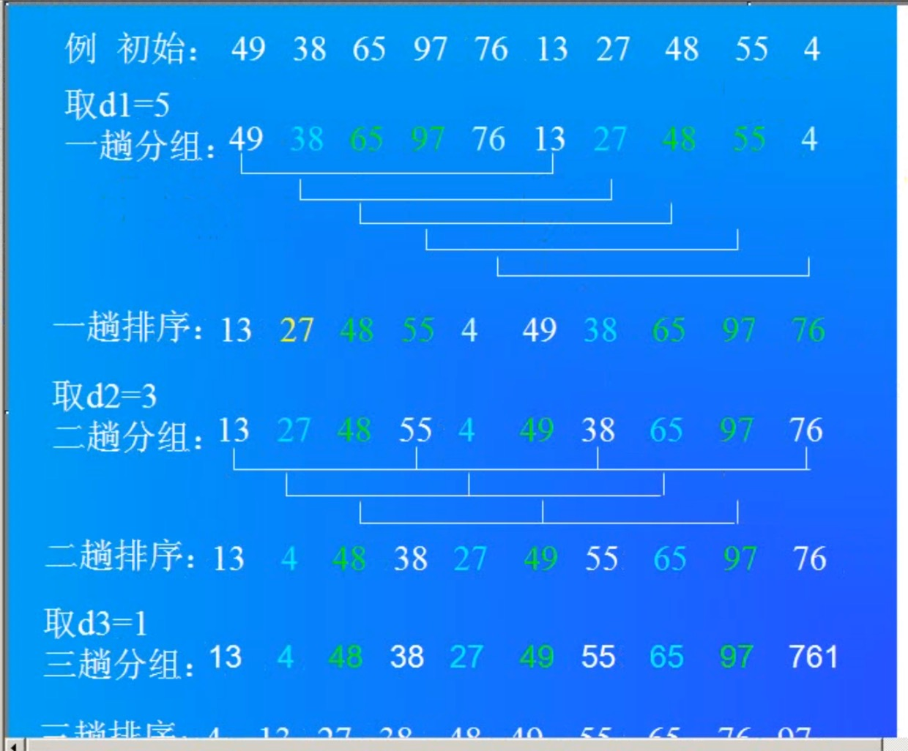
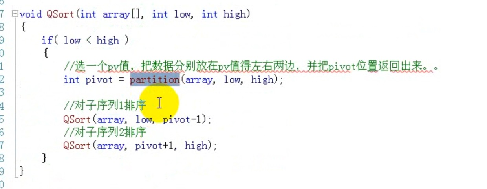
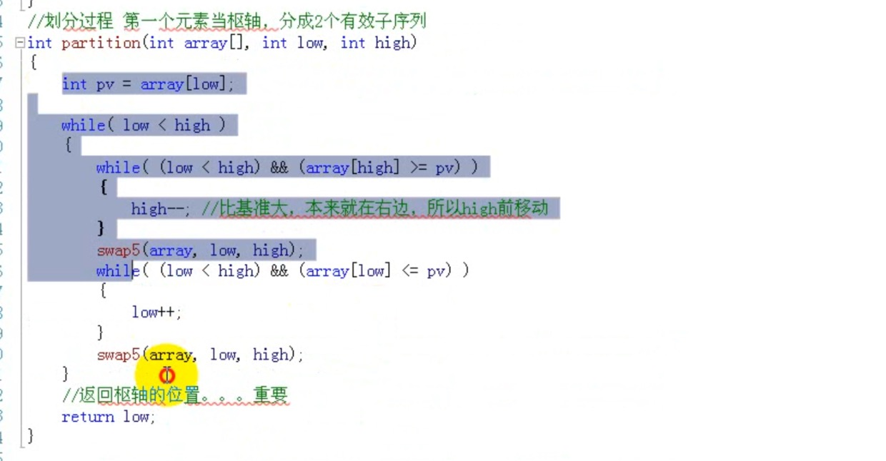
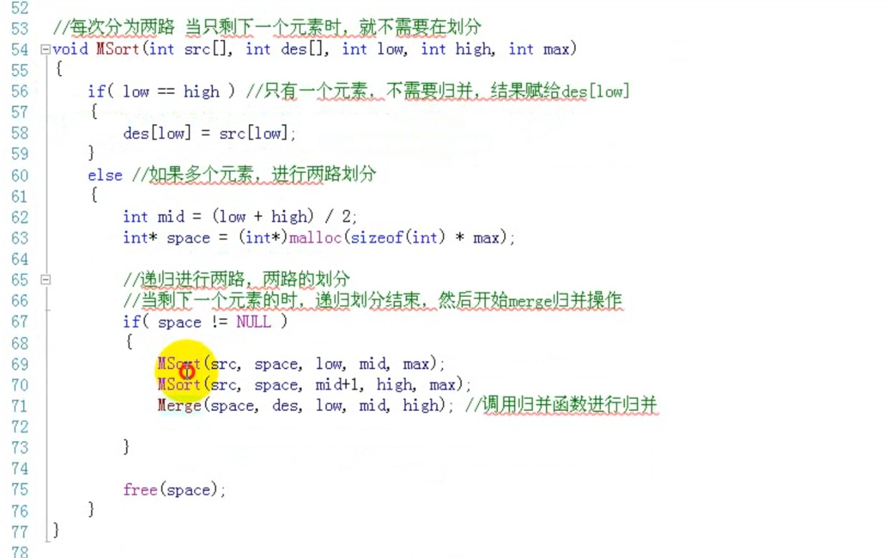
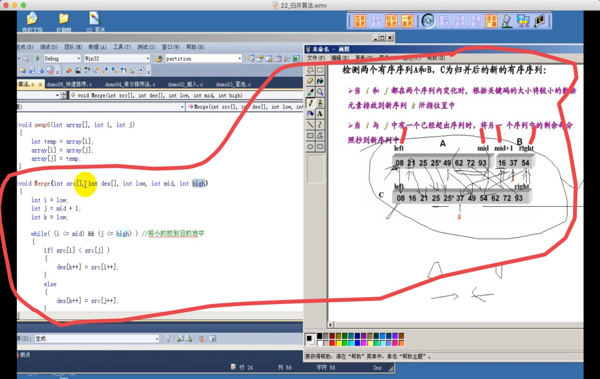

# 排序

- 选择法
- 冒泡法
  速度慢 低级的排序算法
  - 从左向右扫描数据，选择最大的数据，放在右边。
  - 要点：比较相邻的两个数，如果左边的数大于右边的数就进行交换。
  - 需要两个循环。
    - 一共循环几次 n个数 扫n-1次，  每次有多少次比较。
  - 交换太多了  没必要  所以慢。
- 插入算法
- 希尔
- 快速
- 归并

#### 排序中的关键操作

1. 比较
       任意两个数据元素通过比较操作确定先后次序
2. 交换
       数据元素之间需要交换才能到的预期结果

#### 内排序和外排序

1. 内排序
       整个排序过程不需要访问外存便能完成
2. 外排序
       待排序的数据元素数量很大，整个序列的排序过程不可能在内存中完成

#### 排序的审判

1. 时间性能
       关键性能差异体现在比较和交换的数量
2. 辅助存储空间
       为完成排序操作需要的额外的存储空间
       必要时可以“空间换时间”
3. 算法的实现复杂性
       过于复杂的排序法会影响代码的可读性和可维护性，也可能影响排序的性能

#### 总结

- 排序是数据元素从无序到有序的过程
- 排序具有稳定性，是选择排序算法的因素之一
- 比较和交换是排序的基本操作
- 多关键字排序和单关键字排序无本质区别
- 排序的时间性能是区分排序算法好坏的主要因素

# 选择法
- 基本思想：
每一趟（例如第i趟，i = 0，1，... ，n-2）在后面n-i个待排的数据元素中选出关键字最小的元素，作为有序元素序列的第i个元素。
- 排序过程：
1. 首先通过n-1次关键字比较，从n个记录中找出关键字最小的记录，将它与第一个记录交换。
2. 再通过n-2次比较，从剩余的n-1个记录中找出关键字次小的记录，将它与第一个记录交换。
3. 重复上述操作，共进行n-1趟排序后，排序结束。

多少趟
每趟多少  内层比较 

无序数列逐渐减少  有序数列逐渐增加。
最后剩两个未排的数据， 比较一次结束。

核心代码：

# 插入排序
基本思想：
排序过程：
整个排序过程为n-1趟插入，即先将序列中第一个记录看成是一个有序序列，然后从第2个记录开始，逐个进行插入，直至整个序列有序。

实质：
对线性表执行n-1次插入操作，只是先要找到插入位置。

插入排序关键点：
1. 拿出一个元素，留出位置
2. 符合条件的元素后移

插入排序代码：

# 希尔排序

> 排序过程：
>
> 先取一个正整数d1<n，把所有相隔d1的记录放一组，组内进行直接插入排序；然后取d2<d1，重复上述分组和排序操作；直至di=1，即所有记录放进一个组中排序为至
>
> O(n-1.3)
>
> O(nlogn)
>
> 希尔排序是不稳定的

希尔和插入法 差不多

希尔排序的gap（间隙）等于1的时候  和 插入法 一样

分组排序  希尔牛逼

10个数据 
按照冒泡 选择 需要9趟
希尔法  3趟解决。

希尔不稳定  相同的数据 可能顺序改变 但是打破的O（n2）。

希尔算法的平均效率 O(n*1.3)
每次问题规模缩减三分之一，分区同时排序。
如果有20个数据
gap = gap / 3 + 1；

# 快速排序
1. 递归把数据分成两部分
2. 做partition
思想：
快速排序是对冒泡排序的一种改进。它的基本思想是：
通过一趟排序将要排序的数据分割成独立的两部分，其中一部分的所有数据都比另外一部分的所有数据都要小，基准数据排在这两个子序列的中间；
然后再按此方法对这两部分数据分别进行快速排序，整个排序过程可以递归进行，以此达到整个数据变成有序序列。

第一次时 low是`0` high是`len（长度） - 1`
两头移动两个指针 high low， 先取第一个元素，第一个元素就为空，空的一端不移动，另一端和取出来的比较。
结果：两个数组 一个比取出的元素大  一个比取出的元素小。

#  归并排序
稳定的  突破O（n2）
牺牲空间

merge 归并
