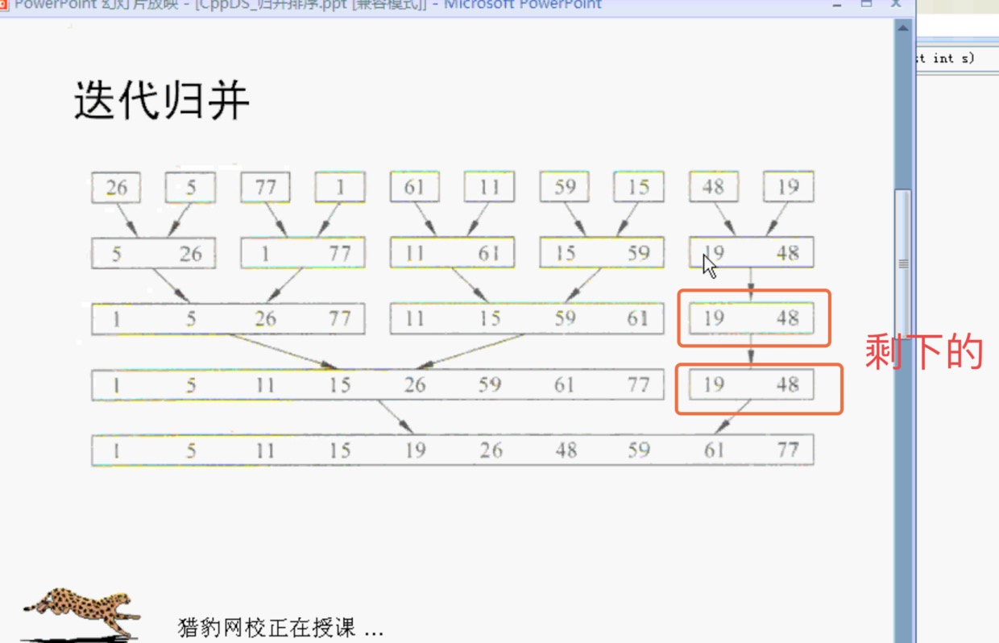

# 归并排序

- 归并
- 迭代归并 （使用迭代也可以使用递归）

把几个已经排好序的数组进行合并 成为最终排好序的数组

把没有排好的数据 分组 




##### 代码实现

下面是一次归并的：

```c++
template<class T>
/// <#Description#>
/// @param initList 原数组
/// @param mergedList 结果数组
/// @param l 第一部分开始下标
/// @param m 第二部分开始下标
/// @param n 总下标
void Merge(T *initList, T *mergedList, const int l, const int m, const int n)
{
    int i1, i2, iResult;
    for (i1 = l, i2 = m + 1, iResult = l; i1 <= m && i2 <= n; iResult++) {
        if (initList[i1] <= initList[i2])
        {
            mergedList[iResult] = initList[i1];
            i1++;
        }
        else
        {
            mergedList[iResult] = initList[i2];
            i2++;
        }
    }
    //把剩下的一次拷进去
    std::copy(initList + i1, initList + m + l, mergedList + iResult);
    std::copy(initList + i2, initList + n + l, mergedList + iResult);
}
```

剩下的就直接复制下来：

```c++
template<class T>
void MergePass(T *initList, T *resultList, const int n, const int s)
{
    int i;
    for (i = 1; i <= n-2*s+1; i += 2 * s) {
        Merge(initList, resultList, i, i+s-1, i+2*s-1);
    }
    if ((i+s-1) < n) {
        Merge(initList, resultList, i, i+s-1, n);
    } else {
        //剩下的直接复制下来
        std::copy(initList+i, initList+n+1, resultList+i);
    }
}
```

```c++
template<class T>
void MergeSort(T *a, const int n)
{
    T *tempList = new int[n+1];//tempList[0]不用
    for (int l = 1; l < n; l*=2) {
        MergePass(a, tempList, n, l);
        l *= 2;
        MergePass(tempList, a, n, l);
    }
    delete [] tempList;
}
```

##### 测试调用：

```c++
void test()
{
    //a[0]不用
    int a[] = {0, 23, 47, 81, 95, 7, 14, 39, 55, 62, 74};
    int b[11] = {0};
    Merge(a, b, 1, 4, 10);
    for (int i = 1; i < 11; ++i) {
        std::cout << b[i] << " ";
    }
    std::cout << std::endl;
    
    int m[] = {0, 26, 5, 77, 1, 61, 11, 59, 15, 48, 19};
    int n[11] = {0};
    MergePass(m, n, 10, 1);
    for (int i = 1; i < 11; i++) {
        std::cout << n[i] << " ";
    }
    std::cout << std::endl;
    
    MergePass(n, m, 10, 2);
    for (int i = 1; i < 11; i++) {
        std::cout << m[i] << " ";
    }
    std::cout << std::endl;
    
    MergePass(m, n, 10, 4);
    for (int i = 1; i < 11; i++) {
        std::cout << n[i] << " ";
    }
    std::cout << std::endl;
    
    MergePass(n, m, 10, 8);
    for (int i = 1; i < 11; i++) {
        std::cout << m[i] << " ";
    }
    std::cout << std::endl;
    
    //上面都是中间结果的测试
    //下面开始测试MergeSort
    
    int x[] = {0, 26, 5, 77, 1, 61, 11, 59, 15, 48, 19};
    MergeSort(x, 10); //最终
    for (int i = 1; i < 11; i++) {
        std::cout << x[i] << " ";
    }
    std::cout << std::endl;
}
```


第一遍归并：每组一个数进行排序 。1个1个归并
第二遍归并：每组两个数排序。      2个2个归并
第三遍归并：每组四个数排序。        4个4个归并
...


每次排序都是之前排好的两个数组再排序


一共有三个函数（都是模版函数）：
- Merge 
- MergePass
- MergeSort

- 优点：
  速度快
- 缺点：
  需要一个临时数组，存储空间大一倍。