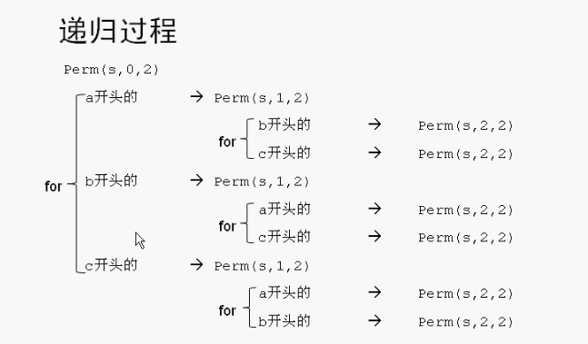

# 排列组合Permutations

使用递归

把abc三个字母进行排列可以得到

- abc
- acb
- bac
- bca
- cab
- cba

三个字母的所有排列组合

代码：

```c++
/// 排列组合 递归函数
/// @param p <#p description#>
/// @param k 开始下标
/// @param m 结束下标
void Permutations(char *p, const int k, const int m)
{
    /**
     // a开头的 后面跟着bc的所有排列
     swap(p[0], p[0]);//把a和a交换
     Permutations(p, 1, 2);
     swap(p[0], p[0]);//把a和a交换
     
     // b开头的 后面跟着ac的所有排列
     swap(p[0], p[1]);//把a和b交换
     Permutations(p, 1, 2);
     swap(p[0], p[1]);//把a和b交换回来
     
     // c开头的 后面跟着ab的所有排列
     swap(p[0], p[2]);//把a和c交换
     Permutations(p, 1, 2);
     swap(p[0], p[2]);//把a和c交换回来
     */
    
    
    //上面代码可以简化 使用一个for循环
    if (k == m) {
        //递归结果。使用for循环 输出
        for (int i = 0; i <= m; i++) {
            cout << p[i];
        }
        cout << endl;
    } else {
        for (int i = k; i <= m; i++) {
            swap(p[k], p[i]);
            Permutations(p, k + 1, m);//递归
            swap(p[k], p[i]);
        }
    }
    
}
```

调用：

```c++
void test()
{
    char s[] = "abc";
    Permutations(s, 0, 2);
}
```

递归过程：

