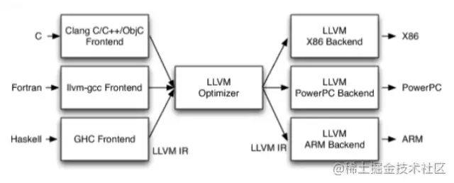
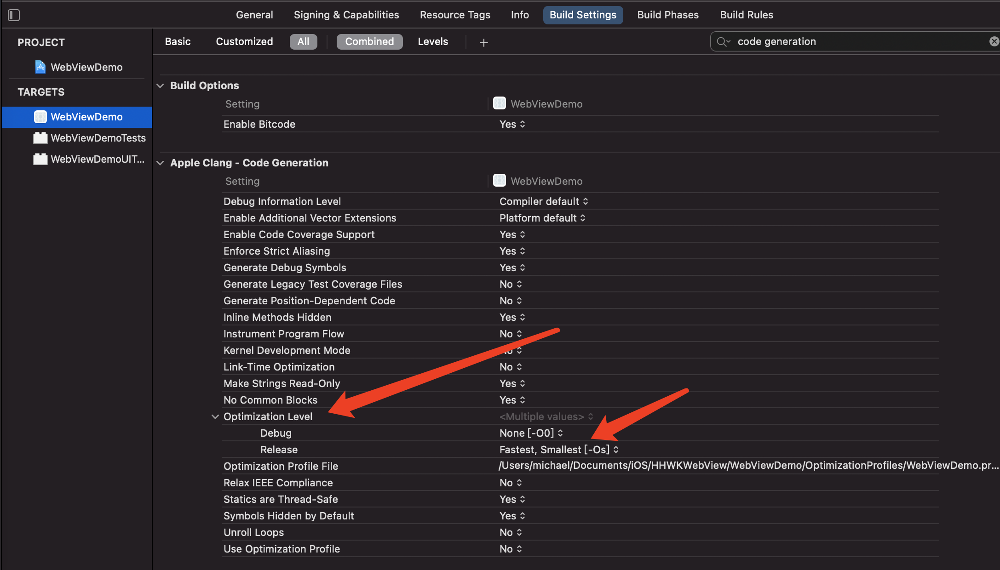

# App编译

## 解释型语言 

python。

读到就执行

## 编译型语言

C、C++、Objc/swift。

需要编译器，翻译成CPU认识的机器语言，二进制可执行文件，然后执行。

编译之后就是汇编代码，再底层就是0和1。

## 机器语言

机器语言是计算机硬件能够直接理解和执行的编程语言。它是一种低级语言，由一系列的**二进制代码**组成，每个代码都对应硬件操作的一个基本指令。

机器语言指令直接对应于计算机中央处理单元（CPU）的指令集架构（ISA），**不需要编译器**。

由于机器语言是由0和1组成的二进制序列，它对于人类来说是难以阅读和编写的。例如，一个简单的机器语言指令可能看起来像这样：

```
10110000 01100001
```

这串二进制代码可能代表一个特定的操作，比如将数字61h（十六进制，等同于97十进制）加载到某个寄存器中。

直接使用机器语言编程非常繁琐且容易出错，程序员通常使用汇编语言或更高级的编程语言来编写程序。

## 汇编语言

汇编语言是机器语言指令的助记符，但是也需要汇编器转换为机器语言才能执行。

更高级的编程语言如C、C++、Java等，需要通过编译器或解释器转换为机器语言，计算机才能执行。

随着计算机技术的发展，机器语言对于绝大多数程序员而言已经变得较为遥远，因为他们通常在更高级的抽象层次上进行编程。然而，对于嵌入式系统开发者、系统程序员、操作系统开发者和某些类型的性能优化工作，理解机器语言仍然很重要。


## 程序执行四个步骤

1. **预处理**：#import插入到指定的位置，替换宏定义等等。
2. **编译**优化：词法分析 语法分析 语义分析
3. **汇编**：生成机器指令 .o
4. **链接**：静态链接 动态链接

## llvm编译器

在Xcode中使用LLVM架构流程化处理上面的步骤。

LLVM的总体架构如下所示，分为前端，中间层，后端。



### 前端

读源代码，词法分析，语法分析，生成AST（LLVM：IR（.ll文件））语法提醒等。

### clang

LLVM大项目的子项目，是一个命令行工具。一个shell环境。对源代码进行词法分析，语法分析，语义分析。

作用：

- 突破口，研究编译器有了一个开始

- LLVM 全面理解。代码变成可执行文件。

- 启动优化（二进制文件的重排）

  - 内存相关

    之前只是iOS系统API相关的内存管理，现在是系统相关的。物理内存和虚拟内存

  2. Clang插桩，swift插桩

clang编译器前端包含：预处理、语法分析、词法分析、汇编、链接。

终端 `man clang`可以看到clang介绍：

>**DESCRIPTION**
>
>​    **clang** is a C, C++, and Objective-C compiler which encompasses
>
>​    preprocessing, parsing, optimization, code generation, assembly, and
>
>​    linking.

#### 1、预处理

在预处理的阶段中，根据语言选择编译器前端。如OC，会调用编译器前端Clang首先预处理代码。将宏替换到代码中、删除注释、处理预编译命令等工作。

#### 2、编译

在这个阶段，在编译器前前端处理以下步骤

1. 词法分析
2. 语法分析
3. 静态分析
4. 为每一个文件生成中间代码IR

### 中间层（优化器）

根据一个又一个pass（节点）进行优化

优化器负责进行各种优化。程序员写的逻辑代码，不要的代码优化。

改善代码的运行时间，例如消除冗余计算等等。

拿到第二个步骤的IR文件后，LLVM中间层LLVM Optimizer就会对每一个IR文件进行一些优化，如尾递归优化、循环优化、全局变量优化。

### 后端

根据不同的架构生成对应的可执行文件

优化后的代码翻译 变成二进制。生成机器语言。

#### 3、汇编

优化完成后，LLVM会调用汇编生成器将每一个IR文件转化成汇编代码。再根据部署的平台选择对应的编译器后端，将汇编转变生成产物，也就是一个个.o文件了（二进制文件）。

#### 4、链接程序

在上面步骤中，生成了一个个.o文件。在开发中，一个文件通常会引用别的文件或是库，链接过程会将多个目标文以及所需的库文件链接成最终的可执行文件，也就是Mach-O的文件。

对于动态库，链接构成中不会把库加载进来，而是会把动态库的相关信息写入到可执行文件中。

经过上述步骤，我们开发的代码会生成一个Mach-O格式的可执行文件。

### LLVM好处

**设备对应后端，语言对应前端。**前后端分离，扩展性强。

不同设备CPU不一样，读的二进制指令集不一样。不同的语言C java，在不同设备上执行，需要前端后端都处理。

## 编译流程

创建main.m文件

```
int main(int argc, const char * argv[]) {
    return 0;
}
```

编译指令`clang -ccc-print-phases main.m `

编译流程：

```
               +- 0: input, "main.m", objective-c
            +- 1: preprocessor, {0}, objective-c-cpp-output
         +- 2: compiler, {1}, ir
      +- 3: backend, {2}, assembler
   +- 4: assembler, {3}, object
+- 5: linker, {4}, image
6: bind-arch, "x86_64", {5}, image
```

0. 读取代码
1. 预处理 宏替换 .h文件导入
2. 编译（前端做的） 语法分析 词法分析 检测， 生成IR代码。
3. 后端： 通过pass（节点）优化 生成汇编代码
4. 汇编生成目标文件代码。
5. link 链接 生成image镜像。从磁盘执行到内存中，就是镜像。
6. 根据不同架构生成不同可执行文件。

### 预处理阶段

`clang -E main.m >> main1.m`

有头文件和宏

typedef，只是加别名，增加可读性，不是预处理

```c
#import <stdio.h>
#define C 30
typedef  int HH_INT_64;
int main(int argc, const char * argv[]) {
    HH_INT_64 a = 10;
    HH_INT_64 b = 20;
    printf("%d",a + b + C);
    return 0;
}
```

### 编译

`clang -fmodules -fsyntax-only -Xclang -ast-dump main.m` 生成语法树

`clang -fmodules -fsyntax-only -Xclang -dump-tokens main.m`

词法分析（token）：把代码分割，每个词都分割。

语法分析（AST）：生成AST语法树，检验语法是否正确 

### 生成优化 IR代码

`clang -S -fobjc-arc -emit-llvm main.m`

`clang -Os -S -fobjc-arc -emit-llvm main.m -o main.ll`编译优化

生成main.ll文件

### Xcode编译器优化



### 生成优化bitcode代码

`clang -emit-llvm -c main.ll -o main.bc`

苹果适配不同设备架构

### 最终生成汇编代码

优化等级：

``clang -S -fobjc-arc main.bc -o main.s``

`clang -S -fobjc-arc main.ll -o main1.s`

`clang -S -fobjc-arc main.m -o main2.s`生成代码最多，上面两个生成代码差不多

`clang -Os -S -fobjc-arc main.bc -o main3.s`//最大化优化

### 生成目标文件（汇编器）

`clang -fmodules -c main.s -o main.o`生成.o目标文件

### 链接

使用的printf在外部的哪个动态库是链接，打个标记。

生成了可执行文件

`clang mian.o -o main`

### 绑定binding
