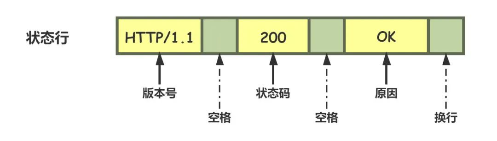
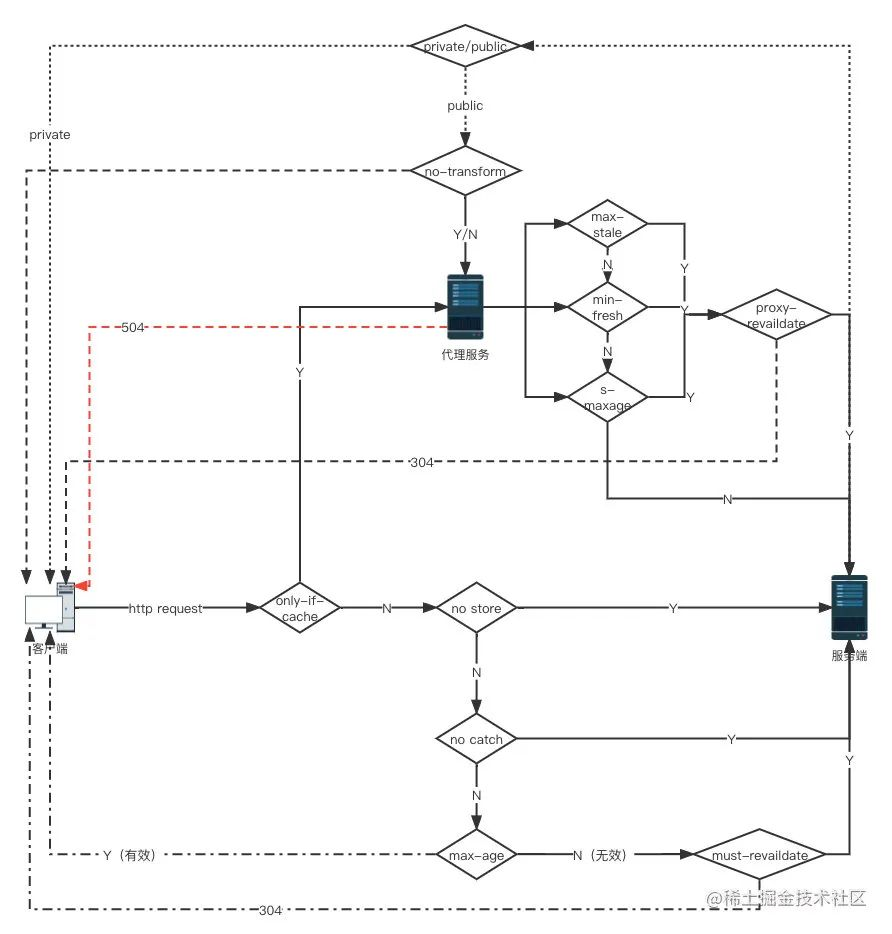

# HTTP连接

HTTP协议即超文本传送协议(HyperTextTransfer Protocol )，是Web联网的基础，也是手机联网常用的协议之一，HTTP协议是建立在TCP协议之上的一种应用。

HTTP连接最显著的特点是：**客户端发送的每次请求都需要服务器回送响应，在请求结束后，会主动释放连接**。从建立连接到关闭连接的过程称为“一次连接”。因此HTTP连接是一种**“短连接”**，要保持客户端程序的在线状态，需要不断地向服务器发起连接请求。若服务器长时间无法收到客户端的请求，则认为客户端“下线”，若客户端长时间无法收到服务器的回复，则认为网络已经断开。

在HTTP 1.1中可以在一次连接中处理多个请求，并且多个请求可以重叠进行，不需要等待一个请求结束后再发送下一个请求。

## HTTP报文

HTTP 协议的请求报文和响应报文的结构基本相同，由三大部分组成：

- 起始行（*start line*）：描述请求或响应的基本信息；
- 头部字段集合（*header*）：使用 key-value 形式更详细地说明报文；
- 消息正文（*entity*）：实际传输的数据，它不一定是纯文本，可以是图片、视频等二进制数据。

### 请求行

请求行一般用来描述客户端要怎样操作服务端的资源，一般由三个部分组成。通常使用空格（space）来分隔，最后要用 CRLF 换行表示结束。

### 状态行

状态行一般用来描述服务端对于客户端的请求回复的状态，一般也是由三个部分组成。

#### 状态码

在HTTP报文部分我们说了HTTP的状态行,我们在这个部分就来看看状态行中的状态码。

状态码是一个十进制的数字，RFC 标准把状态码分成了五类，用数字的第一位表示分类，而 0 ～ 99 不用，这样状态码的实际可用范围就变成了 100~599。这五类的具体含义是：

- 1××：提示信息，表示目前是协议处理的中间状态，还需要后续的操作；
- 2××：成功，报文已经收到并被正确处理；
- 3××：重定向，资源位置发生变动，需要客户端重新发送请求；
- 4××：客户端错误，请求报文有误，服务器无法处理；
- 5××：服务器错误，服务器在处理请求时内部发生了错误。

### 头部字段

请求行或状态行再加上头部字段集合就构成了 HTTP 报文里完整的请求头或响应头。

除了起始行以外，请求头和响应头的结构基本相同。

HTTP 头字段非常灵活，不仅可以使用标准里的 Host、Connection 等已有头，也可以任意添加自定义头。不过使用头字段需要注意下面几点：

- 字段名不区分大小写，例如“Host”也可以写成“host”，但首字母大写的可读性更好；

- 字段名里不允许出现空格，可以使用连字符“-”，但不能使用下划线“_”。例如，“test-name”是合法的字段名，而“test name”“test_name”是不正确的字段名；

- 字段名后面必须紧接着“:”，不能有空格，而“:”后的字段值前可以有多个空格；

- 字段的顺序是没有意义的，可以任意排列不影响语义；

- 字段原则上不能重复，除非这个字段本身的语义允许，例如 Set-Cookie。

  

## HTTP的特点

1. 灵活可扩展：HTTP在诞生之初只规定了报文的基本格式，比如用空格分隔单词，用换行分隔字段，“header+body”等，报文里的各个组成部分都没有做严格的语法语义限制，可以由开发者任意定制。而那些 RFC 文档，实际上也可以理解为是对已有扩展的“承认和标准化”，实现了“从实践中来，到实践中去”的良性循环。
2. 可靠传输: 因为 HTTP 协议是基于 TCP/IP 的，而 TCP 本身是一个“可靠”的传输协议，所以 HTTP 自然也就继承了这个特性，能够在请求方和应答方之间“可靠”地传输数据。
3. 应用层的协议: HTTP 凭借着可携带任意头字段和实体数据的报文结构，以及连接控制、缓存代理等方便易用的特性，只要不太苛求性能，HTTP 几乎可以传递一切东西，满足各种需求，称得上是一个“万能”的协议。
4. 请求 - 应答:请求 - 应答模式是 HTTP 协议最根本的通信模型，通俗来讲就是“一发一收”。请求 - 应答模式也明确了 HTTP 协议里通信双方的定位，永远是请求方先发起连接和请求，是主动的，而应答方只有在收到请求后才能答复，是被动的，如果没有请求时不会有任何动作。
5. 无状态: “状态”其实就是客户端或者服务器里保存的一些数据或者标志，记录了通信过程中的一些变化信息。HTTP在整个协议里没有规定任何的“状态”，但不要忘了 HTTP 是“灵活可扩展”的，虽然标准里没有规定“状态”，但完全能够在协议的框架里给它“打个补丁”，增加这个特性(cookie)。
6. 明文传输: “明文”意思就是协议里的报文（准确地说是 header 部分）不使用二进制数据，而是用简单可阅读的文本形式。
7. 不安全: 安全有很多的方面，明文只是“机密”方面的一个缺点，在“身份认证”和“完整性校验”这两方面 HTTP 也是欠缺的。

## HTTP的实体数据

### 数据类型

#### Accept

在TCP/IP协议栈里，数据的传输都是Header+body的形式。在传输层协议中，不需要关心数据是什么，但在应用层必须要告诉上层数据的类型，否则上层就不知该如何处理。最早的HTTP协议中，并没有附加的数据类型信息，所有传送的数据都被客户程序解释为HTML文档，而为了支持多媒体数据类型，HTTP协议中就使用了附加在文档之前的MIME(Multipurpose Internet Mail Extensions 多用途互联网邮件扩展类型)指定的数据类型信息来标识数据类型。

MINE将数据分为七大类（video、image、application、text、audio、multipart、message），再以type/subtype的格式细分出其下的子类。例如我们常用到的text/html 、text/css 、image/jpeg 、 applaction/json等。

#### Accept-encoding

此外HTTP协议还制定了数据的压缩格式：

- gzip：GNU zip 压缩格式，也是互联网上最流行的压缩格式；
- deflate：zlib（deflate）压缩格式，流行程度仅次于 gzip；
- br：一种专门为 HTTP 优化的新压缩算法（Brotli）。

#### Accept-Language

标记了客户端可理解的自然语言，也允许用“,”做分隔符列出多个类型，例如：`Accept-Language: zh-CN, zh, en`

### 数据类型在请求头中的表现

在 HTTP 协议里用 Accept、Accept-Encoding、Accept-Language 等请求头字段进行内容协商的时候，还可以用一种特殊的“q”参数表示权重来设定优先级，这里的“q”是“quality factor”的意思。权重的最大值是 1，最小值是 0.01，默认值是 1，如果值是 0 就表示拒绝。具体的形式是在数据类型或语言代码后面加一个“;”，然后是“q=value”。服务器会在响应头里多加一个 Vary 字段，记录服务器在内容协商时参考的请求头字段。

## HTTP如何传输大文件

- 数据压缩
  前面提到的`accept-encoding`请求头可以算是是一种传输大文件的解决方式，服务器可以选择一种浏览器支持的数据压缩方式放进`content-encoding`响应头里，再把原数据压缩后返回给客户端。缺点是这种方式只对文本有较好地压缩率，对于图片音频等本身就已经高度压缩的多媒体数据束手无策。
- 分块传输
  在HTTP头部表示为`Transfer-Encoding: chunked`,指报文里的body部分不是一次性发过来的，而是分为许多`chunked`分块发送。`Transfer-Encoding: chunked`和`Content-Length`这两个字段是互斥的，也就是说响应报文里这两个字段不能同时出现，一个响应报文的传输要么是长度已知，要么是长度未知（chunked）。
- 范围请求
  如果想获取某个大文件其中的片段，分块传输就没办法满足这样的需求。HTTP协议提出了范围请求这样的概念，允许客户端只获取文件的某一部分。客户端先发个HEAD请求看看服务器是否支持范围请求，服务器必须在`Accept-Ranges`响应头中告知客户端是否具有范围请求的能力。请求头`Ranges`是HTTP范围请求的专用字段，值的格式是`bytes=x-y`表示`x ~ y`之间的范围。服务端在收到 `Ranges`请求头时，首先验证x-y的范围是否合法（x和y可以省略，省略x则表示从后往前，省略y则表示从前往后），其次计算读取偏移量，返回206状态码和所读取的文件 ，最后在响应头加上`Content-Range`表示实际返回的偏移量和总数,格式为`bytes x-y/length`。
  范围请求还支持在一个头里定义多个`x-y`,这种情况需要一种特殊的MIME类型`multipart/byteranges`,表示报文是有多段组成。

## HTTP连接管理

http的通信过程采取请求/应答模式，在http0.9/1.0时期，每次发起请求都需要建立连接->发送数据->断开连接，由于整个请求的过程非常短暂，早起的http也称为`短链接`无链接的协议。由于TCP简历连接要经过三次握手四次挥手，整个过程需要3个RTT，而HTTP的一次简单请求通常只需要2个RTT，那么被浪费掉的时间有60%。

### Connection：keep-alive

HTTP1.1提出了长连接的概念，也就是`Keep-alive`。在长连接上建立一次TCP连接可以发送多个HTTP请求。但因为连接是`alive`的，如果一直不关闭，就会占用大量的服务器资源，导致服务无法及时响应真正的请求，所以我们也需要及时关闭连接。可以通过在客户端请求头添加`Connection: close`字段主动关闭连接。服务端通常不会主动关闭连接，但我们也可以通过设置时长、请求数等方式约定断开连接的条件。

##### **队头阻塞**

基于`请求-应答`模式的http协议，形成了串行的请求队列（`http1.1还提出了管道机制，即在同一个TCP连接上不用等待上一个请求的响应即可发出下个请求，不过客户端还是按照正常顺序接受响应，这种做法并没带来任何性能上的改善，所以默认保持关闭`），如果队首的请求处于阻塞状态，那么后面的请求也无法正常响应结果就是更长时间的性能浪费。

`并发连接`和`域名分片`是对队头阻塞的针对性优化策略，浏览器限制每个客户端可以并发建立6～8个连接，又可以将多个域名指向同一个服务器，这样实际的连接数量就更多了，是一种用数量解决质量的思路。

##### **重定向**

当我们在浏览器输入一个url再按下回车，页面跳转到我们输入的地址中，这种行为就是主动跳转。浏览器还支持被动跳转，也就是HTTP的重定向。

## cookie

HTTP 是“无状态”的，这既是优点也是缺点。优点是服务器没有状态差异，可以很容易地组成集群，而缺点就是无法支持需要记录状态的事务操作。好在 HTTP 协议是可扩展的，后来发明的 Cookie 技术，给 HTTP 增加了“记忆能力”。
cookie同样存在于HTTP头部字段里。服务端可以使用`set-cookie`标识客户端身份，客户端则在请求时携带`cookie`告诉服务端自己的信息。`cookie`字段以`key=value`的格式保存，浏览器在一个`cookie`字段里可以存放多对数据，用`;`分割。

Cookie 主要用于以下三个方面：

- 会话状态管理（如用户登录状态、购物车、游戏分数或其它需要记录的信息）
- 个性化设置（如用户自定义设置、主题等）
- 浏览器行为跟踪（如跟踪分析用户行为等）

## 相关属性

###### **生存周期**

`Expires`俗称“过期时间”，用的是绝对时间点，可以理解为“截止日期”（deadline）。

`Max-Age`用的是相对时间，单位是秒，浏览器用收到报文的时间点再加上 Max-Age，就可以得到失效的绝对时间。

`Expires` 和 `Max-Age` 可以同时出现，两者的失效时间不一致时浏览器会优先采用`Max-Age`计算失效期。如果服务器不设置Max-Age、Expries或者字段值为0指不能缓存cookie，但在会话期间是可用的，浏览器会话关闭之前可以用cookie记录用户的信息。

###### **作用域**

`Domain`和`Path`指定了 Cookie 所属的域名和路径，浏览器在发送 Cookie 前会从 URI 中提取出 host 和 path 部分，对比 Cookie 的属性。如果不满足条件，就不会在请求头里发送 Cookie。通常 Path 就用一个“/”或者直接省略，表示域名下的任意路径都允许使用 Cookie。

###### **安全性**

`HttpOnly`表示此 Cookie 只能通过浏览器 HTTP 协议传输，禁止其他方式访问。这也是预防“跨站脚本”（XSS）攻击的有效手段。

`SameSite`可以防范“跨站请求伪造”（XSRF）攻击，`SameSite = strict`表示禁止cookie在跳转链接时跨域传输。`SameSite = lax`稍微宽松一点，允许在`GET`、`HEAD`等安全请求方式中跨域携带。默认值为`none`,表示不限制cookie的携带和传输。

`Secure`表示这个cookie仅能用HTTPS协议加密传输，明文的HTTP协议会禁止发送。但Cookie本身不是加密的，浏览器里还是以明文的形式存在。

#### HTTP缓存控制

##### **服务器的缓存控制**

浏览器在访问页面资源时首先会查找缓存数据，如果没有再发送请求，向服务器获取资源；服务器响应请求，返回资源，同时标记资源的有效期；浏览器缓存资源，等待下次重用。这就是客户端缓存。

服务器标记资源有效期使用的头字段是`Cache-Control`，里面的值`max-age=xxx`就是资源的有效时间（与cookie的max-age不同，这里的max-age时间的计算起点是响应报文的创建时刻）。

此外在响应报文里还可以用其他的值来更精确地指示浏览器应该如何使用缓存：
`no-store`: 不允许缓存，用于某些变化非常频繁的数据，例如秒杀页面；
`no-cache`: 可以缓存，但在使用之前必须要去服务器验证是否过期；
`must-revalidate`: 如果缓存不过期就可以继续使用，但过期了就必须去服务器验证。

##### **客户端的缓存控制**

浏览器也可以发`Cache-Control`，也就是说`请求 - 应答`的双方都可以用这个字段进行缓存控制，互相协商缓存的使用策略。在浏览器前进、后退、重定向时cache-control就生效了，响应头里有`from disk cache`字样，就说明浏览器未发送请求，而是直接使用了本地缓存。

###### **条件请求**

浏览器在刷新页面时相当于在请求头中添加了`Cache-Control:no-cache`,这样在刷新页面时，还是向服务端发送了请求，并没有很好的利用到缓存。所以HTTP协议又定义了一系列“If”开头的“条件请求”字段，专门用来检查验证资源是否过期。

条件请求一共有 5 个头字段，我们最常用的是`if-Modified-Since`和`If-None-Match`这两个。需要第一次的响应报文预先提供`Last-modified`（最后修改时间）和`ETag`（资源唯一标识），然后第二次请求时就可以带上缓存里的原值，验证资源是否是最新的。如果资源没有变，服务器就回应一个“304 Not Modified”，表示缓存依然有效，浏览器就可以更新一下有效期，然后放心大胆地使用缓存了。

##### **代理缓存**

###### **代理服务器**

代理服务器就是客户端和服务端之间的中间商，在中间的位置转发上游的请求和下游的响应。代理服务器在计算机领域有非常重要的功能

- 负载均衡：面向客户端时屏蔽原服务器，代理服务器可以通过轮询、哈希等算法将流量分发，提高整体的性能。
- 健康检查：使用‘心跳’等机制监控服务器，保证服务器的可用性。
- 安全防护：保护被代理服务端的IP和流量，防止网络攻击或负载问题。
- 加密卸载：对外和对内使用不同的加密策略，节省加密成本
- 内容缓存：暂存/复位服务器的响应。

##### **缓存代理**

HTTP的服务端缓存主要由代理服务器来实现，代理服务器收到源服务器的响应之后将报文转发给客户端的同时也存入自己的cache里，下次再有相同的请求就可以直接发送304或者缓存数据，节省源服务器的成本。

因为代理服务器`既是服务端，又是客户端`的特性，有一些特殊的`cache-control`属性：

- 服务端

`private`: 表示只能客户端缓存，不允许代理服务器上缓存。
`punlic`:表示完全公开，客户端和代理服务器都可以缓存。
`proxy-revalidate`:要求代理服务器缓存过期后必须回源验证。
`s-maxage`: 代理服务器缓存的有效期
`no-transform`: 不允许代理服务器转换数据格式。

- 客户端

`max-stale`: 如果代理上的缓存过期了也可以接受，但不能过期太多，超过 x 秒也会不要。
`min-flash`: 表示缓存少于x有效期就不要了。
`only-if-cached`:表示只接受代理缓存的数据，不接受源服务器的响应。如果代理上没有缓存或者缓存过期，就应该给客户端返回一个 504。

## HTTPS

**HTTPS（Hyper Text Transfer Protocol over Secure Socket Layer），是以安全为目标的HTTP通道，是HTTP的安全版。**

在HTTP下加入SSL层，HTTPS的安全基础是SSL，因此加密的详细内容就需要SSL。HTTPS存在不同于HTTP的默认端口及一个加密/身份验证层（在HTTP与TCP之间）。HTTP协议以明文方式发送内容，不提供任何方式的数据加密，如果攻击者截取了Web浏览器和网站服务器之间的传输报文，就可以直接读懂其中的信息，因此HTTP协议不适合传输一些敏感信息。

由于 HTTP 天生“明文”的特点，整个传输过程完全透明，任何人都能够在链路中截获、修改或者伪造请求 / 响应报文，数据不具有可信性。只有具有机密性、完整性、身份认证和不可否认性，我们才认为这个请求是安全的。HTTPS为HTTP增加了以上四个特性。

HTTPS实际上就指的是HTTP over TLS/SSl。是在原本的HTTP协议上加了一层TLS/SSL协议。

#### SSL/TLS

SSL 即安全套接层（Secure Sockets Layer），在 OSI 模型中处于第 5 层（会话层），由网景公司于 1994 年发明。SSL 发展到 v3 时已经证明了它自身是一个非常好的安全通信协议，于是在 1999 年它改名为 TLS（传输层安全， Transport Layer Security），目前应用的最广泛的 TLS 是 1.2，而之前的协议（TLS1.1/1.0、SSLv3/v2）都已经被认为是不安全的。

##### **机密性（基于TLS1.2）**

SSL/TLS通过`加密（encrypt）`来传输`密文（cipher text）`保证数据传输的安全性，只有拥有`密钥(key)`的人才能够通过`解密(decrypt)`获得`明文（plain text/clear text）`，加密解密的操作过程就是`加密算法`。所以“密钥”是一长串的数字，约定俗成的度量单位是“位”（bit）。比如，说密钥长度是 128，就是 16 字节的二进制串，密钥长度 1024，就是 128 字节的二进制串。按照密钥的使用方式，加密可以分为两大类：`对称加密`和`非对称加密`。

###### **对称加密**

顾名思义，加密解密都使用相同的密钥就叫做对称加密。TLS里目前常用的有 AES 和 ChaCha20。

`AES` 的意思是“高级加密标准”（Advanced Encryption Standard），密钥长度可以是 128、192 或 256。它是 DES 算法的替代者，安全强度很高，性能也很好，而且有的硬件还会做特殊优化，所以非常流行，是应用最广泛的对称加密算法。

`ChaCha20` 是 Google 设计的另一种加密算法，密钥长度固定为 256 位，纯软件运行性能要超过 AES，曾经在移动客户端上比较流行，但 ARMv8 之后也加入了 AES 硬件优化，所以现在不再具有明显的优势。

###### **非对称加密**

对称加密看上去很好的实现了机密性，但是还有一个问题就是如何安全的传输`密钥`。因为在`加密算法`中,只要拥有密钥就可以解密，如果密钥在传输过程中被窃取，也就无机密性可言。为了解决这个问题，又有了`非对称加密`算法。他拥有两个`密钥`,分别是`公钥（public key）`和`私钥（private key）`,`公钥`是公开的，而`私钥`是严格保密的。`公钥`和`私钥`有个特别的`“单向”性`，虽然都可以用来加密解密，但`公钥`加密后只能用`私钥`解密，反过来，`私钥`加密后也只能用`公钥`解密。非对称加密可以解决`密钥交换`的问题。网站秘密保管私钥，在网上任意分发公钥，你想要登录网站只要用公钥加密就行了，密文只能由私钥持有者才能解密。而黑客因为没有私钥，所以就无法破解密文。

非对称加密算法的设计要比对称算法难得多，在 TLS 里只有很少的几种，比如 DH、DSA、RSA、ECC 等。
`RSA` 可能是其中最著名的一个，几乎可以说是非对称加密的代名词，它的安全性基于“整数分解”的数学难题，使用两个超大素数的乘积作为生成密钥的材料，想要从公钥推算出私钥是非常困难的。

`ECC`是非对称加密里的“后起之秀”，它基于“椭圆曲线离散对数”的数学难题，使用特定的曲线方程和基点生成公钥和私钥，子算法 ECDHE 用于密钥交换，ECDSA 用于数字签名。相对RSA，ECC在安全和性能上都有更明显的优势，160位的ECC相当于1024位的RSA，260位的ECC相当于2048位的RSA。

###### **混合加密**

虽然非对称加密没有`密钥交换`的难题，但因为它们都是基于复杂的数学难题，运算速度很慢，即使是 ECC 也要比 AES 差上好几个数量级。所以目前`TLS`使用`混合加密`，使二者取长补短，既能高效加密解密，又能安全的进行数据传输。

在建立连接之初先使用非对称加密的形式传递密钥，然后用随机数产生对称算法使用的“会话密钥”（session key），再用公钥加密。因为会话密钥很短，通常只有 16 字节或 32 字节，所以慢一点也无所谓。对方拿到密文后用私钥解密，取出会话密钥。这样，双方就实现了对称密钥的安全交换，后续就不再使用非对称加密，全都使用对称加密。

## HTTP和HTTPS的区别

- HTTPS协议需要到CA申请证书；
- HTTP信息是明文传输，HTTPS 则是具有安全性的ssl加密传输协议；
- HTTP和HTTPS使用的是完全不同的连接方式，用的端口也不一样，前者是80，后者是443；
- HTTP的连接很简单，是无状态的，HTTPS协议是由SSL+HTTP协议构建的可进行加密传输、身份认证的网络协议。
