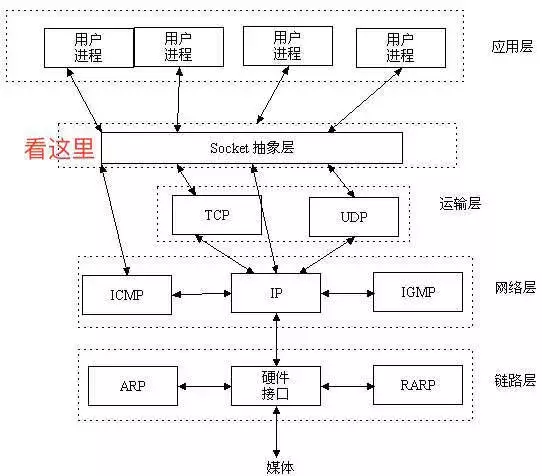

# Socket

**通常情况下Socket连接就是TCP连接**，因此Socket连接一旦建立，通信双方即可开始相互发送数据内容，直到双方连接断开。

在实际应用中，客户端到服务器之间的通信防火墙默认会关闭长时间处于非活跃状态的连接而导致 Socket 连接断连，因此需要通过轮询告诉网络，该连接处于活跃状态。

Socket是对TCP/IP协议的封装，Socket本身并不是协议，而是一个调用接口（API），通过Socket，我们才能使用TCP/IP协议。

## Socket机制

1. Socket是网络服务的一种机制
2. 通信两端都是Socket
3. 网络通信其实就是Socket间的通信
4. 数据在两个Socket之间通过IO传输

## Socket（套接字）

socket是通信的基石，是支持TCP/IP协议的网络通信的基本操作单元，包含进行网络通信必须的五种信息：

- 连接使用的协议
- 本地主机的IP地址
- 本地进程的协议端口
- 远地主机的IP地址
- 远地进程的协议端口

多个TCP连接或多个应用程序进程可能需要通过同一个TCP协议端口传输数据。为了区别不同的应用程序进程和连接，计算机操作系统为应用程序与TCP/IP协议交互提供了 **套接字(Socket)** 接口。应用层可以和传输层通过Socket接口，区分来自不同应用程序进程或网络连接的通信，实现数据传输的并发服务。

**socket是"打开—读/写—关闭"模式的实现，**建立Socket连接至少需要一对套接字，其中一个运行于客户端，称为ClientSocket，另一个运行于服务器端，称为ServerSocket。

Socket可以支持不同的传输层协议（**TCP/UDP**），当使用TCP协议进行连接时，该Socket连接就是一个TCP连接，UDP连接同理。

套接字之间的连接过程分为三个步骤：**服务器监听，客户端请求，连接确认。**

## socket连接

### 1、服务器监听

服务器端套接字并不定位具体的客户端套接字，而是处于等待连接的状态，实时监控网络状态，等待客户端的连接请求。

### 2、客户端请求

指客户端的套接字提出连接请求，要连接的目标是服务器端的套接字。

为此，客户端的套接字必须首先描述它要连接的服务器的套接字，**指出服务器端套接字的地址和端口号**，然后就向服务器端套接字提出连接请求。

### 3、连接确认

当服务器端套接字监听到或者说接收到客户端套接字的连接请求时，就响应客户端套接字的请求，建立一个新的线程，把服务器端套接字的描述发给客户端，一旦客户端确认了此描述，双方就正式建立连接。

