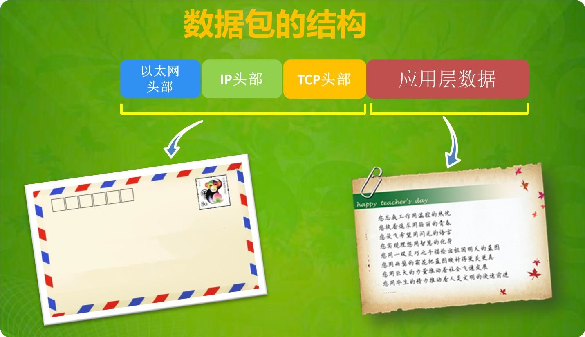

# 网络协议

网络协议本来就很抽象，把抽象的网络协议形象化才能更好的理解，先理解具体的网络协议是起什么作用，然后再学习它的工作过程。

把网络协议想象成人与人之间的礼仪行为，不同的场合有不同的礼仪行为，人是实施不同礼仪行为的主体。同样，网络设备是实施网络协议的主体，网络设备通过运行网络协议与其他的网络设备进行交流。

同样的道理，你的电脑想要与网络设备交流，也要与网络设备一样运行网络协议，**网络协议也是一个软件，是以系统组件的方式安装在你的电脑的操作系统里的**。想象一下，你想在你的电脑上通过QQ与朋友聊天的前提是不是你的电脑和朋友的电脑上都安装有QQ这个软件？

对于计算机网络初学者来说，知道“为什么这么做”比“知道怎么做”更重要，虽然经历知道“为什么这么做？”的过程很痛苦，但一旦过了这个阶段，“知道怎么做”也就水到渠成了。

但是对于初学者来说，真没必要那么深入地学习网络协议的细节，你只需要理解常见协议（例如HTTP、FTP、DHCP、DNS、ARP等常见协议）的工作过程，你理解了这些协议，理解其他的协议就是依葫芦画瓢，虽然计算机网络很讲究知识的积累，但如果你一开始把太多的精力放在了解细节上就会陷进只见树木不进森林的境地。

例如，数据包的结构，浏览一下各字段的作用就可以了，能记住就记住，记不住也没关系，你只需要先重点理解

- ip头部里的目的地址、源地址
- tcp头部里的目的端口号、源端口号。

## 寄信

在日常生活中，我们要传递信息，以前最常用的手段是邮寄信件，想象一下你写信寄信的过程，写信产生数据，寄信传递数据，标准的信件格式是要在信封上写“**收信人地址”**和“**寄信人地址”**（由此引入IP地址），“收信人地址”**对应数据包里IP头部中的“**目的ip地址”**，“**寄信人地址”**对应数据包里IP头部中的“**源ip地址”，写上寄信、收信两个地址就可以保证信件可以邮寄到目的地了。

但信件邮寄到目的地址后由谁来收？从上面这封信的收件人地址检索到这个地址是“沈阳大学”的，沈阳大学里可能住着几万人，那你这封信是邮寄给居住沈阳大学里的那个人的？收件人不明确，邮局就算帮你把信件送到这个地址，也没办法帮你投递到具体的收信人。

因此，我们邮件信件需要填写“收件人姓名”、“收件人地址”和“寄件人姓名”、“寄件人地址”的组合，这样才能保证信件能准确投递到具体的收件人手中。

所以我们要在信件上添加**收信人姓名**和**寄信人姓名**（由此引入端口号），这个时候收件人姓名就对应数据包里TCP协议头部中的目的端口号，寄信人姓名对应数据包里TCP协议头部中的源端口号。

## 传递数据包

1. 首先是位于南宁的李小明给沈阳的王小花通过QQ发送了一条消息，李小明的电脑将此消息打包成TCP数据包发送到计算机网络中，计算机网络通过数据包中的**目的IP地址**把该数据包准确传递到王小花的电脑。
2. 王小花的电脑收到了李小明的电脑发送过来的数据包，但是王小花的电脑上同时运行有多个程序（例如图中的QQ和微信），虽然王小花的电脑知道这个数据包是传输给它的，但是它不知道该把这个数据包中的数据交给那个程序。
3. 针对以上的问题。如果我们使用数据包结构中的源端口号和目的端口号，根据不同的程序使用不同的端口号来发送和接受数据，这样数据包就能投递到具体的电脑上指定的程序了。例如我们指定QQ和微信使用的端口号分别是8000和8080，那么只要你的电脑接收的数据包里目的端口号是8000，那这个数据包就是传输给QQ的。

## TCP校验和

由上面的例子我们还可以引申出数据包结构中的其他字段的作用，例如我们收到信后可以简单地通过信封是否完整来检查该信件是否被别人在传输途中拆开并篡改过信件内容，那么我们怎么保证我们收到的数据包里的数据有没有在中途被别人拆开修改过呢？数据包结构中有一个字段叫TCP校验和就是专门做这个工作的。由数据包的字段可以看出，很多字段都有其用处，只是我们一开始学的时候没必要学的那么仔细而已。

一定要形象地理解数据包，简单的想一下，计算机网络不就是帮助我们传递信息的吗？对于邮寄信件来说，信息的载体是信纸和信封，那计算机网络中信息的载体是什么？就是各种类型的数据包啊！ 数据包里有我们关心的信息，也有我们不关心的花销，我们要学的就是如何使网络按照我们的要求传递信息。例如，我们邮寄信件，有平信，有挂号信，根据不同的应用场景选择不同的邮寄方式。计算机网络里信息传输也是一样，针对不同的场景使用不同的协议， 有些场景需要多种协议同时配合使用。     

再来看一下为什么需要网络协议，我们看下图的简单类比：

从上图可以看出，我们邮寄信件只是想要把我们写在信纸信息传递出去，对于我们来说，邮寄信件需要购买信封和邮票，这对于我们来说是没有意义的，甚至我们会觉得连信纸都是多余的，因为还要购买信纸，我们只是想传递信息而已，信封、邮票和信纸对于我们来说是传递信息的额外花销，**但是没有这些花销，你的信息就无法通过邮局传递**。同理，在计算机网络里也是一样的，我们的通过计算机网络传递信息也需要额外的花销，这些花销体现在计算机网络里就是TCP/IP的各种协议数据包的头部（除去应用层数据之外的其他信息）。

你要知道计算机网络里的数据交换都是像我们日常邮寄信件一样通过各种的数据包来传递的，理解了数据包的作用之后你就应该开始**学习计算机网络是如何把数据包传输到目的地的:**

例如我们的电脑在生成数据包时是怎么知道对方电脑的ip地址的（由此引入DNS）。

我们的信件是最开始是通过邮局帮我们邮寄的，那么我们的电脑的数据包应该由谁来帮我们传输呢（由此引入网关）。

网关又是如何帮我们把数据包传输到目的地的？（由此引入各种路由协议）。

所以，你想要学习网络协议，就要先把一些基本的协议的作用和工作过程搞清楚，网络设备还没智能到人脑的程度，它是由人类创造出来的，它的工作过程肯定是符合人类的交流习惯，按照人类的交流习惯来设计的。所以要以人类的思维方式去理解这些协议。

​		例如，你给别人打电话，不可能电话一接通你就啪啦啪啦地说一大通，万一对方接通电话后因为有事还没来得及倾听呢？这不太符合正常人类的交流习惯。一般是电话接通后，双方一般会有个交互的过程，一般是你说一声“你好”，然后对方也回复一声“你好”，双方通过各自一句“你好”明确对方的注意力都放在了电话沟通上，然后你们双方就可以开始交流了，这才是正常的人类交流方式，这个过程体现在计算机网络里就是网络协议！我们通过TCP协议在两台电脑建立网络连接之前要先发数据包进行沟通，沟通后再建立连接，然后才是信息的传输。而UDP协议就类似于我们的校园广播，广播内容已经通过广播站播放出去了，你能不能听到，那就与广播站无关了，正常情况下，不可能你说没注意听然后再让广播站再播放一次广播内容。

​		同理，我们来看一下网络广播，对于某一个网络的网络广播，只要发送一个网络广播包，这个子网里的所有电脑都能收到这些广播包，这是一个很方便的通知机制，但是会增加对广播数据不感兴趣主机的处理负荷。类似我们的校园广播，校园广播一开启播放，校园里的所有人都能听到，但是不是所有人都对广播内容感兴趣，有些人选择倾听，有些人选择忽略。但不管你是倾听还是忽略，广播的声音都会传到你的耳边。例如，校园广播一条失物招领通知，你根本没丢东西，所以这个广播内容与你无关，但是广播的声音还是会传到你的耳边。对比广场舞音乐，对于跳广场舞的大妈大婶来说，这就是音乐，对于想睡觉的你来说，这就是噪音。知道什么叫[网络广播风暴](https://www.zhihu.com/search?q=网络广播风暴&search_source=Entity&hybrid_search_source=Entity&hybrid_search_extra={"sourceType"%3A"answer"%2C"sourceId"%3A124733136})吗？如果你在晚上八九点去过你们当地的广场，你就会有深刻的理解，广播上被划分了若干个区域，每个区域都有几个高分贝的立体声喇叭，“我从草原来。。。”等各种广场舞音乐不断袭来，整个广场上空像打雷一样，你从边上走过都觉得头疼，更不用说在广场里卿卿我我谈情说爱。

​		怎样才能更好地理解常见的网络协议？学习网络协议就是要先学习它的工作过程，例如DHCP协议，协议大概是这样讲的：启用了DHCP协议的电脑启动后便会发送广播数据包网络中寻找DHCP服务器，如果网络中有DHCP服务器，这台DHCP服务器便会发送广播数据包与你的电脑进行响应。

​		这个过程很简单，就是我想要获取ip地址，然后你给我提供一个。想象一下如果你是DHCP协议的设计者，你会考虑到在ip获取和分配过程中会有哪些特殊情况呢？

第一种，如果在你启动电脑的过程中网络中的dhcp服务器刚好宕机了，这时怎么办？让你的电脑一直徒劳地发送寻找DHCP服务器的广播包吗？还是在发现没有DHCP服务器与你响应后就再也不发了？还是每隔一段时间就再发送一次寻找DHCP服务器的广播包？

第二种，如果DHCP服务器的可用ip地址刚好已经分配完了，那又怎么处理？

第三种，如果网络中同时有两台以上的DHCP服务器，那又该怎么处理？

第四种，对于已经分配出去的ip地址就这么一直保持分配出去的状态吗？还是要回收？如果要回收？是我去问你还要不要使用这个ip地址？还是我设定一个回收的时间？只要你在这个时间段内你没有再次联系我重新获取这个ip地址我就把它回收？等等。。。

​		通过这样的思考你可以发现，网络协议其实也是按照人的思维方式在工作，但是网络设备不会像人一样思考，所以我们当初给它设计各种协议的时候就要尽可能地为它想到这些协议所要应对的场景。例如，你可以先学习ARP协议的工作过程，然后再百度搜索ARP攻击是怎么回事？就是利用ARP协议设计的不严谨，伪造ARP数据包篡改网络里其他电脑的ARP缓存列表。ARP协议采用广播发送协议数据包，这就导致里网络里的每一台电脑都会收到ARP的协议数据包，而ARP协议规定即使你的电脑没有发出arp请求，只要有ARP回应包到达你的主机，你就要对这些协议包进行处理，并将回应包中的mac和ip对应关系放入自己的arp缓存。如果ARP回应包里面的网关IP与ARP对应关系是正确的，这个问题不大，但如果有人在网络中伪造了错误的网关IP与ARP对应关系并广播到网络里，那就出问题了，你可能也意识到你上不了网是因为网关IP对应的ARP对应关系出错，但是没有办法，因为你的电脑上运行的ARP协议规定，你的电脑必须要接受这个错误的对应关系，这就是网络协议设计的不严谨，设计和实现ARP协议的时候没有想到居然会有人在网络中伪造ARP回应包并广播到网络中。

​		先使用模拟器来做实验，像cisco packet tracer 就很好用，它有个模拟功能可以像看动画一样看到网络数据包是如何在网络拓扑结构中传输和交互的，对了解协议的工作过程非常有用，还有抓取数据包的功能，可以抓去指定协议的数据包进行查看。

​		使用真实设备通过在电脑上安装抓包工具进行抓包也可以，只不过没有模拟器上看得那么直观，对于初学者还是建议先以模拟器做实验为主，因为你可以很直观地观察你所设计的网络的运行情况，更容易把心放在学习网络协议的工作过程上。

​		TCP/IP协议是一个协议族，是一大堆网络协议的集合，先从简单的学起！