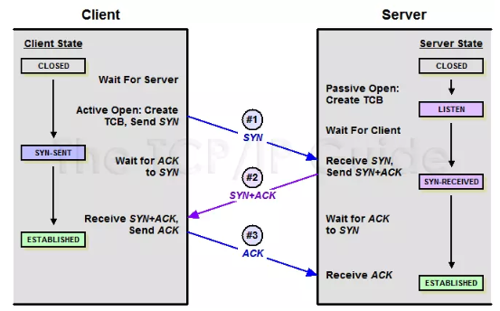
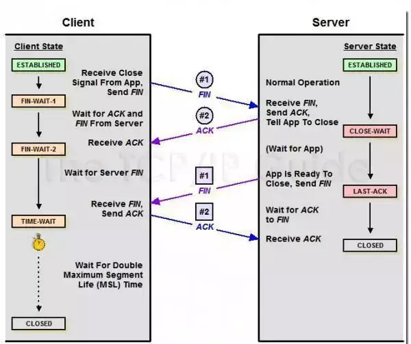

# TCP/UDP

TCP/IP 中有两个具有代表性的传输层协议，分别是 TCP 和 UDP。浏览网页，网络聊天，看视频都是通过TCP或者UDP协议进行数据传输到。TCP/UDP都工作在传输层，目标都是在程序之间传输数据（文本、图片、视频）。

## TCP/IP网络模型

计算机与网络设备要相互通信，双方就必须基于相同的方法。比如，如何探测到通信目标、由哪一边先发起通信、使用哪种语言进行通信、怎样结束通信等规则都需要事先确定。不同的硬件、操作系统之间的通信，所有的这一切都需要一种规则。而我们就把这种规则称为协议（protocol）。

TCP/IP模型是互联网的基础，是互联网相关的各类协议族的总称。比如：TCP，UDP，IP，FTP，HTTP，ICMP，SMTP 等都属于 TCP/IP 族内的协议。

TCP/IP协议还提供一项名为UDP（用户数据报协议）的选择。UDP不能保证可靠的数据包传输。

在网络体系结构中网络通信的建立必须是在通信双方的对等层进行，不能交错。 在整个数据传输过程中，数据在发送端时经过各层时都要附加上相应层的协议头和协议尾（仅数据链路层需要封装协议尾）部分，也就是要对数据进行协议封装，以标识对应层所用的通信协议。

接下去介绍TCP/IP 中有两个具有代表性的传输层协议----TCP 和 UDP。

## TCP

当一台计算机想要与另一台计算机通讯时，两台计算机之间的通信需要畅通且可靠，这样才能保证正确收发数据。

例如，当你想查看网页或查看电子邮件时，希望完整且按顺序查看网页，而不丢失任何内容。当你下载文件时，希望获得的是完整的文件，而不仅仅是文件的一部分，因为如果数据丢失或乱序，都不是你希望得到的结果，于是就用到了TCP。

TCP协议全称是传输控制协议是一种面向连接的、可靠的、基于字节流的传输层通信协议。流就是指不间断的数据结构，你可以把它想象成排水管中的水流。

TCP建立连接有：三次握手、传输确认、四次挥手。

### TCP连接过程

建立一个TCP连接的过程为（三次握手的过程）:

**第一次握手**

客户端向服务端发送连接时，会发送一包连接请求（`syn`数据包），询问能否建立连接。

该报文段中包含自身的数据通讯初始序号。请求发送后，客户端便进入 `SYN-SENT` 状态，等待服务器确认。

**第二次握手**

服务端收到连接请求报文段`syn`后，如果同意连接，则会发送一个应答（`SYN + ACK`数据包），该应答中也会包含自身的数据通讯初始序号（`SYN + ACK`），发送完成后便进入 `SYN-RECEIVED` 状态。

**第三次握手**

当客户端收到连接同意的应答（`SYN + ACK`）后，还要向服务端发送一个确认报文`ACK`。客户端发完这个报文段后便进入 `ESTABLISHED` 状态，服务端收到这个应答后也进入 `ESTABLISHED` 状态，此时连接建立成功。

因为上面过程发送了**三包**数据，所以称为三次握手。

**三次握手成功之后，客户端和服务端都会开辟响应的内存空间资源（socket）。只要资源在，就认为是建立了连接，资源是为对方服务的。**

三次握手(Three-way Handshake)建立一个TCP连接时，需要客户端和服务器总共发送3个包。三次握手的目的是连接服务器指定端口，建立TCP连接，并同步连接双方的序列号和确认号并交换TCP 窗口大小信息。在socket编程中，客户端执行connect()时,将触发三次握手。

syn是同步的单词，ack是知道了的单词。

#### 为什么 TCP 建立连接需要三次握手

为什么 TCP 建立连接需要三次握手，而当服务端收到客户端的`SYN + ACK`之后就建立连接。

这是为了防止出现失效的连接请求报文段被服务端接收的情况，从而产生错误。

客服端的`SYN`包在网络节点发生滞留，为了建立连接客户端会重发一个`SYN`包，这次的数据包正常送达，服务端回复`SYN + ACK`之后建立连接，后来第一包阻塞的网络包突然恢复，第一个`SYN`包又送到了服务端，服务端误认为客服端又发起一个新的连接，从而在两次握手之后进入等待数据阶段，服务端认为是2个连接，客户端认为是一个连接，造成了状态不一致。

三次握手的情况下，服务端收不到最后的`ACK`包，不会认为建立连接成功，服务端没有分配资源，客户端发送过来的数据 服务端会丢弃掉。

所以三次握手本质上就是为了在不可靠的信道上建立可靠的连接。

**TCP连接是全双工的，不区分客户端和服务端。**

#### 切割发送

一包数据可能会被拆成多包发送。这些数据包到达顺序不同（乱序问题）。

TCP为每个连接建立一个发送缓冲区，从建立连接后的第一个字节的序列号为0，后面每个字节的序列号增加1，发送数据时，从发送缓冲区取一部分数据组成发送报文，在TCP协议头中会附带序列号和长度，接收端收到数据后需要回复确认报文，确认报文中的ACK=接收序号+长度，也就是下一包数据需要发送的起始序列号。这样一问一答的发送方式能够是发送端确认发送的数据已经被对方收到，发送端也能一次发送连续的多包数据，接收端只需要回复一次ACK就可以了。这样发送端可以把待发送的数据分割成一系列的碎片，发送到对端，对端根据序列号和长度，在接收后重构出来完整的数据。

#### 丢失重发

假设其中丢失了某些数据包，则接收端可以要求发送端重传`ACK=丢失的序列号`，接收端收到后进行补齐。

### TCP断开链接

**握手过程中传送的包里不包含数据**，三次握手完毕后，客户端与服务器才正式开始传送数据。

理想状态下，TCP连接一旦建立，在通信双方中的任何一方主动关闭连接之前，TCP 连接都将被一直保持下去。

TCP连接的拆除需要发送四个包，因此称为四次挥手(four-way handshake)。在socket编程中，任何一方执行close()操作即可产生“挥手”操作。

TCP 是全双工的，断开连接时客户端和服务端均可以主动发起断开TCP连接的请求。在断开连接时两端都需要发送 FIN 和 ACK。

**第一次握手**

若客户端A认为数据发送完成，则它需要向服务端B发送`FIN`包表示关闭连接，自己进入终止等待1状态`FIN_WAIT_1`。

**第二次握手**

服务端B收到`FIN`包后会发送` ACK 包`，表示自己进入关闭等待状态`CLOSE_WAIT`。

客户端A收到后进入关闭等待2状态`FIN_WAIT_2`，此时表明 A 到 B 的连接已经释放，不再接收 A 发的数据了。

但是因为 TCP 连接是双向的，所以此时 B 仍旧可以发送未发送数据给 A，A还可以接收数据。

**第三次握手**

B 如果此时还有没发完的数据会继续发送，完毕后会向 A 发送连接释放请求`FIN包`，然后 B 便进入最后确认状态`LAST-ACK`。

**第四次握手**

A 收到释放请求`FIN`后，向 B 发送`ACK包`，此时 A 进入超时等待状态`TIME-WAIT`，经过超时时间后关闭连接。B收到`ACK`之后，立即关闭连接。

#### 为什么客户端需要等待超时时间

为了保证对方已收到ACK包，假设A发送完最后一包ACK包之后就释放连接，一旦发送的ACK包在网络中丢失，服务端将一直停留在最后确认状态。如果服务端没有收到ACK包，经过超时时间后，服务端会重发FIN包，客户端响应这个FIN包，重发ACK包并刷新超时时间。也是为了保证**在不可靠的网络链路中进行可靠的连接断开确认**。

该状态会持续 2MSL（最大段生存期，指报文段在网络中生存的时间，超时会被抛弃） 时间，若该时间段内没有 B 的重发请求的话，就进入 CLOSED 状态。当 B 收到确认应答后，也便进入 CLOSED 状态。

## TCP和UDP的比较

### TCP协议的特点

#### 1、面向连接

面向连接，是指发送数据之前必须在两端建立连接。建立连接的方法是“三次握手”，这样能建立可靠的连接。建立连接，是为数据的可靠传输打下了基础。

#### 2、仅支持单播传输

每条TCP传输连接只能有两个端点，只能进行点对点的数据传输，只能是一对一通信，不支持多播和广播传输方式。

#### 3、面向字节流（流模式）

TCP不像UDP一样那样一个个报文独立地传输，而是在不保留报文边界的情况下以字节流方式进行传输。

#### 4、可靠传输

使用流量控制和拥塞控制。(保证数据正确性，保证数据顺序)

对于可靠传输，判断丢包，误码靠的是TCP的段编号以及确认号。TCP为了保证报文传输的可靠，就给每个包一个序号，同时序号也保证了传送到接收端实体的包的按序接收。然后接收端实体对已成功收到的字节发回一个相应的确认(ACK)；如果发送端实体在合理的往返时延(RTT)内未收到确认，那么对应的数据（假设丢失了）将会被重传。

#### 5、提供拥塞控制

当网络出现拥塞的时候，TCP能够减小向网络注入数据的速率和数量，缓解拥塞

#### 5、首部开销

首部最小20字节，最大60字节

#### 6、TCP提供全双工通信

TCP允许通信双方的应用程序在任何时候都能发送数据，因为TCP连接的两端都设有缓存，用来临时存放双向通信的数据。当然，TCP可以立即发送一个数据段，也可以缓存一段时间以便一次发送更多的数据段（最大的数据段大小取决于MSS）

### UDP

UDP协议全称是用户数据报协议，在网络中它与TCP协议一样用于处理数据包，是一种无连接的协议，发送数据就是简单的把数据包封装一下，然后发送出去。

对CPU 内存的占用远小于TCP。

在OSI模型中，在第四层——传输层，处于IP协议的上一层。

UDP有不提供数据包分组、组装和不能对数据包进行排序的缺点，也就是说，当报文发送之后，是无法得知其是否安全完整到达的。

它有以下几个特点：

#### 1、面向无连接

UDP 不需要和 TCP一样在发送数据前进行三次握手建立连接，想发数据就可以开始发送了。并且也只是数据报文的搬运工，不会对数据报文进行任何拆分和拼接操作。

具体来说就是：

- 在发送端，应用层将数据传递给传输层的 UDP 协议，UDP 只会给数据增加一个 UDP 头标识下是 UDP 协议，然后就传递给网络层了
- 在接收端，网络层将数据传递给传输层，UDP 只去除 IP 报文头就传递给应用层，不会任何拼接操作

#### 2、有单播，多播，广播的功能

UDP 不止支持一对一的传输方式，同样支持一对多，多对多，多对一的方式，也就是说 UDP 提供了单播，多播，广播的功能。

#### 3、UDP是面向报文的（数据包形式）

发送方的UDP对应用程序交下来的报文，在添加首部后就向下交付IP层。UDP对应用层交下来的报文，既不合并，也不拆分，而是保留这些报文的边界。因此，应用程序必须选择合适大小的报文

#### 4、不可靠性

首先不可靠性体现在无连接上，通信都不需要建立连接，想发就发，这样的情况肯定不可靠。

并且收到什么数据就传递什么数据，并且也不会备份数据，发送数据也不会关心对方是否已经正确接收到数据了。

再者网络环境时好时坏，UDP因为没有流量控制和拥塞控制，一直会以恒定的速度发送数据。即使网络条件不好，也不会对发送速率进行调整。弊端就是在网络条件不好的情况下可能会导致丢包，优点也很明显，在某些实时性要求高的场景（比如电话会议）就需要使用 UDP。

UDP只会把想发的数据报文一股脑的丢给对方，并不在意数据有无安全完整到达。

#### 5、首部开销

头部开销小，传输数据报文时是很高效的。

UDP 头部包含了以下几个数据：

- 两个十六位的端口号，分别为源端口（可选字段）和目标端口
- 整个数据报文的长度
- 整个数据报文的检验和（IPv4 可选 字段），该字段用于发现头部信息和数据中的错误

UDP 的头部开销小，只有8字节，相比 TCP 的至少二十字节要少得多，在传输数据报文时是很高效的

#### UDP与TCP的区别

**TCP是一种流模式的协议，UDP是一种数据报模式的协议**

**TCP:传输控制协议,长连接（和打电话很相似）**

> 1. 建立连接，形成通信管道。
> 2. 必须经过三次握手完成链接，是可靠的传输协议。
> 3. 传输过程中数据大小不受限制。
> 4. 必须建立连接，建立连接需要开销较多(时间，系统资源)，速度慢，效率就会低。

**UDP:用户数据包协议（和发短信很相似）**

> 1. 将数据的源和目的封装在数据包，不需要建立连接。
> 2. 正因为不需要链接，所以是不可靠的协议
> 3. 传输数据在64K之内
> 4. 不需要建立连接所以速度快。

#### **TCP协议和UDP协议的区别有哪些？**

TCP类似打电话。基于连接，双方肯定都可以接收到消息。

UDP类似写信。对方能否收到，地址是否正确，多封信到达顺序都是不确定的。

**TCP(传输控制协议，**Transmission Control Protocol**)：**

提供IP环境下的数据可靠传输(一台计算机发出的字节流会无差错的发往网络上的其他计算机，而且计算机A接收数据包的时候，也会向计算机B回发数据包，这也会产生部分通信量)，有效流控，全双工操作(数据在两个方向上能同时传递)，多路复用服务，是面向连接，端到端的传输;

面向连接：正式通信前必须要与对方建立连接。事先为所发送的数据开辟出连接好的通道，然后再进行数据发送，像打电话。

TCP支持的应用协议：Telnet(远程登录)、FTP(文件传输协议)、SMTP(简单邮件传输协议)。TCP用于传输数据量大，可靠性要求高的应用。

**UDP(用户数据报协议，User Datagram Protocol)**

面向非连接的(正式通信前不必与对方建立连接，不管对方状态就直接发送，像短信，QQ)，不能提供可靠性、流控、差错恢复功能。UDP用于一次只传送少量数据，可靠性要求低、传输经济等应用。

UDP支持的应用协议：NFS(网络文件系统)、SNMP(简单网络管理系统)、DNS(主域名称系统)、TFTP(通用文件传输协议)等。

## TCP和UDP协议的适用场景

TCP一般传输大量数据，适用于要求可靠传输的应用。

- 文件传输（FTP HTTP 对数据**准确性要求高**，速度可以相对慢）
- 发送或接收邮件（POP IMAP SMTP 对数据准确性要求高，非紧急应用）
- 远程登录（TELNET SSH 对数据准确性有一定要求，有连接的概念）等等。

UDP一般用于传输少量数据，适用于

- 实时应用（IP电话、视频会议、直播等）
- 即时通信（QQ聊天 对数据准确性和丢包要求比较低，但**速度必须快**）
- 在线视频（RTSP 速度一定要快，保证视频连续，但是偶尔花了一个图像帧，人们还是能接受的）
- 网络语音电话（VoIP 语音数据包一般比较小，需要高速发送，偶尔断音或串音也没有问题）等等。

作为知识的扩展，可以再说一些其他应用。

比如

TCP可以用于网络数据库，分布式高精度计算系统的数据传输；

UDP可以用于服务系统**内部之间**的数据传输，因为数据可能比较多，内部系统局域网内的丢包错包率又很低，即便丢包，顶多是操作无效，这种情况下，UDP经常被使用。
