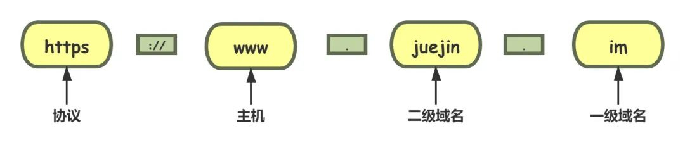
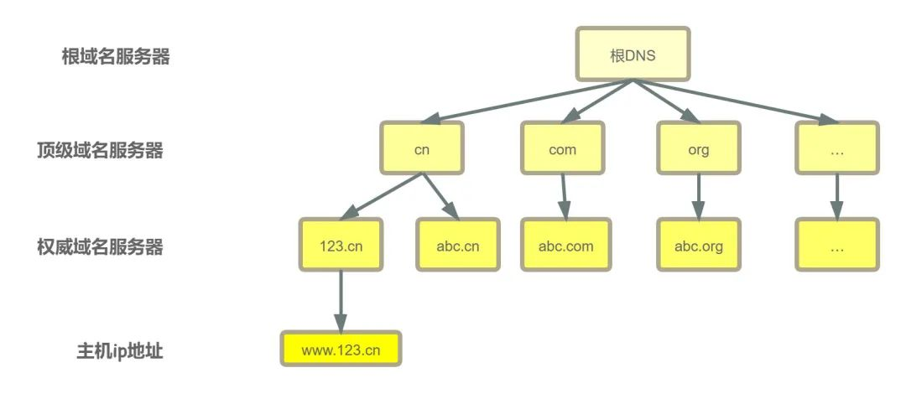

# 基础概念

## IP地址

- 网络中的设备唯一标识符
- 不易记忆，通常可以用主机名
- 本地回环地址：127.0.0.1，主机名：localhost

## 端口号

应用的标识符

有效端口：0-65535，其中0-1024有系统使用或者系统保留。

## 传输协议（用什么方式进行交互）

通讯的规则

常见协议：TCP、UDP

## CDN（Content Delivery Network）

CDN是为了**解决长距离网络访问速度慢的问题**而诞生的一种网络应用服务，全称为“内容分发网络”。

CDN最核心的原则是“就近访问”，使用HTTP协议里的代理和缓存技术，用户在上网的时候不直接访问原网站，而是访问离他最近的一个CDN节点，节省了访问过程中的时间成本。（负载均衡，安全防护，边缘计算）。

慢的原因：

1. 链路过长（长沙访问北京资源，经过很多路由）。
2. 网络问题，南电信北联通

### CDN构成

边缘节点

二级节点

源站节点

## URI/URL

URI（Uniform Resource Identifier）中文名称是统一资源标识符。

DNS 和 IP 地址只是标记了互联网上的主机，URI能够唯一的标记互联网上资源。

URI 不完全等同于网址，它包含有 URL 和 URN 两个部分。

URI 另一个更常用的表现形式是 URL——统一资源定位符（Uniform Resource Locator）， 统一资源定位符。因为它经常出现在浏览器的地址栏里，所以俗称为“网络地址”，简称“网址”。URL是 URI 的一个子集，通常不会做严格的区分。

URI 主要有三个基本的部分构成：

- 协议名：即访问该资源应当使用的协议
- 主机名：即互联网上主机的标记，可以是域名或 IP 地址
- 路径：即资源在主机上的位置，使用“/”分隔多级目录

### URI是什么

URI 本质上是一个字符串，这个字符串的作用是唯一地标记资源的位置或者名字。

上面这个图片就是一个完整的URI，下面详细拆解一下它的结构。

- **scheme** 协议名，表示资源应该使用哪种协议来访问。最常见的当然就是“http”了，表示使用 HTTP 协议。另外还有“https”，表示使用经过加密、安全的 HTTPS 协议。此外还有其他不是很常见的 scheme，例如 ftp、ldap、file、news 等。

- **://** 分隔符，在 scheme 之后，必须是三个特定的字符“://”，它把 scheme 和后面的部分分离开。没有特定的意义。

- **user:passwd@** 身份信息，表示登录主机时的用户名和密码，但现在已经不推荐使用这种形式了，因为它把敏感信息以明文形式暴露出来，存在严重的安全隐患。

- **host:port** 主机名，表示资源所在的主机名，通常的形式是“host:port”，即主机名加端口号。

- **path** 路径,表示资源所在位置,采用了类似文件系统“目录”的表示方式，通常以‘/’开始

- **query** 查询参数，用一个“?”开始，但不包含“?”，表示对资源附加的额外要求。path是多个“key=value”的字符串，这些字符串用字符“&”连接，浏览器和服务器都可以按照这个格式把长串的查询参数解析成可理解的字典或关联数组形式。

- **#fragment** 片段标识符，它是 URI 所定位的资源内部的一个“锚点”，浏览器可以在获取资源后直接跳转到它指示的位置。但片段标识符仅能由浏览器这样的客户端使用，服务器是看不到的。

> 在 URI 里只能使用 ASCII 码，对于 ASCII 码以外的字符集和特殊字符做一个特殊的操作，把它们转换成与 URI 语义不冲突的形式。这在 RFC 规范里称为“escape”和“unescape”，俗称“转义”。URI 转义的规则有点“简单粗暴”，直接把非 ASCII 码或特殊字符转换成十六进制字节值，然后前面再加上一个“%”。

## 域名

> 域名是一个有层次的结构，是一串用“.”分隔的多个单词，最右边的被称为“顶级域名”，然后是“二级域名”，层级关系向左依次降低。最左边的是主机名，通常用来表明主机的用途，比如“www”表示提供万维网服务、“mail”表示提供邮件服务，不过这也不是绝对的。

可以通过下面的例子了解一下协议 主机 域名之间的层次关系。域名就像人的名字一样，名字的关键是要让我们容易记忆。除了标识身份之外，域名还可以代替ip地址。

## DNS（Domain Name System）

域名系统，用有意义的名字来作为 IP 地址的等价替代。

在 DNS 中，“域名”（Domain Name）又称为“主机名”（Host）。域名用“.”分隔成多个单词，级别从左到右逐级升高，最右边的被称为“顶级域名”。但想要使用 TCP/IP 协议来通信仍然要使用 IP 地址，所以需要把域名做一个转换，“映射”到它的真实 IP，这就是所谓的“域名解析”。

我们经常会使用域名访问网站，但其实在网络查找的工程当中是使用ip定位资源的，域名必须解析为ip地址才可以正确的拿到资源。DNS就是用来将域名变为ip的协议。

DNS 的核心系统是一个三层的树状、分布式服务，基本对应域名的结构：

- 根域名服务器（Root DNS Server）：管理顶级域名服务器，返回"com","net","cn"等顶级域名服务器的 IP 地址
- 顶级域名服务器（Top-level DNS Server）：管理各自域名下的权威域名服务器，比如 cn 顶级域名服务器可以返回 123.cn域名服务器的 IP 地址；
- 权威域名服务器（Authoritative DNS Server）：管理自己域名下主机的 IP 地址，比如 123.cn 权威域名服务器可以返回 www.123.cn 的 IP 地址。

虽然DNS的服务，遍布全球，服务能力也很厉害，但是全世界的网民都在使用这个服务，也会对服务器造成很大的压力。在核心 DNS 系统之外，还有两种手段用来减轻域名解析的压力，并且能够更快地获取结果，基本思路就是“缓存”。

DNS的解析结果可以保存在大公司自己的DNS服务器里，或者操作系统缓存、hosts 文件当中，很多域名解析的工作就都不用请求根DNS服务器了，直接在本地或本机就能解决，不仅方便了用户，也减轻了各级 DNS 服务器的压力，效率就大大提升了。

### 重定向

在浏览器输入一个url再按下回车，页面跳转到我们输入的地址中，这种行为就是主动跳转。浏览器还支持被动跳转，也就是HTTP的重定向。

基于域名和DNS服务器，可以实现重定向。因为域名代替了ip地址，所以可以对外域名不变，而主机IP可以任意变动。当主机有情况需要下线、迁移时，可以更改 DNS 记录，让域名指向其他的机器。

### 负载均衡

DNS在域名解析阶段可以进行负载均衡的操作。

- 第一种方式，因为域名解析可以返回多个 IP 地址，所以一个域名可以对应多台主机，客户端收到多个 IP 地址后，就可以自己使用轮询算法依次向服务器发起请求，实现负载均衡。
- 第二种方式，域名解析可以配置内部的策略，返回离客户端最近的主机，或者返回当前服务质量最好的主机，这样在 DNS 端把请求分发到不同的服务器，实现负载均衡。

## HTTP协议传输和TCP协议传输的区别

http是短连接，TCP是长连接，即时通讯要使用长连接。

HTTP连接使用的是“请求—响应”的方式，不仅在请求时需要先建立连接，而且需要客户端向服务器发出请求后，服务器端才能回复数据。

TCP/IP主要的作用就是保证连接的可靠性，我不管发出任何东西给你，都要有这一套协议来保证不丢包比如说TCP协议就是这样，无论上层让他传啥数据，他都通过与IP协议的操作，把这些东西分段，然后输送，同时保证在这个过程中，数据不会丢，如果丢了一块，他还得想办法重新传一次，这就是TCP/IP的意义。

HTTP协议，可以认为主要是用来访问网页的，是比TCP更上层的协议，HTTP里面规定了我们访问网页的时候如何进行缓存，以及请求什么格式，等等。主要是为了让人们访问网页的时候更快，更安全，而规定了很多参数。

在传输数据时，可以只使用传输层（TCP/IP），但是那样的话，由于没有应用层，便无法识别数据内容，如果想要使传输的数据有意义，则必须使用应用层协议（HTTP、FTP、TELNET等），也可以自己定义应用层协议。

- TCP是传输层，而HTTP是应用层，HTTP是要基于TCP连接基础上的。简单的说，TCP就是单纯建立连接，不涉及任何我们需要请求的实际数据，简单的传输。HTTP是用来收发数据，即实际应用上来的。
- TCP是底层通讯协议，定义的是数据传输和连接方式的规范。HTTP是应用层协议，定义的是传输数据的内容的规范，HTTP协议中的数据是利用TCP协议传输的，所以支持HTTP也就一定支持TCP。
- HTTP支持的是www服务，WEB使用HTTP作传输层协议，以封装HTTP文本信息，然后使用TCP/IP做传输层协议将它发送到网络上。
- TCP/IP是协议，它是Internet国际互联网络的基础。TCP/IP是网络中使用的基本的通信协议。TCP/IP是Internet协议族，而不单单是TCP和IP。它包括上百个各种功能的协议，如：远程登录、文件传输和电子邮件等，而TCP协议和IP协议是保证数据完整传输的两个基本的重要协议。

