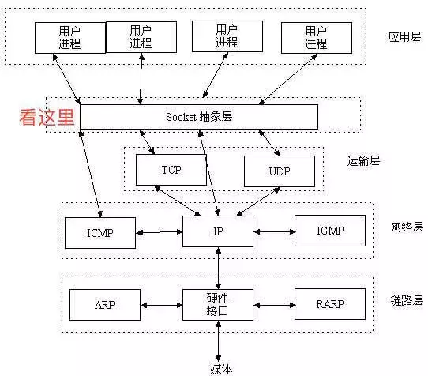

# 基础概念

## IP地址

> 1. 网络中的设备唯一标识符
> 2. 不易记忆，通常可以用主机名
> 3. 本地回环地址：127.0.0.1，主机名：localhost

## 端口号

> 1. 应用的标识符
> 2. 有效端口：0-65535，其中0-1024有系统使用或者系统保留。

## 传输协议（用什么方式进行交互）

> 1. 通讯的规则
> 2. 常见协议：TCP、UDP

## TCP_HTTP_Socket区别

## Socket连接与HTTP连接的不同

**通常情况下Socket连接就是TCP连接**，因此Socket连接一旦建立，通信双方即可开始相互发送数据内容，直到双方连接断开。但在实际应用中，客户端到服务器之间的通信防火墙默认会关闭长时间处于非活跃状态的连接而导致 Socket 连接断连，因此需要通过轮询告诉网络，该连接处于活跃状态。

而HTTP连接使用的是“请求—响应”的方式，不仅在请求时需要先建立连接，而且需要客户端向服务器发出请求后，服务器端才能回复数据。

Socket是对TCP/IP协议的封装，Socket本身并不是协议，而是一个调用接口（API），通过Socket，我们才能使用TCP/IP协议。

## HTTP协议传输和TCP协议传输的区别

http是短连接，TCP是长连接，即时通讯要使用长连接。

TCP/IP主要的作用就是保证连接的可靠性，我不管发出任何东西给你，都要有这一套协议来保证不丢包比如说TCP协议就是这样，无论上层让他传啥数据，他都通过与IP协议的操作，把这些东西分段，然后输送，同时保证在这个过程中，数据不会丢，如果丢了一块，他还得想办法重新传一次，这就是TCP/IP的意义。

HTTP协议，可以认为主要是用来访问网页的，是比TCP更上层的协议，HTTP里面规定了我们访问网页的时候如何进行缓存，以及请求什么格式，等等。主要是为了让人们访问网页的时候更快，更安全，而规定了很多参数。

在传输数据时，可以只使用传输层（TCP/IP），但是那样的话，由于没有应用层，便无法识别数据内容，如果想要使传输的数据有意义，则必须使用应用层协议（HTTP、FTP、TELNET等），也可以自己定义应用层协议。

- TCP是传输层，而HTTP是应用层，HTTP是要基于TCP连接基础上的。简单的说，TCP就是单纯建立连接，不涉及任何我们需要请求的实际数据，简单的传输。HTTP是用来收发数据，即实际应用上来的。
- TCP是底层通讯协议，定义的是数据传输和连接方式的规范。HTTP是应用层协议，定义的是传输数据的内容的规范，HTTP协议中的数据是利用TCP协议传输的，所以支持HTTP也就一定支持TCP。
- HTTP支持的是www服务，WEB使用HTTP作传输层协议，以封装HTTP文本信息，然后使用TCP/IP做传输层协议将它发送到网络上。
- TCP/IP是协议，它是Internet国际互联网络的基础。TCP/IP是网络中使用的基本的通信协议。TCP/IP是Internet协议族，而不单单是TCP和IP。它包括上百个各种功能的协议，如：远程登录、文件传输和电子邮件等，而TCP协议和IP协议是保证数据完整传输的两个基本的重要协议。

