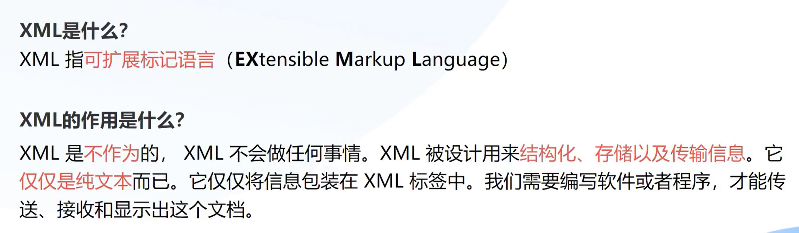
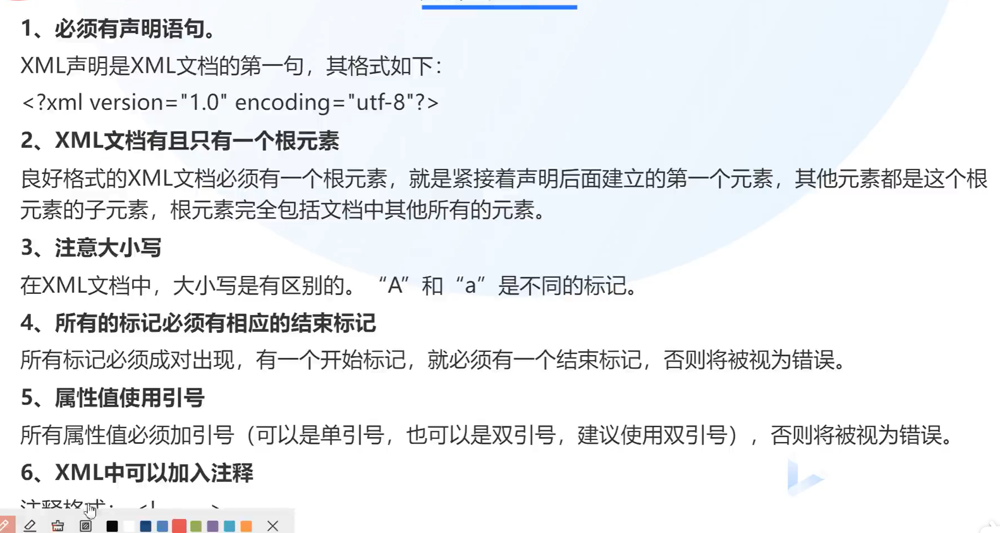
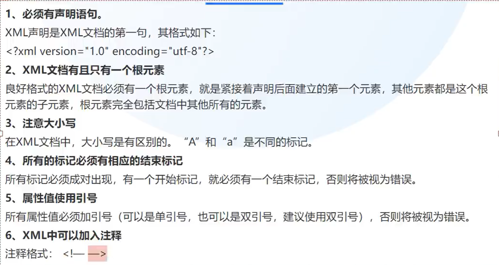
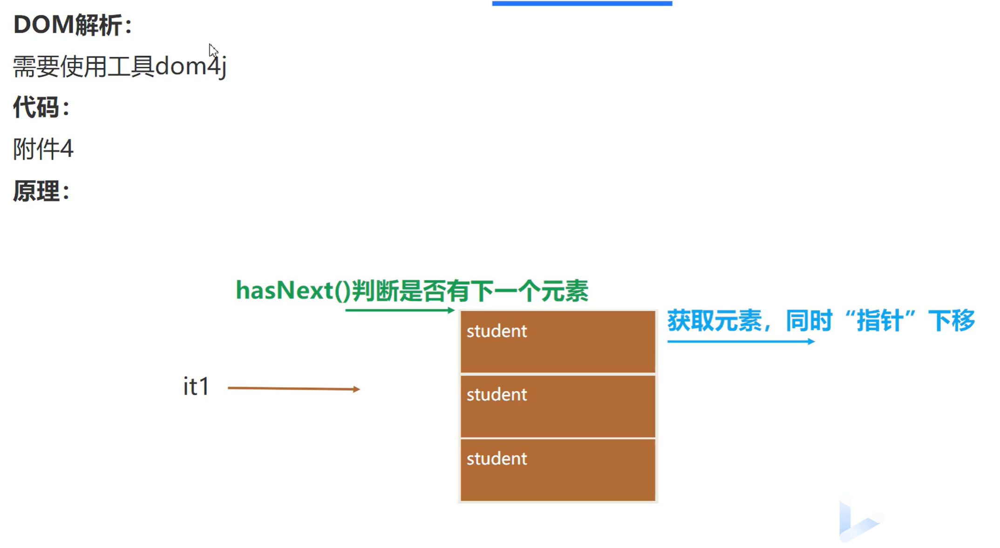

# XML



XML是语言，可自定义标签。

## 定义XML





## XML定义

创建一个`.xml`文件

```xml
<?xml version="1.0" encoding="utf-8" ?>
<!--
注释
stuents:根标签，只有一个。
id:标签的属性
-->
<stuents>
    <student id="1">
        <name>九九</name>
        <age>18</age>
        <sex>女</sex>
        <score>98.7</score>
    </student>
    <student id="2">
        <name>健康</name>
        <age>15</age>
        <sex>男</sex>
        <score>28.7</score>
    </student>
    <student id="3">
        <name>解开</name>
        <age>34</age>
        <sex>男</sex>
        <score>57.7</score>
    </student>
</stuents>
```

## XML解析



下载dom4j 2.1.3.jar工具包，安装。


