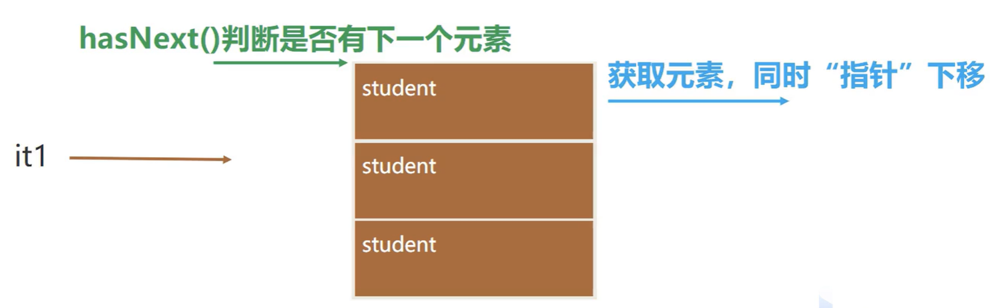

# XML

XML指可扩展标记语言 (EXtensible Markup Language)

## XML的作用

XML 是**不作为**的，XML 不会做任何事情。XML被设计用来**结构化、存储以及传输信息**。它**仅仅是纯文本**而已。它仅仅将信息包装在 XML标签中。我们需要编写软件或者程序，才能传送、接收和显示出这个文档。

XML是语言，可自定义标签。

## XML定义

1、必须有声明语句。

XML声明是XML文档的第一句，其格式如下：

```xml
<?xml version="1.0" encoding="utf-8"?>
```

2、XML文档有且只有一个根元素

良好格式的XML文档必须有一个根元素，就是紧接着声明后面建立的第一个元素，其他元素都是这个根元素的子元素，根元素完全包括文档中其他所有的元素。

3、注意大小写

在XML文档中，大小写是有区别的。“A”和“a〞是不同的标记。

4、所有的标记必须有相应的结束标记

所有标记必须成对出现，有一个开始标记，就必须有一个结束标记，否则将被视为错误。

5、属性值使用引号

所有属性值必须加引号（可以是单引号，也可以是双引号，建议使用双引号），否则将被视为错误。

6、XML中可以加入注释

注释格式：`<!-- -->`

### 案例代码

创建一个`.xml`文件

```xml
<?xml version="1.0" encoding="utf-8" ?>
<!--
注释
stuents:根标签，只有一个。
id:标签的属性
-->
<stuents>
    <student id="1">
        <name>九九</name>
        <age>18</age>
        <sex>女</sex>
        <score>98.7</score>
    </student>
    <student id="2">
        <name>健康</name>
        <age>15</age>
        <sex>男</sex>
        <score>28.7</score>
    </student>
    <student id="3">
        <name>解开</name>
        <age>34</age>
        <sex>男</sex>
        <score>57.7</score>
    </student>
</stuents>
```

## XML解析

### DOM解析

需要使用工具dom4j

下载dom4j 2.1.3.jar工具包，安装。

### 代码


### 原理




