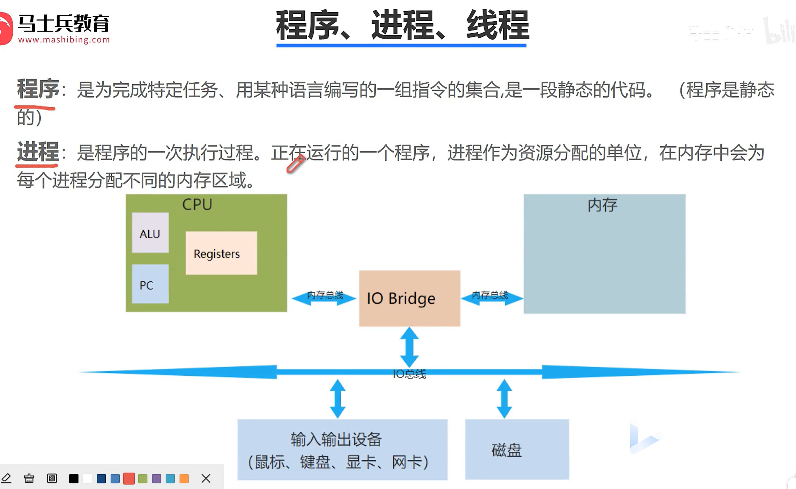
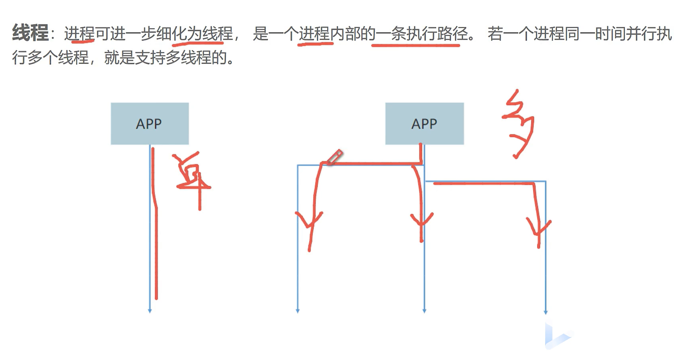

# 多线程



CPU

ALU：计算单元

Register：寄存器

PC：执行到哪条指令

打开程序，放入内存，生成进程。

进程资源分配基本单位

进程有很多任务，多线程。



至少一个主线程。


## Thread

```java
/**
 * 创建一个线程类TestThread，需要继承Thread
 */
public class TestThread extends Thread {
    @Override
    public void run() {//线程对应的任务放在一个方法
        for(int i = 0; i < 10; i++){
            System.out.println("子线程" + i);
        }
    }
}
```

使用

```java
TestThread t = new TestThread();
t.start();
```


