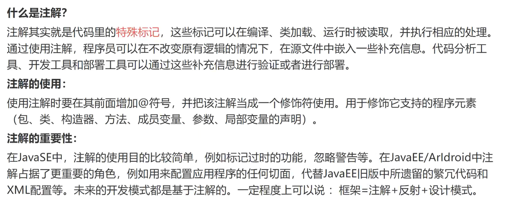
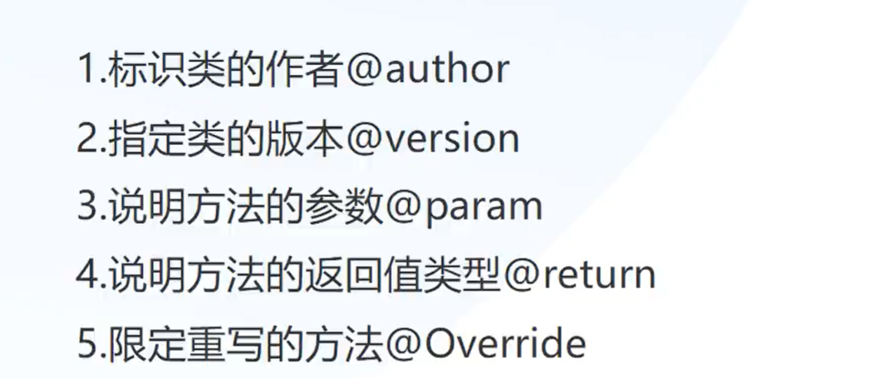

# 注解



## 注解的使用实例




实例1

```java
package com.msb.test19;

/**
 * @author zss
 * @version 1.0
 */
public class Test {
    /**
     *
     * @param num1 求和的第一个变量
     * @param num2 求和的第二个变量
     * @return 返回值int类型..
     */
    public int add(int num1,int num2){
        return num1 + num2;
    }
}
```

实例2

```java
package com.msb.test19;
//父类
public class Person {
    public void eat(){
        System.out.println("人类可以吃饭");
    }
}
//子类
public class Student extends Person{
    @Override//标识下面的方法是重写的方法，可以防止写错
    public void eat() {
        System.out.println("这是对父类方法进行了重写---学生可以吃火锅、烧烤、大排档...");
    }
}
```

