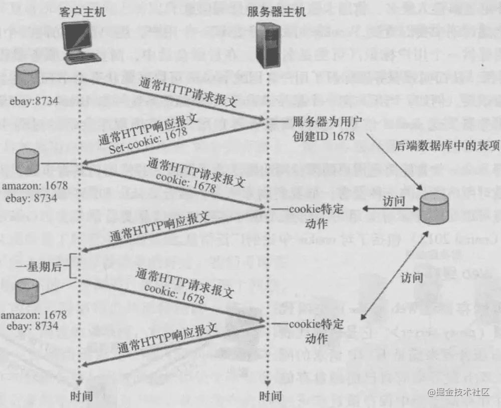

# cookie和session

## cookie

HTTP 协议是**无状态**的。优点是服务器没有状态差异，可以很容易地组成集群，缺点是无法支持需要记录状态的事务操作，客户端必须每次带上自己的状态去请求服务器。好在 HTTP 协议是可扩展的，后来发明的 Cookie 技术，给 HTTP 增加了“记忆能力”。

cookie 主要是用来记录用户状态，区分用户，**状态保存在客户端**。

cookie同样存在于HTTP头部字段里。

服务端可以使用`set-cookie`标识客户端身份，客户端则在请求时携带`cookie`告诉服务端自己的信息。

`cookie`字段以`key=value`的格式保存，浏览器在一个`cookie`字段里可以存放多对数据，用`;`分割。

Cookie 主要用于以下三个方面：

- 会话状态管理（如用户登录状态、购物车、游戏分数或其它需要记录的信息）
- 个性化设置（如用户自定义设置、主题等）
- 浏览器行为跟踪（如跟踪分析用户行为等）

### 用户与服务器的交互：Cookie

1. 首次访问 amazon 时，客户端发送一个 HTTP 请求到服务器端 。服务器端发送一个 HTTP 响应到客户端，其中包含 Set-Cookie 头部。
2. 客户端发送一个 HTTP 请求到服务器端，其中包含 Cookie 头部。服务器端发送一个 HTTP 响应到客户端。
3. 隔段时间再去访问时，客户端会直接发包含 Cookie 头部的 HTTP 请求。服务器端发送一个 HTTP 响应到客户端。

cookie 技术有 4 个组件：

1. 在 HTTP 响应报文中的一个 cookie 首部行
2. 在 HTTP 请求报文中的一个 cookie 首部行
3. 在用户端系统中保留一个 cookie 文件，并由用户的浏览器进行管理
4. 位于 Web 站点的一个后端数据库

cookie 功能需要浏览器的支持。如果浏览器不支持 cookie（如大部分手机中的浏览器）或者把 cookie 禁用了，cookie 功能就会失效。

### cookie的修改和删除

修改 cookie：只需要新 cookie 覆盖旧 cookie 即可，在覆盖的时候，由于 Cookie 具有不可跨域名性，注意 name、path、domain 需与原 cookie 一致

删除 cookie：设置 cookie 的过期时间 expires 为过去的一个时间点，或者 maxAge = 0(Cookie 的有效期,单位为秒)即可

### cookie的安全

事实上，cookie 的使用存在争议，因为它被认为是对用户隐私的一种侵害，而且 cookie 并不安全 HTTP 协议不仅是无状态的，而且是不安全的。使用 HTTP 协议的数据不经过任何加密就直接在网络上传播，有被截获的可能。使用 HTTP 协议传输很机密的内容是一种隐患。

- 如果不希望 Cookie 在 HTTP 等非安全协议中传输，可以设置 Cookie 的 secure 属性为 true。浏览器只会在 HTTPS 和 SSL 等安全协议中传输此类 Cookie。
- secure 属性并不能对 Cookie 内容加密，因而不能保证绝对的安全性。如果需要高安全性，需要在程序中对 Cookie 内容加密、解密，以防泄密
- 也可以设置 cookie 为 **HttpOnly**，如果在 cookie 中设置了 **HttpOnly** 属性，那么通过 js 脚本将无法读取到 cookie 信息，这样能有效的防止 **XSS**（跨站脚本攻击）攻击

## Session

除了使用 Cookie，Web 应用程序中还经常使用 **Session** 来记录客户端状态。Session 是服务器端使用的一种记录客户端状态的机制，使用上比 Cookie 简单一些，相应的也增加了服务器的存储压力。

Session 是另一种记录客户状态的机制，不同的是 **Cookie** 保存在客户端浏览器中，而**Session** 保存在服务器上。

客户端浏览器访问服务器的时候，服务器把客户端信息以某种形式记录在服务器上。这就是 Session。客户端浏览器再次访问时只需要从该 Session 中查找该客户的状态就可以了。

\* 当程序需要为某个客户端的请求创建一个 session 时，服务器首先检查这个客户端的请求里是否已包含了一个 session 标识（称为 SessionId）

\* 如果已包含则说明以前已经为此客户端创建过 session，服务器就按照 SessionId 把这个 session 检索出来，使用（检索不到，会新建一个）

\* 如果客户端请求不包含 SessionId，则为此客户端创建一个 session 并且生成一个与此 session 相关联的 SessionId，SessionId 的值应该是一个既不会重复，又不容易被找到规律以仿造的字符串，这个 SessionId 将被在本次响应中返回给客户端保存。

\* 保存这个 SessionId 的方式可以采用 cookie，这样在交互过程中浏览器可以自动的按照规则把这个标识发送给服务器。但 cookie 可以被人为的禁止，则必须有其他机制以便在 cookie 被禁止时仍然能够把 SessionId 传递回服务器。

## Cookie 和 Session 的区别

- cookie 数据存放在客户的浏览器上，session 数据放在服务器上。
- cookie 相比 session 不是很安全，别人可以分析存放在本地的 cookie 并进行 cookie 欺骗,考虑到安全应当使用 session。
- session 会在一定时间内保存在服务器上。当访问增多，会比较占用你服务器的性能,考虑到减轻服务器性能方面，应当使用 cookie。
- 单个 cookie 保存的数据不能超过 4K，很多浏览器都限制一个站点最多保存 20 个 cookie。而 session 存储在服务端，可以无限量存储
- 将登录信息等重要信息存放为 session，其他信息如果需要保留，可以放在 cookie 中