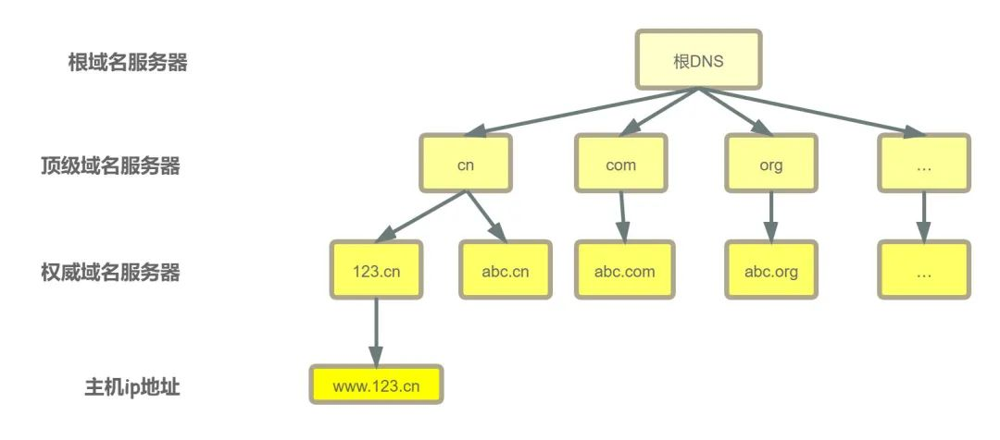

# DNS

## IP地址

用来标志网络中的一个通信实体的地址。通信实体可以是计算机，路由器等。

- 网络中的设备唯一标识符。
- 不易记忆，通常可以用主机名
- 本地回环地址：127.0.0.1，主机名：localhost

## 端口号

IP地址用来标志一台计算机，但是一台计算机上可能提供多种应用程序，使用端口来区分这些应用程序。

应用的标识符。

有效端口：0-65535，其中0-1024有系统使用或者系统保留。

## 域名

> 域名是一个有层次的结构，是一串用“.”分隔的多个单词，最右边的被称为“顶级域名”，然后是“二级域名”，层级关系向左依次降低。最左边的是主机名，通常用来表明主机的用途，比如“www”表示提供万维网服务、“mail”表示提供邮件服务，不过这也不是绝对的。

可以通过下面的例子了解一下协议 主机 域名之间的层次关系。域名就像人的名字一样，目的是容易记忆。除了标识身份之外，域名还可以代替ip地址。

## DNS（Domain Name System）

域名系统，用有意义的名字来作为 IP 地址的等价替代。

域名（Domain Name）又称为主机名（Host）。域名用`.`分隔成多个单词，级别从左到右逐级升高，最右边的被称为“顶级域名”。

想要使用 TCP/IP 协议来通信仍然要使用 IP 地址，所以需要把域名做一个转换，“映射”到它的真实 IP，这就是所谓的“域名解析”。

我们经常会使用域名访问网站，但其实在网络查找的工程当中是使用ip定位资源的，域名必须解析为ip地址才可以正确的拿到资源。DNS就是用来将域名变为ip的协议。

DNS 服务器通常是运行 BIND 软件的 UNIX 机器，DNS 协议运行在 **UDP** 上，使用 53 号端口 DNS 通常是由其他应用层协议所使用的，包括 HTTP、SMTP 等。其作用则是：**将用户提供的主机名解析为IP地址**

DNS 的一种简单设计就是在因特网上只使用一个 DNS 服务器，该服务器包含所有的映射。很明显这种设计是有很大的问题的：

- **单点故障**：如果该 DNS 服务器崩溃，全世界的网络随之瘫痪

- **通信容量**：单个 DNS 服务器必须处理所有 DNS 查询

- **远距离的集中式数据库**：单个 DNS 服务器必须面对所有用户，距离过远会有严重的时延。

- **维护**：该数据库过于庞大，还需要对新添加的主机频繁更新。

所以，DNS 被设计成了一个**分布式、层次数据库**

DNS 的核心系统是一个三层的树状、分布式服务，基本对应域名的结构：

- 根域名服务器（Root DNS Server）：管理顶级域名服务器，返回"com","net","cn"等顶级域名服务器的 IP 地址
- 顶级域名服务器（Top-level DNS Server）：管理各自域名下的权威域名服务器，比如 cn 顶级域名服务器可以返回 123.cn域名服务器的 IP 地址；
- 权威域名服务器（Authoritative DNS Server）：管理自己域名下主机的 IP 地址，比如 123.cn 权威域名服务器可以返回 www.123.cn 的 IP 地址。

DNS的服务遍布全球，服务能力也很厉害，但是全世界的网民都在使用这个服务，也会对服务器造成很大的压力。在核心 DNS 系统之外，还有两种手段用来减轻域名解析的压力，并且能够更快地获取结果，基本思路就是“缓存”。

DNS的解析结果可以保存在大公司自己的DNS服务器里，或者操作系统缓存、hosts 文件当中，很多域名解析的工作就都不用请求根DNS服务器了，直接在本地或本机就能解决，不仅方便了用户，也减轻了各级 DNS 服务器的压力，效率就大大提升了。

### DNS 解析过程

迭代查询和递归查询

DNS 查询链：本地 DNS 服务器-->根 DNS 服务器-->顶级域 DNS 服务器-->权威 DNS 服务器。

### DNS缓存

**DNS 缓存（DNS Caching）**：为了改善时延性能并减少在因特网上到处传输的 DNS 报文数量，DNS 广泛使用了缓存技术。

在一个请求链中，当某 DNS 服务器接收一个 DNS 回答时，它能将该回答中的信息缓存在本地存储器中。那么另一个对相同主机名的查询到达该 DNS 服务器时，该 DNS 服务器就可以提供所要求的 IP 地址，即使它不是该主机名的权威服务器。

由于 IP 和主机名的映射并不是永久的，DNS 服务器在一段时间后就会丢弃缓存的信息。

本地 DNS 服务器也能够缓存 TLD 服务器的 IP 地址，从而允许本地 DNS 绕过查询链中的根 DNS 服务器。

**而事实上，有 DNS 的地方，就有缓存。浏览器、操作系统、本地DNS服务器、根DNS服务器，它们都会对 DNS结果做一定程度的缓存。**

### DNS 解析过程

大致分为 8 步：

1、发起基于域名的请求后，首先检查本地缓存（浏览器缓存-->操作系统的 hosts 文件）

2、如果本地缓存中有，直接返回目标 IP 地址，否则将域名解析请求发送给本地 DNS 服务器

3、如果本地 DNS 服务器中有，直接返回目标 IP 地址，到这一步基本能解析 80%的域名。如果没有，本地 DNS 服务器将解析请求发送给根 DNS 服务器

4、根 DNS 服务器会返回给本地 DNS 服务器一个所查询的 TLD 服务器地址列表

5、本地 DNS 服务器再向上一步返回的 TLD 服务器发送请求，TLD 服务器查询并返回域名对应的权威域名服务器的地址

 6、本地 DNS 服务器再向上一步返回的权威域名服务器发送请求，权威域名服务器会查询存储的域名和 IP 的映射关系表，将 IP 连同一个 TTL（过期时间）值返回给本地 DNS 服务器

7、本地 DNS 服务器会将 IP 和主机名的映射保存起来，保存时间由 TTL 来控制

8、本地 DNS 服务器把解析的结果返回给用户，用户根据 TTL 值缓存在本地系统缓存中，域名解析过程结束

### 重定向

在浏览器输入一个url再按下回车，页面跳转到我们输入的地址中，这种行为就是主动跳转。浏览器还支持被动跳转，也就是HTTP的重定向。

基于域名和DNS服务器，可以实现重定向。因为域名代替了ip地址，所以可以对外域名不变，而主机IP可以任意变动。当主机有情况需要下线、迁移时，可以更改 DNS 记录，让**域名指向其他的机器**。

### 负载均衡

DNS在域名解析阶段可以进行负载均衡的操作。

- 第一种方式，因为域名解析可以返回多个 IP 地址，所以一个域名可以对应多台主机，客户端收到多个 IP 地址后，就可以自己使用轮询算法依次向服务器发起请求，实现负载均衡。
- 第二种方式，域名解析可以配置内部的策略，返回离客户端最近的主机，或者返回当前服务质量最好的主机，这样在 DNS 端把请求分发到不同的服务器，实现负载均衡。